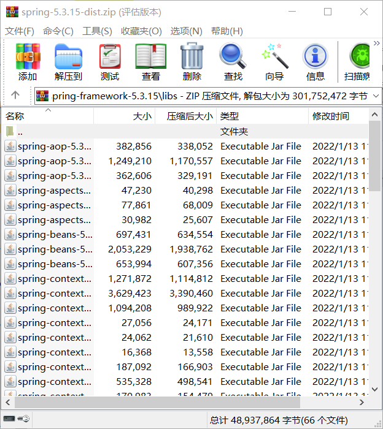
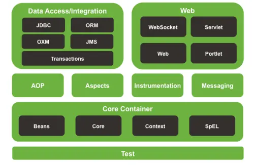
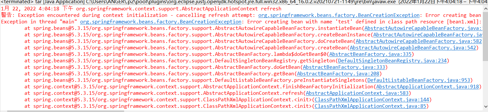
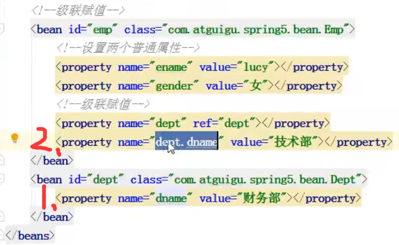
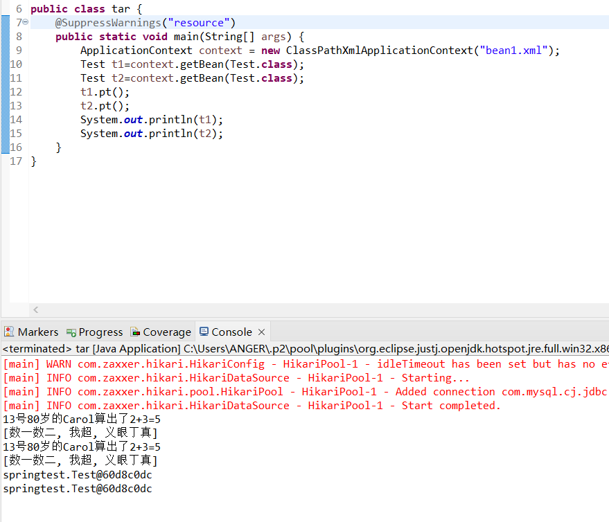
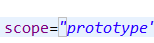
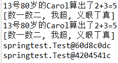

## 前言

虽然目前 redis 还没有完成对结构层的深挖，但是由于项目需要，不得不提前开始 Spring/Spring Boot 的学习。。。（悲

## Spring 入门

概述

#### Spring 是什么？

1. 开源轻量级（依赖包较少，可独立使用）的 JavaEE 框架
2. 目的是解决企业应用开发的复杂性，也就是简化开发流程与项目代码
3. 两大核心部分：IoC（控制反转，把创建对象的过程交给框架） 和 AOP（面向切面编程，在不修改源代码的情况下进行功能增强）
4. 特点：
   - 方便解耦，简化开发
   - AOP 编程支持
   - 方便程序测试（无侵入性以及依赖注入）
   - 方便整合其它框架
   - 方便进行事务管理
   - 降低了 api 的开发难度

#### 去码头整点薯条

[Spring | Home](https://spring.io/)

先去这个网站看一下最新稳定版本

[repo.spring.io](https://repo.spring.io/ui/native/release/org/springframework/spring/)

再在这个仓库里下载

然后打开压缩包一看，大写的懵：



这内置 jar 也忒多了，还好咱只是先测试一下，看一下模型图，只用把核心部分搬过去就行了




上图理解可以看看：[Spring 5.X系列教程:满足你对Spring5的一切想象-持续更新 - flydean - 博客园 (cnblogs.com)](https://www.cnblogs.com/flydean/p/spring5.html)

整点薯条也不容易

### IoC 是什么？

IoC 就是 Inversion of Control，即控制反转，简单来说，平时控制权在程序，程序又受程序员控制，例如创建一个新的对象，是由程序员编写了相应实例化代码。而依赖反转则是将控制权交给框架，Java Bean 组件的创建都由框架来完成。

> 控制反转（Inversion of Control，英文缩写为IoC）是框架的重要特征，并非面向对象编程的专用术语。它包括依赖注入（Dependency Injection，简称DI）和依赖查找（Dependency Lookup）。

#### 关于

- 在创建 Bean 时，IoC 容器会使用反射获取相关信息（将 xml 中 class 属性解析，使用工厂类创建），IoC 底层就是对象工厂
- Spring 提供 IoC 容器的两种实现方式：（两大接口）

  1. BeanFactory：获取对象时创建
  2. ApplicationContext：加载配置文件时创建

     （后文会对这两种方式进行详细解释）

#### DI	依赖注入

主要有三种手动实现方式与一种自动方式

##### 1、构造方法注入

构造方法注入涉及的标签：

- constructor-arg
- index:指定参数在构造函数参数列表的索引位置
- name:指定参数在构造函数中的名称
- value:它能赋的值是基本数据类型和 String 类型
- ref:它能赋的值是其他 bean 类型，且必须是在配置文件中配置过的 bean

##### 2、set 方法注入

- 手动注入，见上
- 自动注入，用注解

##### 3、接口注入

用了这个 Spring 的无侵入性就变得毫无意义了，所以现在基本不用了

##### 自动绑定

使用注解 @Autowired

#### DL	依赖查找

依赖查找（Dependency Lookup，简称 DL），它是控制反转设计原则的一种实现方式。它的大体思路是：容器中的受控对象通过容器的 API 来查找自己所依赖的资源和协作对象。这种方式虽然降低了对象间的依赖，但是同时也使用到了容器的 API，造成了我们无法在容器外使用和测试对象。依赖查找是一种更加传统的 IOC 实现方式。

##### 1、依赖拖拽

##### 2、依赖上下文查找

### 第一次框架测试

本次测试目标：使用方法依赖注入与构造依赖注入，套一层娃看一下依赖查找的实现



淦。

改了几项参数后发现并不是地址之类的配错了，结果往后一滑还有一段：`Failed to instantiate [springtest.Test]: Is the constructor accessible?;`

还好老早以前就出过这岔子，属于是模块化编程没开龙脊，module--info 文件加上 open 开一下龙脊就 OK 了。

重点还是了解一下 Spring XML 该怎么写：

```xml
<?xml version="1.0" encoding="UTF-8"?>
<beans xmlns="http://www.springframework.org/schema/beans"
    xmlns:xsi="http://www.w3.org/2001/XMLSchema-instance" 
    xmlns:p="http://www.springframework.org/schema/p"
    xsi:schemaLocation="http://www.springframework.org/schema/beans
        http://www.springframework.org/schema/beans/spring-beans.xsd">
    <bean id="test" class="springtest.Test">
        <property name="ans" value="1" />
        <property name="ques" value="三减二等于" />
        <property name="stu" ref="student" />
    </bean>
    <bean id="student" class="springtest.Student">
    	<constructor-arg>
        <value>小明</value>
        </constructor-arg>
        <constructor-arg>
        <value>8</value>
        </constructor-arg>
    </bean>
</beans>
```

附上 Java 测试类代码：

```java
package springtest;

import org.springframework.context.ApplicationContext;
import org.springframework.context.support.ClassPathXmlApplicationContext;

public class tar {
	@SuppressWarnings("resource")
	public static void main(String[] args) {
		ApplicationContext context = new ClassPathXmlApplicationContext("bean1.xml");
		Test t=context.getBean("test",Test.class);
		t.pt();
	}
}
```

```java
package springtest;

public class Test {
	private int ans;
	private String ques;
	private Student stu;
	public void setAns(int ans) {
		this.ans=ans;
	}
	public void setQues(String ques) {
		this.ques=ques;
	}
	public void setStu(Student stu) {
		this.stu=stu;
	}
	public void pt() {
		System.out.println(stu+ques+ans);
	}
}
```

#### 关于 xml 写法有些要注意的点：

- **id**：给对象在**容器中**提供一个唯一标识。用于获取对象。
- **class**：指定类的全限定名。用于反射创建对象。默认情况下**调用无参构造函数**。

  > **注：id 与 name 的区别**
  >
  > （感觉和前端里面的 id 和 class 有点像啊o(*￣▽￣*)o）
  >
  > - id用来标识bean，是唯一的，且只有一个，只允许以字母开头，其后只能为字母或数字或”-“。
  > - name定义的是bean的alias，可以有多个，并可能与其他的bean重名，name允许特殊字符。
  > - 当多个重名的name同时存在时，先产生的bean会被后产生的bean覆盖
  > - 当id和name的值相同，通过值获取bean得到的是name对应的bean。
  >
  > ```xml
  > <bean id="person" class="com.luis.dto.Student"></bean>
  > <bean name="person" class="com.luis.dto.Teacher"></bean> 
  > <!-- factory.getBean(“person”)返回的是Teacher对象-->
  > ```
  >
  > - 如果设置 bean 的时候并没有声明 id，则采用全类限定名作为bean的id，此时称为**匿名bean**
  >
  > ```xml
  > <bean class="com.learnSpring.hellWorld"/>
  > <bean class="com.learnSpring.hellWorld"/>
  > <bean class="com.learnSpring.hellWorld"/>
  > ```
  >
  > - 如果存在多个class属性都是一样的匿名的Bean，则根据Spring读取配置文件的顺序生成id。
  >
  > ```xml
  > "com.learnSpring.hellWorld" 
  > "com.learnSpring.hellWorld#0" 
  > "com.learnSpring.hellWorld#1"
  > ```
  >
- **scope**：指定对象的作用范围。

  - *singleton*：**默认值**，单例的（在整个容器中只有一个对象）.
  - *prototype*：多例的
  - *request*：将Spring 创建的 Bean 对象存入到 request 域中.
  - *session*：将Spring 创建的 Bean 对象存入到 session 域中.
  - *global session*：WEB 项目中,应用在 Portlet 环境.如果没有 Portlet 环境那么globalSession 相当于 session。

  |     作用域     | 描述                                                                                                                                                                                                 |
  | :------------: | :--------------------------------------------------------------------------------------------------------------------------------------------------------------------------------------------------- |
  |   singleton   | 单例模式，singleton是默认的作用域，当定义Bean时没有指定scope配置项，Bean的作用域被默认为singleton。singleton属于单例模式，在整个系统上下文环境中，仅有一个Bean实例。**因此生命周期与容器绑定** |
  |   prototype   | 原型模式，当一个Bean的作用域被定义prototype时，程序每次从IOC容器获取的Bean都是一个新的实例。**需要时才创建，长时间不使用则被垃圾回收机制自动回收**                                             |
  |    request    | http请求，bean作用于HTTP request生命周期，每个request有通过bean创建的实例。                                                                                                                          |
  |    session    | 会话，bean作用于session生命周期。                                                                                                                                                                    |
  | global-session | 全局会话，bean作用于全局的session生命周期。                                                                                                                                                          |
- **init-method**：指定类中的初始化方法名称。
- **destroy-method**：指定类中销毁方法名称。比如DataSource的配置中一般需要指定destroy-method=“close”。
- **lazy-init**：ApplicationContext实现的默认行为就是在启动时将所有 singleton bean进行实例化。lazy-init可以延迟初始化，设置 `lazy-init="true"`使得Ioc容器在第一次需要bean的时候进行实例化。

#### Bean 的实例化

**Bean 管理** 有两步：**1、Spring 创建对象** 和 **2、Spring 注入属性**

**Bean 管理操作** 也有两种方式：**1、xml** 和 **2、注解**。这里先将 XML 讲一下

##### 1、无参构造

根据无参构造方法创建

```xml
<bean id="wanger" class="com.luis.dto.Person"></bean>
```

##### 2、静态工厂

使用静态工厂创建实例，其中:

- id 属性：指定 bean 的 id，用于从容器中获取
- class 属性：指定静态工厂的全限定类名
- factory-method 属性：指定生产对象的静态方法

```xml
<bean id="person" class="com.luis.factory.StaticFactory" factory-method="createPerson"/>
```

##### 3、实例工厂

将工厂的创建交给Spring进行，使用工厂bean调用方法创建实例化对象。其中：

- factory-bean 属性：用于指定实例工厂 bean 的 id。
- factory-method 属性：用于指定实例工厂中创建对象的方法。

```xml
<bean id="instancFactory" class="com.luis.factory.PersonFactory"/>
<bean id="person" factory-bean="instancFactory" factory-method="createPerson"/>
```

**Bean 可以在被注入的属性值内创建，称之为内部 Bean，否则就是外部 Bean**

而内部 Bean 的创建，就算一种 **级联赋值**

##### 级联赋值

就是在向目标 Bean A 注入其它 Bean B 的同时为 Bean B 进行赋值

以下是常见的两种方式，方式二中的 `.dname` 是设置 dname 的值，**一定要记得配置 getter**



#### 依赖注入方法

##### 1、构造方法注入

构造方法注入涉及的标签：

- constructor-arg
- index:指定参数在构造函数参数列表的索引位置
- name:指定参数在构造函数中的名称
- value:它能赋的值是基本数据类型和 String 类型
- ref:它能赋的值是其他 bean 类型，且必须是在配置文件中配置过的 bean

##### 2、set 方法注入

- 手动注入，见上（可以去网上看一下 p 名称空间注入，相当于简写 set 注入）
- 自动注入，用注解

##### 3、接口注入

用了这个 Spring 的无侵入性就变得毫无意义了，所以现在基本不用了

囸，我 lazy 了，滚去睡觉力，至于后面的内容，这篇写的非常清晰：[Spring基于XML方式的使用 - 紫焱luis - 博客园 (cnblogs.com)](https://www.cnblogs.com/liuyi6/p/10217096.html)

##### 特殊情况

**输入空值**

采用 `<null/>` 标签，装在属性中注入（p名称空间应该用不了）

**特殊符号**

1. 使用转义字符
2. 写入 CDATA 中（`<![CDATA[ 注入字段 ]]>`）

**注入 set、map、list 等等集合**

分别有相应标签：

```xml
<!--1 集合类型属性注入-->
<bean id="stu" class="com.atguigu.spring5.collectiontype.Stu">
     <!--数组类型属性注入-->
     <property name="courses">
         <array>
             <value>java 课程</value>
             <value>数据库课程</value>
         </array>
     </property>
     <!--list 类型属性注入-->
     <property name="list">
         <list>
             <value>张三</value>
             <value>小三</value>
         </list>
     </property>
     <!--map 类型属性注入-->
     <property name="maps">
         <map>
             <entry key="JAVA" value="java"></entry>
             <entry key="PHP" value="php"></entry>
         </map>
     </property>
     <!--set 类型属性注入-->
     <property name="sets">
         <set>
             <value>MySQL</value>
             <value>Redis</value>
         </set>
     </property>
</bean>

```

而向这些集合结构中设置对象类型也较为简单，引入外部 Bean 就可以了

```xml
<!--创建多个 course 对象-->
<bean id="course1" class="com.atguigu.spring5.collectiontype.Course">
 	<property name="cname" value="Spring5 框架"></property>
</bean>
<bean id="course2" class="com.atguigu.spring5.collectiontype.Course">
 	<property name="cname" value="MyBatis 框架"></property>
</bean>
<!--注入 list 集合类型，值是对象-->
<property name="courseList">
     <list>
         <ref bean="course1"></ref>
         <ref bean="course2"></ref>
     </list>
</property>
```

**把集合注入部分提取出来**
（1）在 spring 配置文件中引入名称空间 util

```xml
<?xml version="1.0" encoding="UTF-8"?>
<beans xmlns="http://www.springframework.org/schema/beans"
	xmlns:xsi="http://www.w3.org/2001/XMLSchema-instance"
 	xmlns:p="http://www.springframework.org/schema/p"
	xmlns:util="http://www.springframework.org/schema/util"
	xsi:schemaLocation="http://www.springframework.org/schema/beans
http://www.springframework.org/schema/beans/spring-beans.xsd
	http://www.springframework.org/schema/util
http://www.springframework.org/schema/util/spring-util.xsd">
```

（2）使用 util 标签完成 list 集合注入提取

```xml
<!--1 提取 list 集合类型属性注入-->
<util:list id="bookList">
	<value>易筋经</value>
 	<value>九阴真经</value>
 	<value>九阳神功</value>
</util:list>
<!--2 提取 list 集合类型属性注入使用-->
<bean id="book" class="com.atguigu.spring5.collectiontype.Book">
	<property name="list" ref="bookList"></property>
</bean>
```

#### IOC 操作 Bean 管理

##### （FactoryBean）

1. **Spring 有两种类型 bean，一种普通 bean，另外一种工厂 bean（FactoryBean）**
2. **普通 bean：在配置文件中定义 bean 类型就是返回类型**
3. **工厂 bean：在配置文件定义 bean 类型可以和返回类型不一样**

- 第一步 创建类，让这个类作为工厂 bean，实现接口 FactoryBean
- 第二步 实现接口里面的方法，在实现的方法中定义返回的 bean 类型

```java
public class MyBean implements FactoryBean<Course> {
 //定义返回 bean
 @Override
 public Course getObject() throws Exception {
 	Course course = new Course();
 	course.setCname("abc");
 	return course;
 }
 @Override
 public Class<?> getObjectType() {
 	return null;
 }
 @Override
 public boolean isSingleton() {
 	return false;
 }
}
```

```xml
<bean id="myBean" class="com.atguigu.spring5.factorybean.MyBean">
</bean>
```

```java
@Test
public void test3() {
 ApplicationContext context =
 new ClassPathXmlApplicationContext("bean3.xml");
    //使用实际返回类型，而不是 "MyBean"
 Course course = context.getBean("myBean", Course.class);
 System.out.println(course);
}
```

##### （bean 作用域）

1. **在 Spring 里面，设置创建 bean 实例是单实例还是多实例**
2. **在 Spring 里面，默认情况下，bean 是单实例对象**

   

   <center>结果中的哈希码相同</center>
3. **如何设置单实例还是多实例**

- **在 spring 配置文件 bean 标签里面有属性（scope）用于设置单实例还是多实例**
- **scope 属性值**

      第一个值 默认值，singleton，表示是单实例对象

      第二个值 prototype，表示是多实例对象

  

  
- **singleton 和 prototype 区别**

      **第一** singleton 单实例，prototype 多实例
  	**第二** 设置 scope 值是 singleton 时候，加载 spring 配置文件时候就会创建单实例对象
  设置 scope 值是 prototype 时候，不是在加载 spring 配置文件时候创建 对象，在调用 getBean 方法时候创建多实例对象

#### ApplicationContext

创建 Spring 容器时有这样一段代码：

```java
ApplicationContext context = new ClassPathXmlApplicationContext("bean1.xml");
```

可以看到，Spring容器就是 `ApplicationContext`，它是一个接口，有很多实现类，这里我们选择 `ClassPathXmlApplicationContext`，表示它会自动从classpath中查找指定的XML配置文件。

获得了 `ApplicationContext`的实例，就获得了IoC容器的引用。从 `ApplicationContext`中我们可以根据Bean的ID获取Bean，**但更多的时候我们根据Bean的类型获取Bean的引用**：

```java
Test t=context.getBean(Test.class);
```

当然呢，通过 id 获取，也不是不行：

```java
Test t=context.getBean("test",Test.class);
```

Spring还提供另一种IoC容器叫 `BeanFactory`，使用方式和 `ApplicationContext`类似：

```java
BeanFactory factory = new XmlBeanFactory(new ClassPathResource("application.xml"));
MailService mailService = factory.getBean(MailService.class);
```

`BeanFactory`和 `ApplicationContext`的区别在于，`BeanFactory`的实现是按需创建，即第一次获取Bean时才创建这个Bean，而 `ApplicationContext`会一次性创建所有的Bean。实际上，`ApplicationContext`接口是从 `BeanFactory`接口继承而来的，并且，`ApplicationContext`提供了一些额外的功能，包括国际化支持、事件和通知机制等。通常情况下，我们总是使用 `ApplicationContext`，很少会考虑使用 `BeanFactory`。

### 把麻烦的 xml 扔掉吧！(并不)

实际上，在之前的 Servlet 学习中也有个叫做 “web.xml” 的东西，主要拿来配 Servlet 类与地址之间的映射以及 Filter 的拦截路径，并且在熟悉配套注解后，我们能直接扔掉繁琐的 xml 配置文件转而使用注解简单完成构造。

事实上，对于 Spring 来说，也存在一套专属的注解能够代行 xml 的功能（好好好，顶中顶），但是请注意，注解的作用还是简化配置文件，起一个辅助作用，过多的注解反而不利于解耦

- `@Component`注解：

  实际上就相当于定义一个 Bean 组件，名称可自选，默认为类名首字母变小写
- `@Autowired`注解：

  相当于把指定类型的Bean注入到指定的字段中。和XML配置相比，`@Autowired`大幅简化了注入，因为它不但可以写在 `set()`方法上，还可以直接写在字段上，甚至可以写在构造方法中
- `@Configuration`注解：

  如果使用的实现类是 `AnnotationConfigApplicationContext`，必须传入一个标注了 `@Configuration`的类名。
- `@ComponentScan`注解：

  这个注解一定要用在文件结构中所有组件的最上层文件夹，它告诉容器，自动搜索当前类所在的包以及子包，把所有标注为 `@Component`的Bean自动创建出来，并根据 `@Autowired`进行装配。
