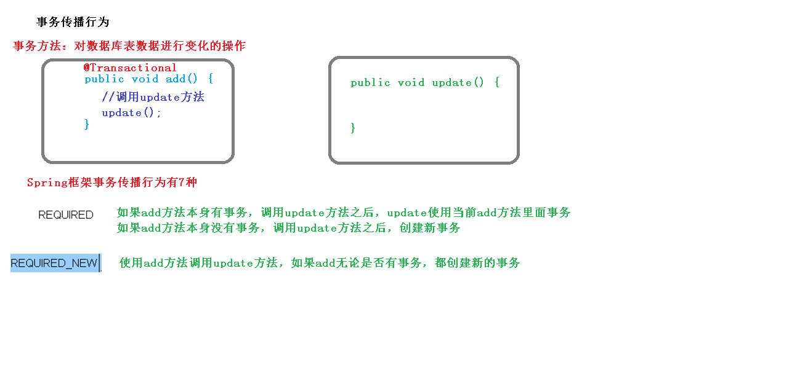
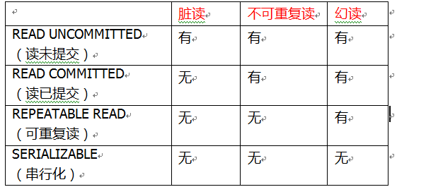

今天就来解析一下数据库实务操作是如何在 Spring 框架中使用的

先前的项目中，我们先后创建了，DAO（Data Access Object）接口，DAO 实现类，以及 Service 业务层类。在这之中，实际是由 DAO 负责数据库操作，而业务操作集合成的事务将放在 Service 一并进行。


按照之前数据库的事务知识，一个事务操作应当含有四个步骤：

- 开启事务
- 进行业务操作
- 如果没有异常，提交事务
- 如果出现异常，回滚事务

### Spring 如何实现事务

两种方法：

- 编程式事务管理（写代码，容易造成代码臃肿）
- 声明式事务管理（常用）

声明式，有两种实现：

1. 基于 XML
2. 基于注解（方便常用）

**声明式事务管理底层基于 AOP**

想一想，需要哪些呢？（Before，After，异常）

Spring 提供一个 API，根据不同框架提供不同服务


#### 基于注解

```xml
<!--    创建事务管理器-->
    <bean id="transactionManager" class="org.springframework.jdbc.datasource.DataSourceTransactionManager">
<!--        和 Template 一样，注入 DataSource 数据源-->
        <property name="dataSource" ref="data"></property>
    </bean>
<!--    开启事务注解-->
    <tx:annotation-driven transaction-manager="transactionManager"></tx:annotation-driven>
```

虽说基于注解，但还是配置下 XML 吧，记住引入 tx 名称空间，其它都比较好懂

这之后你就可以使用相应注解：**@Transactional**

它既可以加到类头上表示该类中所有方法都遵循事务操作，也可以加到某方法头上单独指定

```java
@Transactional
public void insertAll(List<Object[]> ol){
    B.insertAllStu(ol);
    int a=10/0;
}
```

这种情况下，再执行：

```java
Object[] o1=new Object[]{"11","GHOST"};
Object[] o2=new Object[]{"12","KABUTO"};
Object[] o3=new Object[]{"13","DRIVE"};
List<Object[]> ol=new ArrayList<>();
ol.add(o1);
ol.add(o2);
ol.add(o3);
bs.insertAll(ol);
```

最终结果：

```sql
mysql> select * from copy;
+-----+--------+
| SId | Sname  |
+-----+--------+
| 3   | ALISE  |
| 8   | ARGITO |
| 7   | FRANK  |
| 6   | GUNDAM |
| 2   | IMOTO  |
| 4   | KOG    |
| 5   | KUUGA  |
| 1   | OKAMI  |
| 10  | Revice |
| 9   | W      |
+-----+--------+
10 rows in set (0.00 sec)
```

可以发现，由于除零异常，事务被回滚了。

##### 注解内部参数


可以看到，里面又一打可供我们自行配置的参数：

- **propagation：事务传播行为**

  

  ```java
  @Transactional(propagation = Propagation.REQUIRED)
  ```

- **ioslation：事务隔离级别**

  也就是解决之前讨论过的脏读幻读不可重复读等问题，详见之前的数据库笔记

  

  而再设置注解参数时，直接加到后面就 OK 了

  ```java
  @Transactional(propagation = Propagation.REQUIRED,isolation = Isolation.REPEATABLE_READ)
  ```

- **timeout：超时时间**

  超时不必多言，防止资源浪费，到时不提交自动回滚

  默认值 -1，可以自行设置（单位：秒）

  ```java
  @Transactional(timeout = -1,propagation = Propagation.REQUIRED,isolation = Isolation.REPEATABLE_READ)
  ```

- **readOnly：是否只读**

  这里的读指的是查询操作，写指的是增删改

  默认是 false（让你可以自由的 CRUD）

  与 timeout 一样，直接设置值就行

- **rollbackFor：回滚**

  设置哪些异常回滚

- **noRollbackFor：不回滚**

  设置哪些异常不回滚

  最后俩很简单，设置方法也相似，都是直接提供异常类：

  ```java
  //使 Exception 类异常时回滚
  @Transactional(rollbackOn = Exception.class)
  ```

  > 需要注意的是：`rollbackFor`默认值为UncheckedException，包括了RuntimeException和Error.
  >  当我们直接使用`@Transactional`不指定`rollbackFor`时，Checked Exception及其子类都不会触发回滚

#### 基于 XML

有三个步骤：

1. 配置事务管理器（和之前一样）
2. 配置通知
3. 配置切入点然后切面

```xml
<!--1 创建事务管理器-->
<bean id="transactionManager" class="org.springframework.jdbc.datasource.DataSourceTransactionManager">
    <!--注入数据源-->
    <property name="dataSource" ref="dataSource"></property>
</bean>
<!--2 配置通知-->
<tx:advice id="txadvice">
    <!--配置事务参数-->
    <tx:attributes>
        <!--指定哪种规则的方法上面添加事务-->
        <tx:method name="accountMoney" propagation="REQUIRED"/>
        <!--<tx:method name="account*"/>-->
    </tx:attributes>
</tx:advice>
<!--3 配置切入点和切面-->
<aop:config>
    <!--配置切入点-->
    <aop:pointcut id="pt" expression="execution(* com.atguigu.spring5.service.UserService.*(..))"/>
    <!--配置切面-->
    <aop:advisor advice-ref="txadvice" pointcut-ref="pt"/>
</aop:config>
```

总的来说不难，而且咱也不怎么用啊哈哈

#### 完全注解开发

之前做基于注解时，可以发现仍然使用了部分 XML 配置（比如创建事务管理器和开启注解）

这次我们通过创建配置类来实现完全注解开发

```java
@Configuration //配置类
@ComponentScan(basePackages = "com.atguigu") //组件扫描
@EnableTransactionManagement //开启事务
public class TxConfig {
    //创建数据库连接池
    @Bean
    public DruidDataSource getDruidDataSource() {
        DruidDataSource dataSource = new DruidDataSource();
        dataSource.setDriverClassName("com.mysql.jdbc.Driver");
        dataSource.setUrl("jdbc:mysql:///user_db");
        dataSource.setUsername("root");
        dataSource.setPassword("root");
        return dataSource;
    }
    //创建 JdbcTemplate 对象
    @Bean
    public JdbcTemplate getJdbcTemplate(DataSource dataSource) {
        //到 ioc 容器中根据类型找到 dataSource
        JdbcTemplate jdbcTemplate = new JdbcTemplate();
        //注入 dataSource
        jdbcTemplate.setDataSource(dataSource);
        return jdbcTemplate;
    }
    //创建事务管理器
    @Bean
    public DataSourceTransactionManager getDataSourceTransactionManager(DataSource dataSource) {
        DataSourceTransactionManager transactionManager = new 
            DataSourceTransactionManager();
        transactionManager.setDataSource(dataSource);
        return transactionManager;
    }
}
```

不过，**ClassPathXmlApplicationContext("jdbc.xml")** 应该改为 **AnnotationConfigApplicationContext(【配置类类名】)**

而 SpringBoot 本身就是对 Spring 的一次再封装，所以实现这些更为容易。
