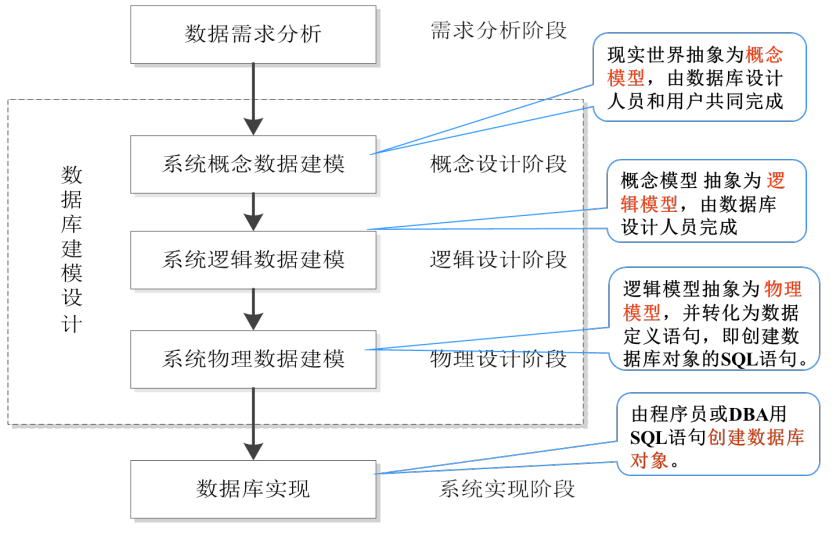
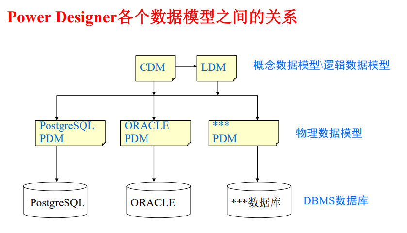

数据库结构设计一般分为概念层、逻辑层和物理层设计

相对的，有三种设计模型：

- **概念数据模型**

  是一种面向用户的系统数据模型，它用来描述现实世界的系统概念化数据结构。使数据库设计人员在系统设计的初始阶段，摆脱计算机系统及 DBMS 的具体技术问题，集中精力分析业务数据以及数据之间 的联系等，描述系统的数据对象及其组成关系

- **逻辑数据模型**

  是在概念数据模型基础上，从系统设计角度描述系统的数据对象组成及其关联结构，并考虑这些数据对象符合数据库对象的逻辑表示

- **物理数据模型**

  是在逻辑数据模 型基础上，针对具体DBMS所设计的数据模型。它用于描述系 统数据模型在具体 DBMS 中的数据对象组织、存储方式、索引 方式、访问路径等实现信息

### ER 模型

**实体(Entity)**

- **概念**：一个现实世界中有别于其它对象的对象。
- **注意**：可以是具体的、也可以是抽象的。
- **示例**：某某学生、某某老师、某门课程

**属性（Attribute）**

数据库结构设计一般分为概念层、逻辑层和物理层设计

相对的，有三种设计模型：

- **概念数据模型**

  是一种面向用户的系统数据模型，它用来描述现实世界的系统概念化数据结构。使数据库设计人员在系统设计的初始阶段，摆脱计算机系统及 DBMS 的具体技术问题，集中精力分析业务数据以及数据之间 的联系等，描述系统的数据对象及其组成关系

- **逻辑数据模型**

  是在概念数据模型基础上，从系统设计角度描述系统的数据对象组成及其关联结构，并考虑这些数据对象符合数据库对象的逻辑表示

- **物理数据模型**

  是在逻辑数据模 型基础上，针对具体DBMS所设计的数据模型。它用于描述系 统数据模型在具体 DBMS 中的数据对象组织、存储方式、索引 方式、访问路径等实现信息

### ER 模型

**实体(Entity)**

- **概念**：一个现实世界中有别于其它对象的对象。
- **注意**：可以是具体的、也可以是抽象的。
- **示例**：某某学生、某某老师、某门课程

**属性（Attribute）**

数据库结构设计一般分为概念层、逻辑层和物理层设计

相对的，有三种设计模型：

- **概念数据模型**

  是一种面向用户的系统数据模型，它用来描述现实世界的系统概念化数据结构。使数据库设计人员在系统设计的初始阶段，摆脱计算机系统及 DBMS 的具体技术问题，集中精力分析业务数据以及数据之间 的联系等，描述系统的数据对象及其组成关系

- **逻辑数据模型**

  是在概念数据模型基础上，从系统设计角度描述系统的数据对象组成及其关联结构，并考虑这些数据对象符合数据库对象的逻辑表示

- **物理数据模型**

  是在逻辑数据模 型基础上，针对具体DBMS所设计的数据模型。它用于描述系 统数据模型在具体 DBMS 中的数据对象组织、存储方式、索引 方式、访问路径等实现信息

### ER 模型

**实体(Entity)**

- **概念**：一个现实世界中有别于其它对象的对象。
- **注意**：可以是具体的、也可以是抽象的。
- **示例**：某某学生、某某老师、某门课程

**属性（Attribute）**

- **概念**：实体的特征或性质，即实体用若干属性来描述。
- **示例**：学生的学号、姓名、生日、年龄、性别、住址等；课程的课程号、课程名、学时、学分、开课学院等。
- **分类(按结构)**：简单属性(不可再分)复合属性和子属性。
- **示例**：复合—姓名(现用名、曾用名、英文名)；住址(省、市、区、街道、门牌号、邮政编码)

**域（Domain）**

- **概念**：属性的取值范围。

- **按域的取值分**：单值、多值、导出和空值(NULL)等属性。

- **示例**：

  ① 单值属性—性别（每个实体只有唯一确定的值）
  ② 多值属性—学位值(学士、硕士、博士)；
  ③ 导出属性—年龄（是出生日期计算出年龄）

**键（Key）**

- **概念**：用于 **唯一标识** 集合中的每个实体的一组属性。

- **示例**：学生的学号；课程的课程号；选课的学号及课程号

- **键的分类(按属性个数)**：简单键、复合键。

  ① 由单个属性构成的键，称为简单键 

  ② 由两个或两个以上属性构成的键，称为复合键

- **候选键(Candidate Key)**：有多种选择作为键的属性或属性集，且属 性集的任何属性都不可缺少，如缺少任意属性，就不能成为键。

- **主键(Primary Key)**：当存在多个候选键时，需选定一个作为实体的 主键。是描述实体的唯一标识。示例：学生的身份证号、学号等。

> #### 1、书中的定义
>
> **超键(super key)**: 在关系中能唯一标识元组的属性集称为关系模式的超键
>
> **候选键(candidate key)**: 不含有多余属性的超键称为候选键。也就是在候选键中，若再删除属性，就不是键了！
>
> **主键(primary key)**: 用户选作元组标识的一个候选键程序主键
>
> **外键(foreign key)**：如果关系模式R中属性K是其它模式的主键，那么k在模式R中称为外键。
>
> #### 2、咱们创建简单的两个表，说明一下各个键！
>
> 学生信息（学号 身份证号 性别 年龄 身高 体重 宿舍号）和 宿舍信息（宿舍号 楼号）
>
> **超键**：只要含有“学号”或者“身份证号”两个属性的集合就叫超键，例如R1（学号 性别）、R2（身份证号 身高）、R3（学号 身份证号）等等都可以称为超键！
>
> **候选键**：不含有多余的属性的超键，比如（学号）、（身份证号）都是候选键，又比如R1中学号这一个属性就可以唯一标识元组了，而有没有性别这一属性对是否唯一标识元组没有任何的影响！
>
> **主键**：就是用户从很多候选键选出来的一个键就是主键，比如你要求学号是主键，那么身份证号就不可以是主键了！
>
> **外键**：宿舍号就是学生信息表的外键

