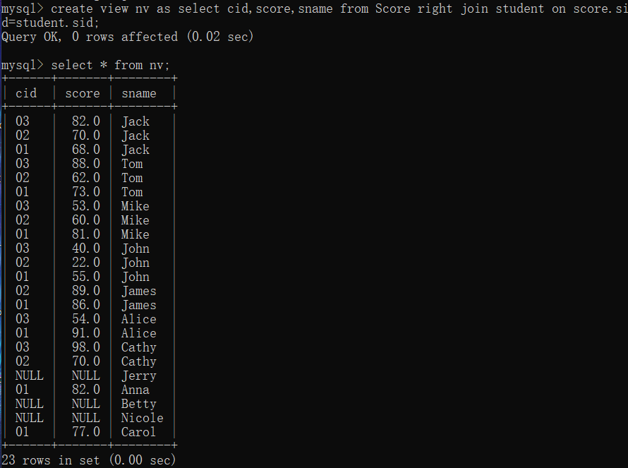

### 数据控制SQL语句

是一种可对用户数据访问权进行控制 的操作语句，它可以控制特定用户或角色对数据表、视图、存储过程、 触发器等数据库对象的访问权限。

主要有如下语句： 

- GRANT授权语句 
- REVOKE收权语句 
- DENY拒绝权限语句

#### GRANT授权语句

授权主要就是增删查改四个功能

```sql
GRANT <权限列表> ON <数据库对象> TO <用户或角色> [ WITH GRANT OPTION ]；
```

#### REVOKE收权语句 

与 GRANT 对应，回收权限。

```sql
REVOKE <权限列表> ON <数据库对象> FROM <用户或角色
```

#### DENY拒绝权限语句

和 REVOKE 不同的是，DENY 不会管你之前有什么权限，在 DENY 相应权限后也禁止授权

```sql
DENY <权限列表> ON <数据库对象> TO <用户或角色> 
```

### 视图

视图——是一种通过基础表或其它视图构建的虚拟表。它本身没有自己的数据，而是使用了存储在基础表中的数据

<font size="7">没有真实结构</font>

语法：

```sql
CREATE VIEW <视图名>[(列名1)，(列名2)，…] AS <SELECT查询>；
```

建立的视图可以像普通表一样使用



删除视图与删除表结构一样，使用 **DROP** 语句：

```sql
DROP VIEW <视图名>
```

视图可以对敏感或冗余信息进行过滤，保证数据库的安全性与简洁

### 公用表达式

可以看做 一个临时的结果集，在接下来的select ，insert，update，delete可以被 多次引用。使用公用表达式CTE可以让语句更加清晰简练。 

> 临时存储结果集的方法：
>
> - 临时表
> - 表变量

```sql
with 公用表达式名字(列名1,列名2,….,列名n) as 		*STEP1*
(select 列1,列2,….,列n from xxx where 条件)			*STEP2*
select * from 公用表达式名字;						*STEP3*
```

> <font size="7">☢</font>注意，单独声明一个公用表达式是没用甚至错误的，一定要后接引用才行，也就是 *STEP1*、*STEP2* 之后一定要有 *STEP3* 再结束语句。


<font size="5" color="red">视图和临时表 、表变量之间比较</font>

| 视图           | 是一条预编译的SQL语句，并不保存实际数据。是一个快 照，一个虚表，不分配物理空间。 |
| -------------- | ------------------------------------------------------------ |
| **快照临时表** | **保存在tempdb中的实际的表，是客观存在的表类型 对象。分配物理空间。** |
| **表变量**     | **和普通的变量一样，在定义表变量的存储过程、批处理 、动态语句、函数结束时，会自动清除。** |

> **with...as语句**
>
> （1）with...as语句，也称为子查询部分（subquery factoring），定义 一个SQL片段，该SQL片段会被整个SQL语句所用到。 
>
> （2）如果WITH AS所以定义的表名被调用两次以上，则优化器会自 动将WITH AS所获取的数据放入临时表里，如果只是被调用一次， 则不会。可以通过materialize将WITH AS短语里的数据强制放入全局 临时表里。 
>
> （3）WITH AS可以被紧跟着的一条SQL语句所使用多次，但不能被 紧跟着的多条SQL语句使用。

### UNION & UNION ALL

**UNION** 操作符用于合并两个或多个 SELECT 语句的结果集。 请注意，UNION 内部的 SELECT 语句必须拥有相同数量的列。列也必须拥有相似的数据类型。同时，每条 SELECT 语句中的列的顺序必须相同。

```sql
SELECT column_name(s) FROM table_name1
UNION
SELECT column_name(s) FROM table_name2
```

这时，合并结果集会自动去重，如果想要保留重复结果，就要使用 UNION ALL

```sql
SELECT column_name(s) FROM table_name1
UNION ALL
SELECT column_name(s) FROM table_name2
```

### RECURSIVE

[MySql8 WITH RECURSIVE递归查询父子集的方法_Mysql_脚本之家 (jb51.net)](https://www.jb51.net/article/202247.htm)

```sql
WITH RECURSIVE t(n) AS(
	VALUES(1)
	UNION ALL
	SELECT n+1 FROM t WHERE n<100
)
SELECT * FROM t;
```

实际上，在数据库中，这个并不是纯粹的递归，而是被处理为循环。

在最内层，n >= 100，因此 `SELECT n+1 FROM t WHERE n<100` 不会执行，只会有 `VALUES(1)` ——也就是最小的那个 1

递归倒数第二层，凑上了 `VALUES(1)` 之后会有一次 n+1，全部 n 所属列的元素都会加一

按这样的规矩，实际上最外层的 `VALUES(1)` 在最后就变成了 **100** 

所以实际上最后 `n<100` 就只是限制搜寻范围，实际上这个结果集是无穷的

### DISTINCT

> 在表中，一个列可能会包含多个重复值，有时您也许希望仅仅列出不同（distinct）的值。
>
> DISTINCT 关键词用于返回唯一不同的值。
>
> ### SQL SELECT DISTINCT 语法
>
> ```sql
> SELECT DISTINCT column_name,column_name
> FROM *table_name*;
> ```

比如下方 CARD_OWNER 表：

| cid  | cname |
| ---- | ----- |
| 1245 | Tobby |
| 1233 | Calif |
| 4535 | Tobby |

Tobby 出现了两次，使用 `SELECT DISTINCT cname FROM CARD_OWNER;` 就会返回：

| cname |
| ----- |
| Tobby |
| Calif |

