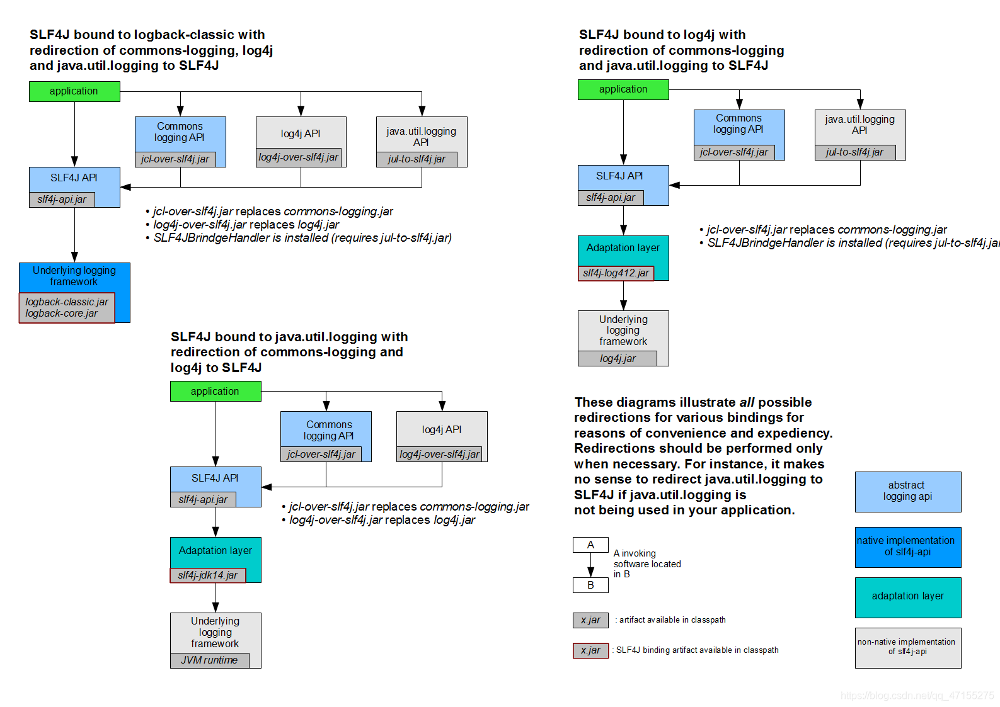

Spring5 不仅优化了代码，还砍掉了一众不推荐的或不经常使用的功能。而 log4j 也强制更新到了 log4j2——这就很要命了，前阵子才出来了巨型漏洞，至少像我这样的个人开发者（目前）掂量掂量着就换 logback 了。

依据下面两张图整合其他日志框架：

> 中间包替换原有日志框架依据图：
> 

> slf4j整合其他日志框架依据图：
> 

然后我就找到了很详细的一篇文章：

> ```xml
> <?xml version="1.0" encoding="UTF-8"?>
> <!-- 
> 	scan:当此属性设置为true时，配置文件如果发生改变，将会被重新加载，默认值为true。
> 	scanPeriod:设置监测配置文件是否有修改的时间间隔，如果没有给出时间单位，默认单位是毫秒。当scan为true时，此属性生效。默认的时间间隔为1分钟。
> 	debug:当此属性设置为true时，将打印出logback内部日志信息，实时查看logback运行状态。默认值为false。
>  -->
> <configuration scan="true" scanPeriod="60 seconds" debug="true">
> 	<!-- 定义变量APP_NAME用于区分不同应用的的记录 -->
> 	<property name="APP_NAME" value="bills" />
> 	<!-- 定义变量LOG_HOME用于配置log日志生成的目录  -->
> 	<property name="LOG_HOME" value="/logs/bills/" />
> 	<!-- 定义输出日志的格式
> 	   %d{yyyy-MM-dd  HH:mm:ss.SSS} 定义日期格式兼容java.text.SimpleDateFormat语法 2014-03-25 14:06:49.812
> 	   %thread 输出产生日志的线程名
> 	   %-5level 输出日志级别
> 	   %logger{80}设置为80表示只输入logger最右边点符号之后的字符串，从最后一个标点符号往前数
> 	   %msg 输出应用程序提供的信息
> 	   %n输出平台相关的分行符“\n”或者“\r\n”
> 	 -->
> 	<property name="ENCODER_PATTERN" value="%d{yyyy-MM-dd  HH:mm:ss.SSS} [%thread] %-5level %logger{80} - %msg%n" />
> 	<contextName>${APP_NAME}</contextName>
> 
> 	<!-- appender是<configuration>的子节点，是负责写日志的组件。
>                    两个必要属性name和class。name指定appender名称，class指定appender的全限定名
>                  定义控制台appender   class="ch.qos.logback.core.ConsoleAppender" 
>                  作用：把日志输出到控制台
> 	    <encoder>子节点 对日志进行格式化
> 	    <target>子节点：字符串 System.out 或者 System.err ，默认 System.out ；
> 	-->
> 	<appender name="STDOUT" class="ch.qos.logback.core.ConsoleAppender">
> 		<encoder class="ch.qos.logback.classic.encoder.PatternLayoutEncoder">
> 			<Pattern>${ENCODER_PATTERN}</Pattern>
> 		</encoder>
> 	</appender>
> 
> 	<!--RollingFileAppender 滚动记录文件，先将日志记录到指定文件，当符合某个条件时，将日志记录到其他文件.
> 	        class="ch.qos.logback.core.rolling.RollingFileAppender"
> 	     参数： 
> 	     <rollingPolicy>:当发生滚动时，决定 RollingFileAppender 的行为，涉及文件移动和重命名。
> 	     <file>：被写入的文件名，可以是相对目录，也可以是绝对目录，如果上级目录不存在会自动创建，没有默认值。
> 	     <append>：如果是 true，日志被追加到文件结尾，如果是 false，清空现存文件，默认是true。
> 	     <encoder>：对记录事件进行格式化
> 	     <triggeringPolicy >: 告知 RollingFileAppender 合适激活滚动。
>          <prudent>：当为true时，不支持FixedWindowRollingPolicy。支持TimeBasedRollingPolicy，但是有两个限制，1不支持也不允许文件压缩，2不能设置file属性，必须留空。
> 	 -->
> 	<appender name="FILE" class="ch.qos.logback.core.rolling.RollingFileAppender">
> 	    <!-- rollingPolicy滚动策略
> 	       TimeBasedRollingPolicy： 最常用的滚动策略，它根据时间来制定滚动策略，既负责滚动也负责出发滚动。有以下子节点：
>               <fileNamePattern>:必要节点，包含文件名及“%d”转换符， “%d”可以包含一个 java.text.SimpleDateFormat指定的时间格式，如：%d{yyyy-MM}。如果直接使用 %d，默认格式是 yyyy-MM-dd。 
>                  RollingFileAppender 的file字节点可有可无，通过设置file，可以为活动文件和归档文件指定不同位置，当前日志总是记录到file指定的文件（活动文件），活动文件的名字不会改变；
>                                          如果没设置file，活动文件的名字会根据fileNamePattern 的值，每隔一段时间改变一次。“/”或者“\”会被当做目录分隔符。
>               <maxHistory>:可选节点，控制保留的归档文件的最大数量，超出数量就删除旧文件。假设设置每个月滚动，且 <maxHistory>是6，则只保存最近6个月的文件，删除之前的旧文件。注意，删除旧文件是，那些为了归档而创建的目录也会被删除。
>            FixedWindowRollingPolicy：根据固定窗口算法重命名文件的滚动策略。有以下子节点
>               <minIndex>:窗口索引最小值
>               <maxIndex>:窗口索引最大值，当用户指定的窗口过大时，会自动将窗口设置为12。
>               <fileNamePattern >:必须包含“%i”例如，假设最小值和最大值分别为1和2，命名模式为 mylog%i.log,会产生归档文件mylog1.log和mylog2.log。还可以指定文件压缩选项，例如，mylog%i.log.gz 或者 没有log%i.log.zip
> 	     -->
> 		<rollingPolicy class="ch.qos.logback.core.rolling.TimeBasedRollingPolicy">
> 			<fileNamePattern>${LOG_HOME}/output.%d{yyyy-MM-dd}.log</fileNamePattern>
> 			<maxHistory>7</maxHistory>
> 		</rollingPolicy>
> 		<encoder class="ch.qos.logback.classic.encoder.PatternLayoutEncoder">
> 			<pattern>${ENCODER_PATTERN}</pattern>
> 		</encoder>
> 	</appender>
> 
> 	<!-- 
> 	
> 	-->
> 	<appender name="ERROR_FILE" class="ch.qos.logback.core.rolling.RollingFileAppender">
> 		<rollingPolicy class="ch.qos.logback.core.rolling.TimeBasedRollingPolicy">
> 			<fileNamePattern>${LOG_HOME}/error.%d{yyyy-MM-dd}.log</fileNamePattern>
> 			<maxHistory>7</maxHistory>
> 		</rollingPolicy>
> 		<encoder class="ch.qos.logback.classic.encoder.PatternLayoutEncoder">
> 			<pattern>${ENCODER_PATTERN}</pattern>
> 		</encoder>
> 		<!-- filter过滤器，执行一个过滤器会有返回个枚举值，即DENY，NEUTRAL，ACCEPT其中之一。
> 		             返回DENY，日志将立即被抛弃不再经过其他过滤器；
> 		             返回NEUTRAL，有序列表里的下个过滤器过接着处理日志；
> 		             返回ACCEPT，日志会被立即处理，不再经过剩余过滤器。
> 		             过滤器被添加到<Appender> 中，为<Appender> 添加一个或多个过滤器后，可以用任意条件对日志进行过滤。<Appender> 有多个过滤器时，按照配置顺序执行。
> 		  LevelFilter： 级别过滤器，根据日志级别进行过滤。如果日志级别等于配置级别，过滤器会根据onMath 和 onMismatch接收或拒绝日志。有以下子节点
> 		     <level>:设置过滤级别
>              <onMatch>:用于配置符合过滤条件的操作
>              <onMismatch>:用于配置不符合过滤条件的操作
>                                 如：将过滤器的日志级别配置为INFO，所有INFO级别的日志交给appender处理，非INFO级别的日志，被过滤掉。
>                <filter class="ch.qos.logback.classic.filter.LevelFilter">   
> 			      <level>INFO</level>   
> 			      <onMatch>ACCEPT</onMatch>   
> 			      <onMismatch>DENY</onMismatch>   
> 			  </filter>
> 		  ThresholdFilter： 临界值过滤器，过滤掉低于指定临界值的日志。
> 		                当日志级别等于或高于临界值时，过滤器返回NEUTRAL；当日志级别低于临界值时，日志会被拒绝。
>                                     例如：过滤掉所有低于INFO级别的日志。
>               <filter class="ch.qos.logback.classic.filter.ThresholdFilter">  
>                   <level>INFO</level>   
> 		      </filter> 
> 		  EvaluatorFilter： 求值过滤器，评估、鉴别日志是否符合指定条件。需要额外的两个JAR包，commons-compiler.jar和janino.jar有以下子节点：
> 		      <evaluator>:鉴别器，常用的鉴别器是JaninoEventEvaluato，也是默认的鉴别器，它以任意的java布尔值表达式作为求值条件，
> 		                          求值条件在配置文件解释过成功被动态编译，布尔值表达式返回true就表示符合过滤条件。evaluator有个子标签<expression>，用于配置求值条件。
> 		      <onMatch>:用于配置符合过滤条件的操作
>               <onMismatch>:用于配置不符合过滤条件的操作
>                                       例如：过滤掉所有日志消息中不包含“******”字符串的日志。
>                <filter class="ch.qos.logback.core.filter.EvaluatorFilter">         
> 			      <evaluator>  默认为 ch.qos.logback.classic.boolex.JaninoEventEvaluator 
> 			         <expression>return message.contains("******");</expression>   
> 			      </evaluator>   
> 			      <OnMatch>ACCEPT </OnMatch>  
> 			      <OnMismatch>DENY</OnMismatch>  
> 			    </filter>   
> 		 -->
> 		<filter class="ch.qos.logback.classic.filter.ThresholdFilter">
> 			<level>WARN</level>
> 		</filter>
> 	</appender>
> 	
> 	<!-- 定义包/类级别的 appender-->
> 	<appender name="HISUN_FILE"  class="ch.qos.logback.core.rolling.RollingFileAppender">
> 		<rollingPolicy class="ch.qos.logback.core.rolling.TimeBasedRollingPolicy">
> 			<fileNamePattern>${LOG_HOME}/hisun.%d{yyyy-MM-dd}.log</fileNamePattern>
> 			<maxHistory>7</maxHistory>
> 		</rollingPolicy>
> 		<encoder class="ch.qos.logback.classic.encoder.PatternLayoutEncoder">
> 			<pattern>${ENCODER_PATTERN}</pattern>
> 		</encoder>
> 	</appender>
> 	<!--logger 用来设置某一个包或者具体的某一个类的日志打印级别、以及指定<appender>。<loger>仅有一个name属性，一个可选的level和一个可选的addtivity属性。
> 	    name:用来指定受此loger约束的某一个包或者具体的某一个类。
> 	    level:用来设置打印级别，大小写无关：TRACE, DEBUG, INFO, WARN, ERROR, ALL 和 OFF 
> 	    addtivity:是否向上级loger传递打印信息。默认是true,会将信息输入到root配置指定的地方
> 	    * 可以包含多个appender-ref，标识这个appender会添加到这个logger
>     -->
> 	<logger name="com.hisun" level="ALL" addtivity="true">
> 		<appender-ref ref="HISUN_FILE" />
> 		
> 	</logger>
> 	<!-- 
> 	      将root的打印级别设置为“INFO”，指定了名字为"FILE","STDOUT","ERROR_FILE"的appender。
> 	 -->
> 	<root>
> 		<level value="ALL" />
> 		<appender-ref ref="FILE" />
> 		<appender-ref ref="ERROR_FILE" />
> 	</root>
> </configuration>
> ```
>
> 可惜不符合我的文件结构，所以我另外找了一个（[Spring5.x与日志框架的整合 - codedot - 博客园 (cnblogs.com)](https://www.cnblogs.com/myitnews/p/14040489.html)）：
>
> ```xml
> <?xml version="1.0" encoding="UTF-8"?>
> <configuration>
> 
>     <!-- 模块名 -->
>     <contextName>OS_PRO</contextName>
> 
>     <!--定义日志文件的存储地址 logs为当前项目的logs目录 还可以设置为../logs -->
>     <property name="LOG_HOME" value="logs" />
> 
>     <!--控制台日志， 控制台输出 -->
>     <appender name="STDOUT" class="ch.qos.logback.core.ConsoleAppender">
>         <encoder class="ch.qos.logback.classic.encoder.PatternLayoutEncoder">
>             <!--格式化输出：%d表示日期，%thread表示线程名，%-5level：级别从左显示5个字符宽度,%msg：日志消息，%n是换行符-->
>             <pattern>%d{yyyy-MM-dd HH:mm:ss.SSS} [%thread] %-5level %logger{50} - %msg%n</pattern>
>         </encoder>
>     </appender>
> 
>     <!--文件日志， 按照每天生成日志文件 -->
>     <appender name="FILE_ERROR" class="ch.qos.logback.core.rolling.RollingFileAppender">
>         <rollingPolicy class="ch.qos.logback.core.rolling.TimeBasedRollingPolicy">
>             <!--日志文件输出的文件名-->
>             <fileNamePattern>${LOG_HOME}/error-%d{yyyy-MM-dd}.log</fileNamePattern>
>             <!--日志文件保留天数-->
>             <maxHistory>30</maxHistory>
>         </rollingPolicy>
>         <encoder class="ch.qos.logback.classic.encoder.PatternLayoutEncoder">
>             <!--格式化输出：%d表示日期，%thread表示线程名，%-5level：级别从左显示5个字符宽度%msg：日志消息，%n是换行符-->
>             <pattern>%d{yyyy-MM-dd HH:mm:ss.SSS} [%thread] %-5level %logger{50} - %msg%n</pattern>
>             <charset>UTF-8</charset>
>         </encoder>
>         <!--日志文件最大的大小-->
>         <triggeringPolicy class="ch.qos.logback.core.rolling.SizeBasedTriggeringPolicy">
>             <maxFileSize>10MB</maxFileSize>
>         </triggeringPolicy>
>         <!-- 过滤掉 低于ERROR级别的-->
>         <filter class="ch.qos.logback.classic.filter.ThresholdFilter">
>             <level>WARN</level>
>         </filter>
>     </appender>
> 
>     <!--文件日志， 按照每天生成日志文件 -->
>     <appender name="FILE_DEBUG" class="ch.qos.logback.core.rolling.RollingFileAppender">
>         <rollingPolicy class="ch.qos.logback.core.rolling.TimeBasedRollingPolicy">
>             <!--日志文件输出的文件名-->
>             <fileNamePattern>${LOG_HOME}/debugAndInfo-%d{yyyy-MM-dd}.log</fileNamePattern>
>             <!--日志文件保留天数-->
>             <maxHistory>30</maxHistory>
>         </rollingPolicy>
>         <encoder class="ch.qos.logback.classic.encoder.PatternLayoutEncoder">
>             <!--格式化输出：%d表示日期，%thread表示线程名，%-5level：级别从左显示5个字符宽度%msg：日志消息，%n是换行符-->
>             <pattern>%d{yyyy-MM-dd HH:mm:ss.SSS} [%thread] %-5level %logger{50} - %msg%n</pattern>
>             <charset>UTF-8</charset>
>         </encoder>
>         <!--日志文件最大的大小-->
>         <triggeringPolicy class="ch.qos.logback.core.rolling.SizeBasedTriggeringPolicy">
>             <maxFileSize>10MB</maxFileSize>
>         </triggeringPolicy>
>         <!-- 过滤掉 低于DEBUG级别的-->
>         <filter class="ch.qos.logback.classic.filter.ThresholdFilter">
>             <level>DEBUG</level>
>         </filter>
>     </appender>
> 
>     <!-- spring及apache-->
>     <logger name="org.springframework" level="INFO" />
>     <logger name="org.apache.http" level="INFO" />
> 
>     <!-- show parameters for hibernate sql 专为 Hibernate 定制 -->
>     <logger name="org.hibernate.type.descriptor.sql.BasicBinder" level="TRACE" />
>     <logger name="org.hibernate.type.descriptor.sql.BasicExtractor" level="DEBUG" />
>     <logger name="org.hibernate.SQL" level="DEBUG" />
>     <logger name="org.hibernate.engine.QueryParameters" level="DEBUG" />
>     <logger name="org.hibernate.engine.query.HQLQueryPlan" level="DEBUG" />
> 
>     <!-- mybatis log configure-->
>     <logger name="com.apache.ibatis" level="TRACE"/>
>     <logger name="java.sql.Connection" level="DEBUG"/>
>     <logger name="java.sql.Statement" level="DEBUG"/>
>     <logger name="java.sql.PreparedStatement" level="DEBUG"/>
> 
>     <!--日志的输出级别由低到高（越来问题越严重）trace->debug->info->warn->error -->
>     <!-- 日志输出级别 生成上禁止DEBUG, 至少INFO级别-->
>     <root level="INFO">
>         <!-- 生产上 STDOUT 要注释掉 -->
>         <appender-ref ref="STDOUT" />
>         <appender-ref ref="FILE_DEBUG"/>
>         <appender-ref ref="FILE_ERROR"/>
>     </root>
> </configuration>
> ```

需要导入 `slf4j-api`，`logback-classic`，`logback-core` 三个包，和 log4j 一样，配置文件名字时固定的——**logback.xml**，还有一个本地测试配置类 **logback-test.xml**

最后效果：

