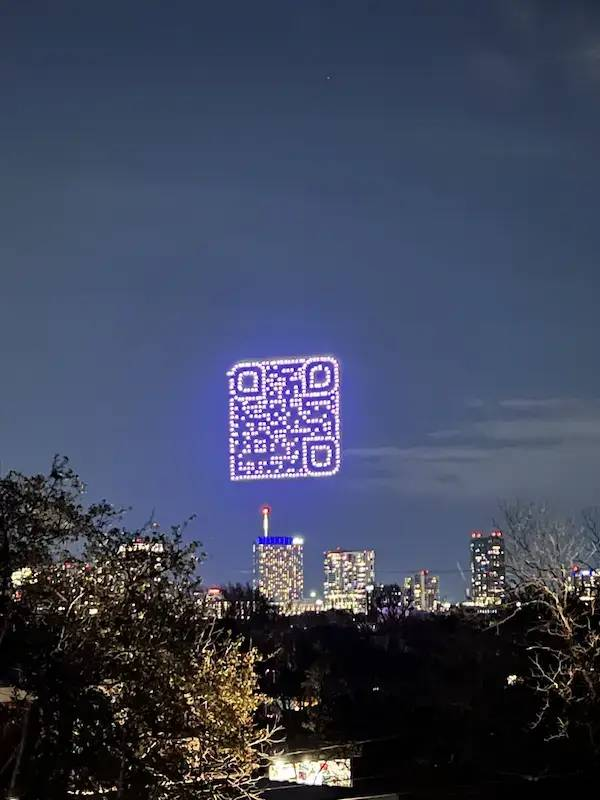
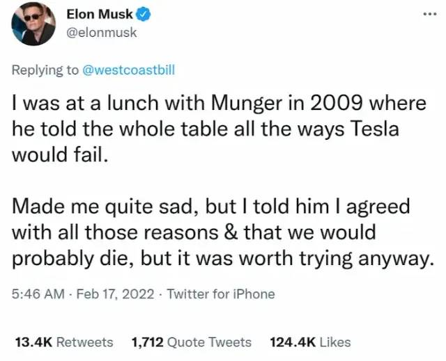
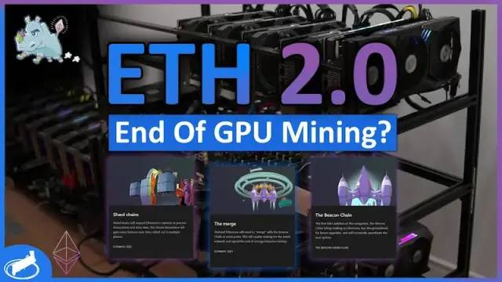
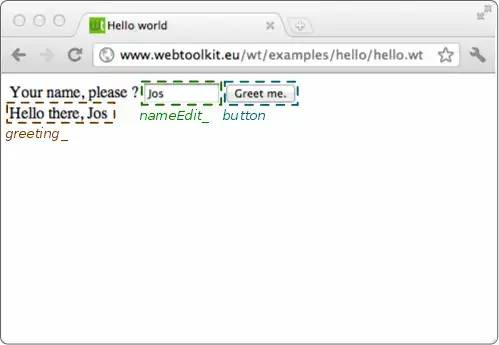
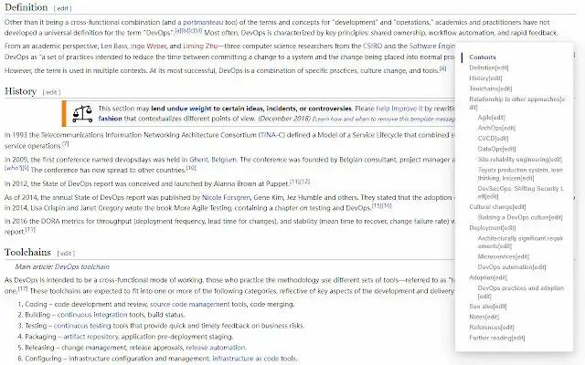
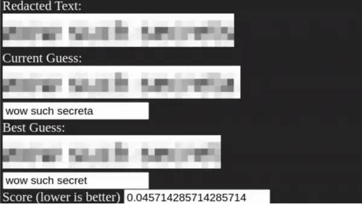
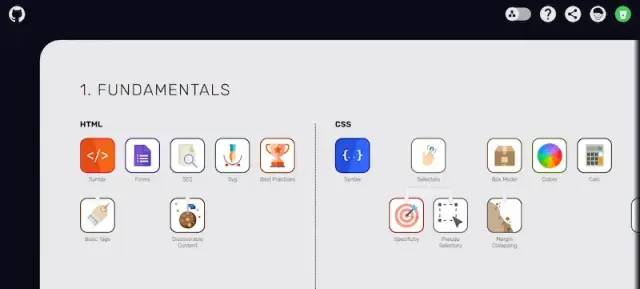

> 派拉蒙影业公司使用400架无人机，在美国德州奥斯汀市上空，组成了一个全世界最大的二维码。它是可以扫描的，指向该公司即将上映的科幻影集《Halo》。这种方式的宣传效果很好，以后城市的上空也许经常会出现飞翔的二维码。

绝了，这样的广告虽算不上精美，也十分有创意了。

关于 HALO，也就是著名游戏系列光环——在外国已经俨然形成自己的游戏文化了。这次的封面图就是游戏的一张概念图（超帅

### 低期望，多尝试

> 马斯克最近在推特上，说了一件往事。2009年，他与著名投资家芒格共进午餐。
>
> 
>
> 他对芒格说，自己打算投资做特斯拉。芒格极其不看好电动汽车，认为肯定会失败，一条条给他分析理由，劝他不要做。
>
> 马斯克听了很难过，对芒格说，你的理由我都同意而且我也可能因此遭遇危机，但是无论如何，我都打算尝试一下。
>
> 这条推特的下面，很多人留言，称赞马斯克的远见，感叹芒格年纪大了，太保守了。

实际上两人的观点在某种角度上都是对的。保守的眼光固然重要，但是有些时候如果有你认为的不得不做、一生中仅此一次的机会，就不能犹豫。人生中有无数事情可以保持稳重，但能让我们疯狂的也就只有那一两件、最重要的事。

### 科技动向

显卡与以太坊区块链[6]

本周，国外的显卡价格大降，澳大利亚的 RTX 3080 显卡据说一天内跌价35%。有的分析认为，这与以太坊即将切换区块链的共识机制有关。

目前，以太坊的测试链已经运行成功，可能会在6月份与主链合并，到时共识机制将从工作量证明（PoW）切换到权益证明（PoS）。切换后，**新的节点不通过计算哈希产生**，这意味着显卡挖矿没用了。

一旦以太坊不再为了挖矿耗费能源，这对加密货币会产生什么影响，令人非常好奇。

谢天谢地！显卡要降啦！（其实国内说不准）

### 工具

#### [Wt](https://www.webtoolkit.eu/wt/)

一个 C++ 框架，用来写上面一样的网页。淦哦你们真会玩

#### [Smart TOC](https://github.com/lcomplete/smart-toc)

一个开源的浏览器插件，自动为网页内容生成目录，便于浏览与跳转。

#### [Unredacter](https://github.com/bishopfox/unredacter)

这个工具可以还原马赛克图片的原始内容。

原理就是暴力破解，只能说下次最好用涂抹覆盖不要用马赛克

### 资源

#### [Web 技能图卡](https://andreasbm.github.io/web-skills/)

这个网站以图卡的形式，整理出了 Web 开发所需的各种技能，并且进行了分类。

#### [野生架构师周刊](https://www.getrevue.co/profile/lcomplete)

网友写的中文周刊，介绍软件开发的各种内容，目前发到第11期。

#### [开始音乐创作之旅](https://learningmusic.ableton.com/zh-Hans/)

可视化的音乐教程，介绍了音乐的组成：鼓、贝斯、和弦与旋律，用户可以在网页界面上按照其提供的基本组成来构建自己的 demo。