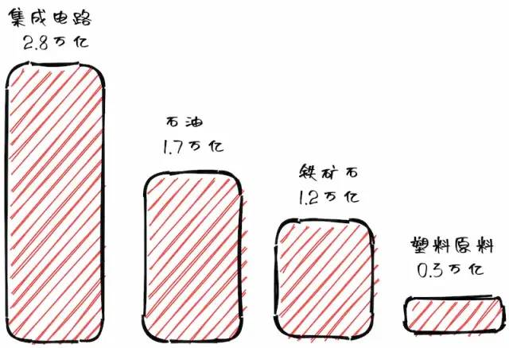

### 话题：中国科技的软肋——半导体

上个月，国家统计局公布了《中国2021年统计公报》。

去年，中国进口最多的三样商品依次是集成电路、石油和铁矿石。

集成电路占了全部进口的16%，约等于石油和铁矿石的总和。由此可见，**中国经济对于进口集成电路的依赖，要大于对于进口石油的依赖。** 中国已经是世界石油进口最多的国家，可想而知，集成电路的进口规模有多大。

为什么会进口这么多集成电路呢？原因很简单，我们自己生产不了高端计算机芯片，不得不进口。

目前，世界最先进的半导体工艺是台积电的 5nm，已经投产了，据说 3nm 今年也将投产，明后年就是 1nm。作为比较，大陆最先进的工艺是中芯国际的 14nm，但是产量较少，且核心的光刻机依赖国外，因此大部分 14nm 和所有 14nm 以下的芯片现在都依赖进口，这包括了几乎所有家用电脑和手机的 CPU 芯片。

硬件的贫弱，是我们科技道路上的软肋！现在，政府的规划是尽快实现 28nm 全程国产化，然后再实现 14nm 的国产化，但能否实现、何时实现都不确定。

不用谈之前被制裁的中兴跌的有多惨，像华为这样一直宣扬自主研发的公司也难逃其害。2020年，美国制裁华为，禁止任何企业将含有美国技术的半导体产品提供给华为，除非得到美国商务部的批准。这让华为的手机业务大幅萎缩，x86 服务器业务不得不卖掉。整个华为集团的营收2021年下降了28.9%，是二十年来第一次收入下降。

科技无国界不过是理想主义者自我欺诈的酒精，事实是：人类社会从来就不存在大范围的共享！竞争才是生物数千亿年永恒不变的主题。想要在这种弱肉强食的社会下生存，唯有锤炼自己的能力，掌握核心竞争力。

所以我看好未来十年甚至二十年内的硬件发展，唯有谋求发展才能破局，而眼下中国的硬件发展建设正是一把至关重要的钥匙。

### 趣闻

#### 欧洲叠石头锦标赛

2015年，一位英国艺术家提出，叠石头也是一种艺术，应该举办比赛。他从2016年开始，每年都在苏格兰的一处海滩上，举办欧洲叠石头锦标赛，上图就是2019年的冠军作品。（太离谱了，是真的闲）

以前的比赛，每年都有十几个国家（地区）的30~40名选手参加。2021年由于疫情，只限于英国选手报名，但仍有30人参加，两千多名观众现场观看。

比赛只有半天时间，在早上退潮时开始，必须在下次涨潮前完成。一旦涨潮，沙滩上所有的作品顿时都会被冲毁。

#### 数字围墙

苹果地图和谷歌地图上，苹果公司的 CEO 蒂姆库克的加州住宅最近被模糊处理。房子的四周树立了数字墙，在街景地图上不再能看到外观了。

前些时候，有人在社交媒体上声称要闯入该处，跟蒂姆库克会面。苹果公司向法院申请禁令，法院批准后不久，数字围墙就出现了。

不过，这个待遇不是蒂姆库克独有的，任何人都可以向苹果申请，为自己的房子加上数字围墙。

#### 元宇宙时装节

国外的元宇宙网站 Decentraland 于3月24日至27日，在虚拟世界举办了一次时装节，雅诗兰黛、Dolce & Gabbana、Forever 21 等知名品牌都参与了。

每个品牌都有自己的旗舰店，展示自家的服装，还有走秀活动。

消费者可以购买这些品牌的虚拟服装，供自己在虚拟世界里面穿着，也可以购买真实服装和数字产品的 NFT。

### 文章

#### [一行 CSS 布局](https://1linelayouts.glitch.me/)

本文介绍10种可以用一行（关键）代码实现的网页布局。

还包括了 CSS 新增属性 aspect-ratio，可实时编辑，甚至包含一个 YouTube 教学视频

#### [为什么会有冰刺？](http://www.its.caltech.edu/~atomic/snowcrystals/icespikes/icespikes.htm)

冰箱里面形成的冰块，有时会出现冰刺，这是为什么？

### 工具

#### [sqlite-utils](https://github.com/simonw/sqlite-utils)

一个命令行工具，可以直接对 SQLite 数据库执行 SQL 查询。

#### [lemmy](https://github.com/LemmyNet/lemmy)

一个开源的论坛聚合服务，只要是支持 Fediverse 协议的论坛，都可以用它订阅。然后就可以在一个页面上，同时浏览多个论坛并发帖。

### 资源

#### [动画电影的制作过程](https://disneyanimation.com/process/)

迪斯尼的官方网页，解释动画电影是如何制作的，网页很精美，配有很多图片和视频，值得一看。

#### [PHP 之道](https://learnku.com/docs/php-the-right-way/PHP8.0)

面向新人的免费 PHP 教程

有些东西吧，学不学无关紧要，但是可以放在这做个备用

#### [Golang 学习资源大全](https://github.com/LearnGolang/LearnGolang)

一个中国开发者整理的 Go 语言学习资源。

Go 有很久没有使用了，很多东西都忘了，到时候准备捡起来时可以看

### 图片

差点被笑死，你确定不会被意大利人民追着打？这不是被社会排斥而是反社会了吧（笑

### 文章

#### 软件项目应该像蛋糕

（1）蛋糕的制作有时间限制，软件也是。

你事先就知道，做蛋糕大概需要多久。如果你估计需要3个小时，那么稍微超出一点时间，问题不大。但如果你实际上拖了一周才做出蛋糕，蛋糕内部可能已经坏了。软件也是这样，如果实际耗费的时间大大超出原先的估计，这个软件十有八九是有问题的。

（2）蛋糕的体积很小，软件项目的规模也不应该很大。

小体积意味着你可以快速进行大量迭代，找出真正有效的方法。每次迭代都是一个实验，它帮你发现有价值的部分。小体积还可以很容易地进行试错。

（3）蛋糕有消费者，软件也必须有消费者。

如果你做出蛋糕，肯定有人愿意尝尝。用户会提供真正客观的数据，帮助发现蛋糕哪里做得比较好，哪里需要改进，这使得设计决策更容易。软件也必须有人愿意尝试，千万不要做出没有人愿意吃的蛋糕。

（4）做蛋糕很有趣，动手前你就知道会做出什么。

软件也应该这样，你很清楚做出来会是什么样，然后再迭代。每做一次蛋糕，就测试一个新想法。如果你感到这件事不再有趣了，很可能哪里出错了。

总之，你把软件想成是一块蛋糕，可以想通很多事情。

