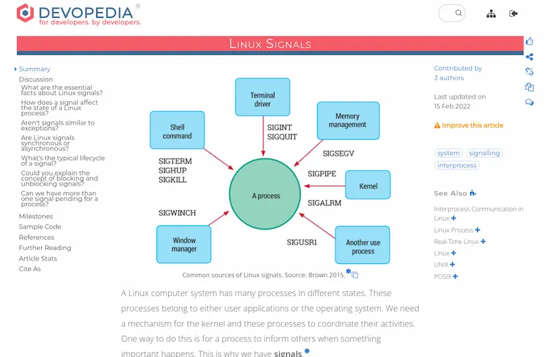
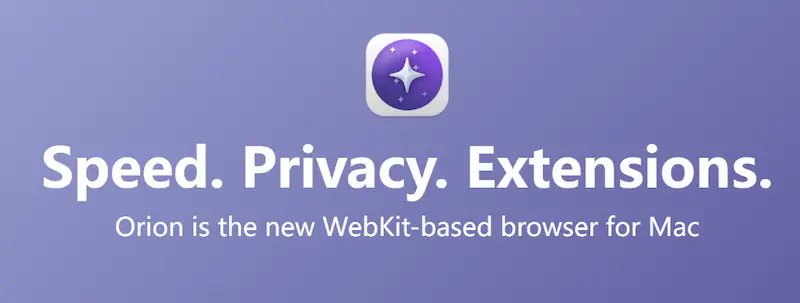
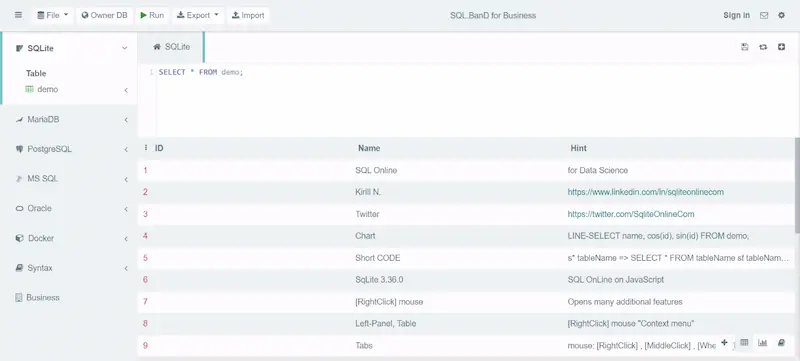
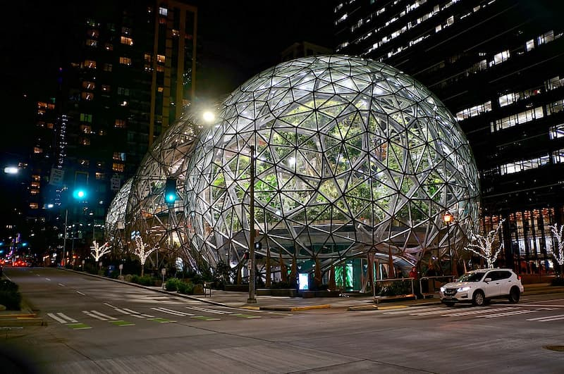
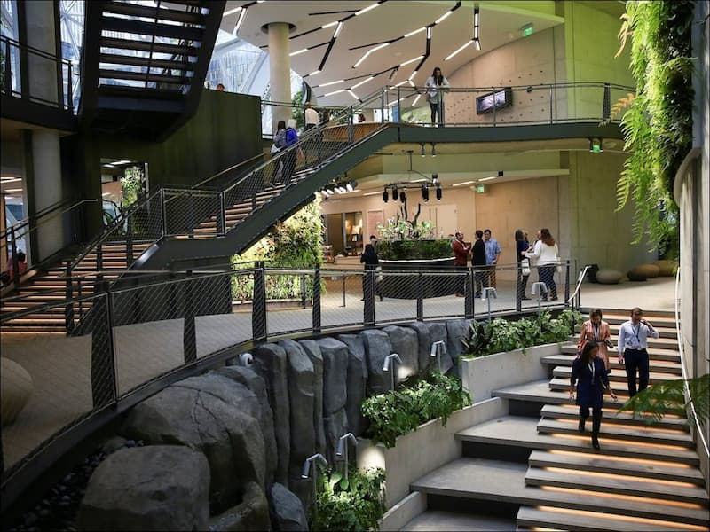
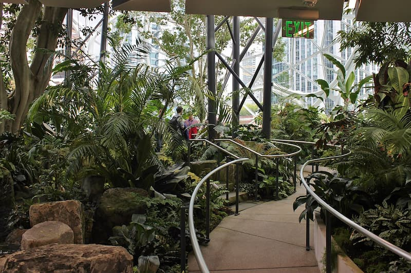

上一期因为比较忙的原因，只是看了，没有做摘要，不过，最近几期雀食没有特别值得写下来归档的点，越写越少不是因为我懒了，而是因为我能力在一直不断地上升，自然值得收录的东西也越来越少

### [POST 和 PUT 方法有什么区别？](https://stackoverflow.com/questions/630453/what-is-the-difference-between-post-and-put-in-http)（英文）

有的文档说，HTTP 协议的 PUT 方法用于新建资源，POST 方法用于修改资源；另一些文档说，应该反过来做。其实这两种说法都不完全对。

一篇 StackOverflow 上的文章，超级长并且很多地方较为专业，扫了一下有的地方没怎么看懂，估计得等过阵子再多学一点看比较好

### [Linux 信号知识](https://devopedia.org/linux-signals)（英文）

本文是一篇科普文章，介绍什么是 Linux 信号，以及它的基本用法。

### [Orion 浏览器](https://browser.kagi.com/)

一种基于 Webkit 的新浏览器，只能用于 MacOS 和 iOS，但是能安装 Chrome 的插件，目前还是测试版。据说体验非常好，胜过 Safari。

加油啊，回头就用你了

### [SQLite Online IDE](https://sqliteonline.com/)

一个数据库在线管理工具，通过上传或在线连接，在网页上进行数据库管理和查询，支持 SQLite、MySQL、PostgreSQL 等数据库。

这样就可以方便地做演练了，简单看了一下这个 webapp 不出所料地是使用 cookie 存的数据

### [亚马逊的球形温室](https://www.sohu.com/a/220142155_117195)

亚马逊公司的西雅图总部园区内，有三个巨大的球形温室，高达三四层楼（24米到29米），作为员工休息室和办公区。

温室里面有各种热带植物，还设置了会议室和零售商店，每个球体可容纳800人，主要供员工使用，每周固定时间免费开放给公众参观。

球形温室于2015年正式动工。2018年1月29日落成，总共耗资40亿美元。

别人家的公司，羡慕不来（当然不排除我以后有幸能进去）