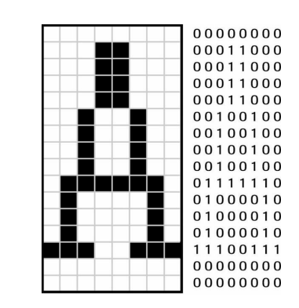
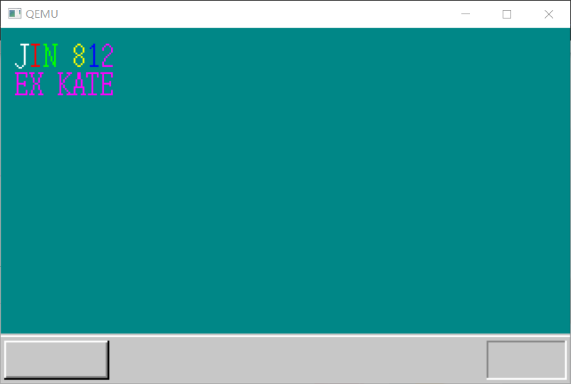
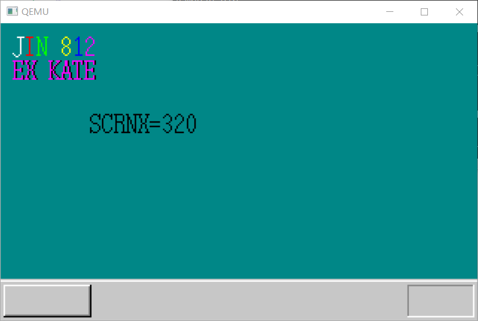

### 第5天 结构体、文字显示与GDT/IDT初始化

这题我会！gdt 就是全局描述符表，用于建立虚拟内存与物理地址之间的映射以及安全上的保护，idt 是中断描述符表，用于保护模式下储存中断处理程序的数据结构。CPU在接收到中断时，会根据中断向量在中断描述符表中检索对应的描述符。

#### 绘制字符

与之前绘制背景一样，都是使用坐标定位后绘制



像上图，将每行用十六进制数表示再传入

```c
void putfont8(char *vram, int xsize, int x, int y, char c, char *font)
{
	int i;
	char *p, d /* data */;
	for (i = 0; i < 16; i++) {
		p = vram + (y + i) * xsize + x;
		d = font[i];
		if ((d & 0x80) != 0) { p[0] = c; }
		if ((d & 0x40) != 0) { p[1] = c; }
		if ((d & 0x20) != 0) { p[2] = c; }
		if ((d & 0x10) != 0) { p[3] = c; }
		if ((d & 0x08) != 0) { p[4] = c; }
		if ((d & 0x04) != 0) { p[5] = c; }
		if ((d & 0x02) != 0) { p[6] = c; }
		if ((d & 0x01) != 0) { p[7] = c; }
	}
	return;
}
```

对八位数进行逐位判定，并上色。

```c
void puttext(char *vram, int xsize, int x, int y,char c, unsigned char *t, char *font){
	for(;*t!=0x00;t++){
		putfont8(vram, xsize,  x, y, c, font + *t * 16);
		x+=8;
	}
	return;
}
```

改为循环调用字符绘制函数，只需要输入一个字符串就可以方便地输出



如上，上一排使用逐字输入，下一排使用批量输入。

#### 显示变量值

简单来说，自制操作系统时很多库都不能用（毕竟从底层做起，只能自己造），但是仍然有一些函数是编译器自带，可以使用，这里引入 sprintf，不使用操作系统功能，只对内存进行操作

与printf类似，使用格式+值的形式，只不过在格式之前加入了内存这一新参数，可以让结果输出到相应位置。


