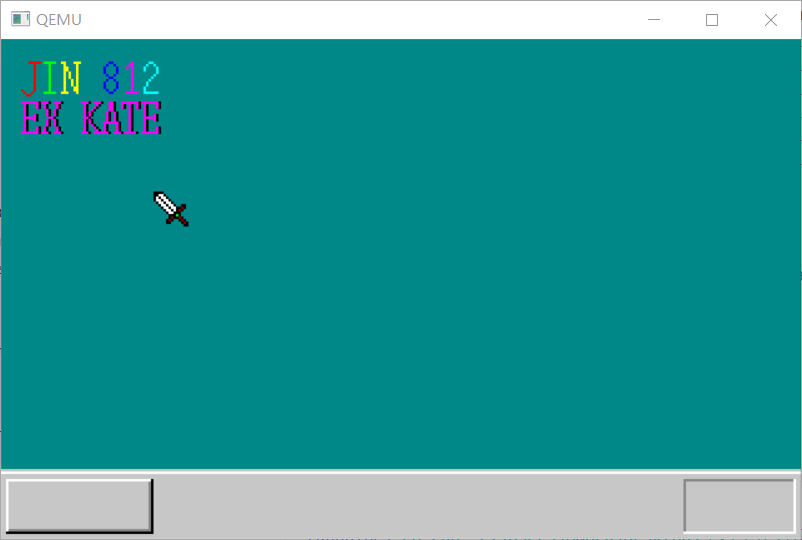

### 第5天 结构体、文字显示与GDT/IDT初始化

这题我会！gdt 就是全局描述符表，用于建立虚拟内存与物理地址之间的映射以及安全上的保护，idt 是中断描述符表，用于保护模式下储存中断处理程序的数据结构。CPU在接收到中断时，会根据中断向量在中断描述符表中检索对应的描述符。

#### 绘制字符

与之前绘制背景一样，都是使用坐标定位后绘制


像上图，将每行用十六进制数表示再传入

```c
void putfont8(char *vram, int xsize, int x, int y, char c, char *font)
{
	int i;
	char *p, d /* data */;
	for (i = 0; i < 16; i++) {
		p = vram + (y + i) * xsize + x;
		d = font[i];
		if ((d & 0x80) != 0) { p[0] = c; }
		if ((d & 0x40) != 0) { p[1] = c; }
		if ((d & 0x20) != 0) { p[2] = c; }
		if ((d & 0x10) != 0) { p[3] = c; }
		if ((d & 0x08) != 0) { p[4] = c; }
		if ((d & 0x04) != 0) { p[5] = c; }
		if ((d & 0x02) != 0) { p[6] = c; }
		if ((d & 0x01) != 0) { p[7] = c; }
	}
	return;
}
```

对八位数进行逐位判定，并上色。

```c
void puttext(char *vram, int xsize, int x, int y,char c, unsigned char *t, char *font){
	for(;*t!=0x00;t++){
		putfont8(vram, xsize,  x, y, c, font + *t * 16);
		x+=8;
	}
	return;
}
```

改为循环调用字符绘制函数，只需要输入一个字符串就可以方便地输出


如上，上一排使用逐字输入，下一排使用批量输入。

#### 显示变量值

简单来说，自制操作系统时很多库都不能用（毕竟从底层做起，只能自己造），但是仍然有一些函数是编译器自带，可以使用，这里引入 sprintf，不使用操作系统功能，只对内存进行操作

与printf类似，使用格式+值的形式，只不过在格式之前加入了内存这一新参数，可以让结果输出到相应位置。


太棒了，这下运行时可以更直观的进行debug了

#### 显示指针

还记得当年写 C 语言结课作业时，被光标显示和物体移动折磨的死去活来

干，一个小小的光标花了我一晚上，C 真的忘了很多

```c
char* init_mouse_cursor(){
	char cursor[16][16]={
		"................",
		".----...........",
		".--##-..........",
		".-#-##-.........",
		".-##-##-........",
		"..-##-##-.......",
		"...-##-##-..--..",
		"....-##-##--+-..",
		".....-##-#-+-...",
		"......-##---....",
		".......---*-....",
		".......-+--+-...",
		"......-+-..-+-..",
		"......--....-+-.",
		".............--.",
		"................",
	};
	static char mouse[256];
	int x,y;
	for(y=0;y<16;y++){
		for(x=0;x<16;x++){
			if(cursor[y][x]=='#'){
				mouse[y*16+x]=COL8_FFFFFF;
			}else if(cursor[y][x]=='-'){
				mouse[y*16+x]=COL8_000000;
			}else if(cursor[y][x]=='*'){
				mouse[y*16+x]=COL8_00FF00;
			}else if(cursor[y][x]=='+'){
				mouse[y*16+x]=COL8_840000;
			}else{
				mouse[y*16+x]=-1;
			}
		}
	}
	return mouse;
}
void putblock(char *vram,int xsize,int bxsize,int bysize,int px,int py,char* mouse){
	int c,x,y;
	for(y=0;y<bysize;y++){
		for(x=0;x<bxsize;x++){
			c=mouse[y*bxsize+x];
			if(c!=-1){
				vram[(py+y)*xsize+px+x]=c;
			}
		}
	}
}
```

当然，如果改成直接使用带有颜色参数的字符数组运算量会更小，不过难看清，就作罢了。

原文中设置了背景色，但是我感觉这样不好显示可能会出问题，所以改为若为空就直接跳过到显卡的复制。

#### 设置 GDT 与 IDT

之前在哈工大网课学习时也了解到了，在 32 位保护模式之下想要让操作系统能够使用，必须设定好 GDT 和 IDT

##### 分段

像 ORG 指令，就是指定要读入的内存段，避免内存使用冲突

> **分页** 用于任务管理，与分段不同，有多 少个任务就要分多少页，还要对内存进行排序

为了表示一个段，需要有以下信息：

- 段的大小
- 段的起始位置
- 段的管理属性（禁止写入，禁止执行，系统专用等）

由于在 32 位下，实际寄存器仍然使用 16 位，因此要完成段号与段之间的映射，这样调用段号就知道该使用哪个段了

> 调色板中，色号可以使用0~255的数。段号可以用0~8191的数。因为段寄存器是16 位，所以本来应该能够处理0~65535范围的数，但由于CPU设计上的原因，段寄存 器的低3位不能使用。因此能够使用的段号只有13位，能够处理的就只有位于 0~8191的区域了。
>
> 段号怎么设定呢？这是对于CPU的设定，不需要像调色板那样使用io_out（由于不 是外部设备，当然没必要）。但因为能够使用0~8191的范围，即可以定义8192个 段，所以设定这么多段就需要8192×8=65 536字节（64KB）。大家可能会想，CPU 没那么大存储能力，不可能存储那么多数据，是不是要写入到内存中去呀。不错， 正是这样。这64KB（实际上也可以比这少）的数据就称为GDT。

<font color="red">GDT是“global（segment）descriptor table”的缩写，意思是全局段号记录表。将这些 数据整齐地排列在内存的某个地方，然后将内存的起始地址和有效设定个数放在 CPU内被称作 GDTR（global (segment) descriptor table register） 的特殊寄存器中，设定就完成了。</font>

##### 关于 IDT

IDT是“interrupt descriptor table”的缩写，中断记录表

当 CPU遇到外部状况变化，或者是内部偶然发生某些错误时，会临时切换过去处理这 种突发事件。这就是中断功能。也就是之前咱们用的 INT 指令，保护模式下想要调用就必须通过这个中断记录表。

中断的发明是相当伟大的，想一想，一般我们键盘或者鼠标输入，如果采用循环扫描的方式，要么频率太高浪费资源，要么频率太低漏相应。有了中断机制，外部输入设备产生变化就触发一个中断，并进行相应处理，CPU可以不用一直查询键盘，鼠标，网卡等设备的状态，将 精力集中在处理任务上

而我们的 IDT 中，保存的就是0～255的中断号码与调用函数的对应关系，设定方法与 GDT 类似

原文中作者说了到现在才用 C 语言设置两种表单纯是考虑对读者友好，实际上（包括在正式程序中），GDT 与 IDT 都是在一开始的 IPL 汇编代码中就写好了（即写完了在进入保护模式）。不过在 C 中设置还能叫做保护模式吗（恼

这部分能看懂就OK了，毕竟配两个表更多的偏向于公式化的代码，不过汇编应该补补了

运行：



看起来和光标完成时一样，但实际上两表已经被我们配置完成了。
