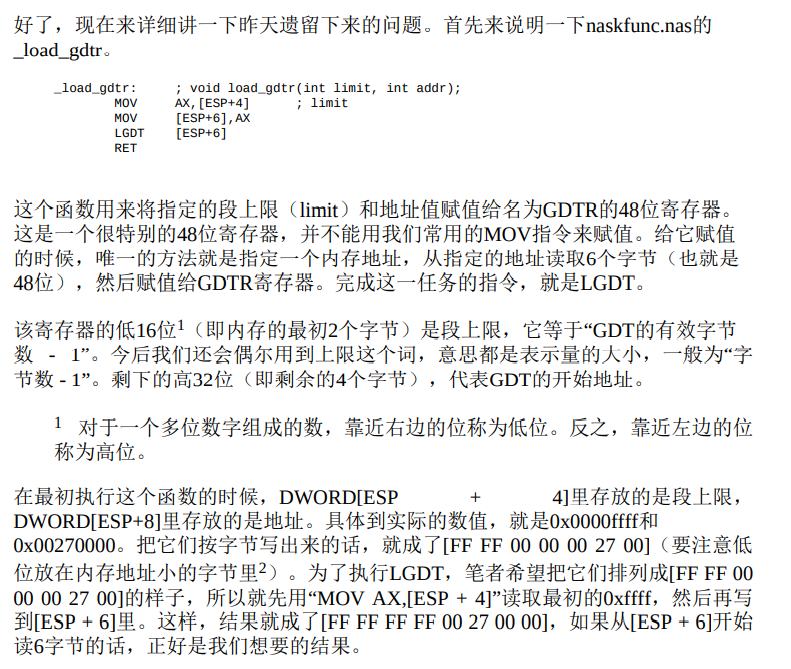
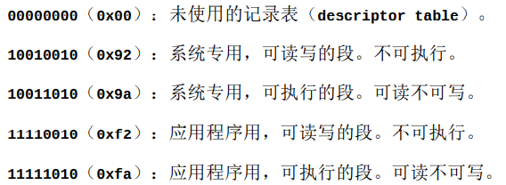
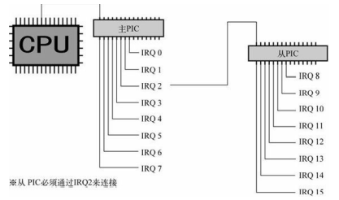
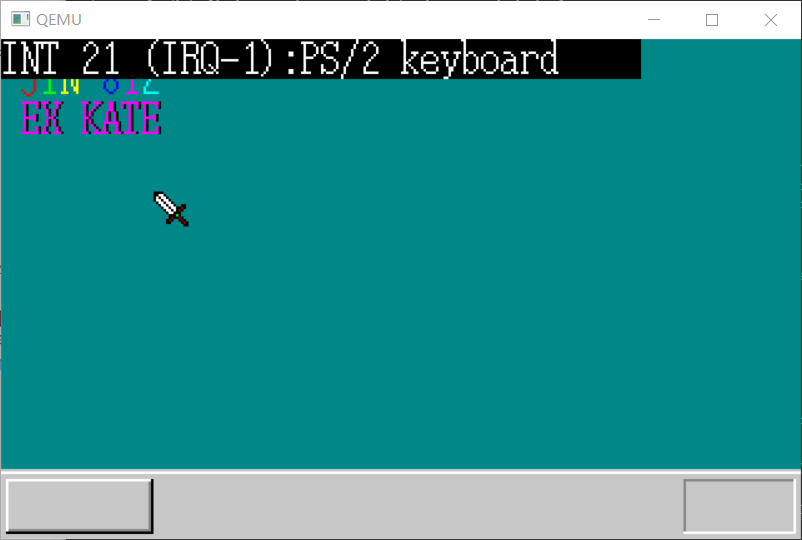

### 分割编译与中断处理

这一章实操较多，内容紧凑，所以我是在看完并编写完相应代码之后才写的笔记

中间不乏有因为一些傻乎乎的 BUG 而破防的瞬间，但是当编译运行成功，出现正确结果的时候，才觉得一切都值了

#### 分割源文件

这个在大型项目中太过于常见了，因此必须掌握——啊顺带一提这个我完全没有问题哦（笑

> 优点
>
> - 按照处理内容进行分类，如果分得好的话，将来进行修改时，容易找到地方。
> - 如果Makefile写得好，只需要编译修改过的文件，就可以提高make的速度。
> - 单个源文件都不长。多个小文件比一个大文件好处理。
>
> 缺点
>
> - 源文件数量增加。
> - 分类分得不好的话，修改时不容易找到地方。

活用 make 的检查更新机制嘛

makefile 中使用模式匹配，可以减少冗余行

记得做一个头文件，把函数声明以及一些宏定义分出去，记得引用

#### 关于汇编函数



相当于一个复制操作，将 FF FF 向后复制了

#### 关于 SEGMENT_DESCRIPTOR 结构体

说起来，这个结构体也整的不清不楚的，虽然用代码写了一遍，但还是有很多疑点

代码：

```c
struct SEGMENT_DESCRIPTOR{
    short limit_low, base_low;
    char base_mid, access_right;
    char limit_high, base_high;
};
```

> 首先看一下段的地址。地址当然是用32位来表示。这个地址在CPU世界的语言里，
> 被称为段的基址。所以这里使用了base这样一个变量名。在这个结构体里base又分
> 为low（2字节），mid（1字节），high（1字节）3段，合起来刚好是32位。所以，
> 这里只要按顺序分别填入相应的数值就行了。虽然有点难懂，但原理很简单。程序
> 中使用了移位运算符和AND运算符往各个字节里填入相应的数值。
>
> 为什么要分为3段呢？主要是为了与80286时代的程序兼容。有了这样的规格，
> 80286用的操作系统，也可以不用修改就在386以后的CPU上运行了。

> 下面再说一下段上限。它表示一个段有多少个字节。可是这里有一个问题，段上限
> 最大是4GB，也就是一个32位的数值，如果直接放进去，这个数值本身就要占用4
> 个字节，再加上基址（base），一共就要8个字节，这就把整个结构体占满了。这
> 样一来，就没有地方保存段的管理属性信息了，这可不行。
>
> 因此段上限只能使用20位。这样一来，段上限最大也只能指定到1MB为止。明明有
> 4GB，却只能用其中的1MB，有种又回到了16位时代的错觉，太可悲了。在这里英
> 特尔的叔叔们又想了一个办法，他们在段的属性里设了一个标志位，叫做Gbit。这
> 个标志位是1的时候，limit的单位不解释成字节（byte），而解释成页（page）。页
> 是什么呢？在电脑的CPU里，1页是指4KB。
>
> 这样一来，4KB × 1M = 4GB，所以可以指定4GB的段。
>
> 这20位的段上限分别写到limit_low和limit_high里。看起来它们好像是总共有3字 节，即24位，但实际上我们接着要把段属性写入limit_high的高4位里，所以最后段 上限还是只有20

> 最后再来讲一下12位的段属性。段属性又称为“段的访问权属性”，在程序中用变量
> 名access_right或ar来表示。因为12位段属性中的高4位放在limit_high的高4位里，所
> 以程序里有意把ar当作如下的16位构成来处理：
>
> **xxxx0000xxxxxxxx(其中x是0或1)**
>
> ar的高4位被称为“扩展访问权”。为什么这么说呢？因为这高4位的访问属性在80286
> 的时代还不存在，到386以后才可以使用。这4位是由“GD00”构成的，其中G是指刚
> 才所说的G bit，D是指段的模式，1是指32位模式，0是指16位模式。这里出现的16
> 位模式主要只用于运行80286的程序，不能用于调用BIOS。所以，除了运行80286
> 程序以外，通常都使用D=1的模式。
>
> 
>
> 第八位标注中的系统专用和应用程序用，是为了安全管理，也就是在 32 为系统之下，系统可以接触到的指令与应用程序是不相同的，有一个权限的控制

#### 初始化 PIC

PIC 为 programmable interrupt controller，意为可编程中断控制器

在设计上，CPU单独只能处 理一个中断，这不够用，所以在设计电脑时，就在主板上增设了几个辅助芯片。现如今它们已经被集成在一个芯片组里了

PIC 有 8 个管脚，接受其传来的中断信号（IRQ），设计者认为外部设备可能不止 8 个，于是加入了主从 PIC 的设计，扩展为了 15 个管脚



对 PIC 的初始化：

```c
void init_pic(void)
    /* PIC的初始化 */
{
    io_out8(PIC0_IMR, 0xff ); /* 禁止所有中断 */
    io_out8(PIC1_IMR, 0xff ); /* 禁止所有中断 */
    
    io_out8(PIC0_ICW1, 0x11 ); /* 边沿触发模式（edge trigger mode） */
    io_out8(PIC0_ICW2, 0x20 ); /* IRQ0-7由INT20-27接收 */
    io_out8(PIC0_ICW3, 1 << 2); /* PIC1由IRQ2连接 */
    io_out8(PIC0_ICW4, 0x01 ); /* 无缓冲区模式 */
    
    io_out8(PIC1_ICW1, 0x11 ); /* 边沿触发模式（edge trigger mode） */
    io_out8(PIC1_ICW2, 0x28 ); /* IRQ8-15由INT28-2f接收 */
    io_out8(PIC1_ICW3, 2 ); /* PIC1由IRQ2连接 */
    io_out8(PIC1_ICW4, 0x01 ); /* 无缓冲区模式 */
    
    io_out8(PIC0_IMR, 0xfb ); /* 11111011 PIC1以外全部禁止 */
    io_out8(PIC1_IMR, 0xff ); /* 11111111 禁止所有中断 */
    return;
}
```

> 现在简单介绍一下PIC的寄存器。首先，它们都是8位寄存器。IMR是“interrupt mask
> register”的缩写，意思是“中断屏蔽寄存器”。8位分别对应8路IRQ信号。如果某一位
> 的值是1，则该位所对应的IRQ信号被屏蔽，PIC就忽视该路信号。这主要是因为，
> 正在对中断设定进行更改时，如果再接受别的中断会引起混乱，为了防止这种情况
> 的发生，就必须屏蔽中断。还有，如果某个IRQ没有连接任何设备的话，静电干扰
> 等也可能会引起反应，导致操作系统混乱，所以也要屏蔽掉这类干扰。
>
> ICW是“initial control word”的缩写，意为“初始化控制数据”。因为这里写着word，
> 所以我们会想，“是不是16位”？不过，只有在电脑的CPU里，word这个词才是16位
> 的意思，在别的设备上，有时指8位，有时也会指32位。PIC不是仅为电脑的CPU而
> 设计的控制芯片，其他种类的CPU也能使用，所以这里word的意思也并不是我们觉
> 得理所当然的16位。

中断完成后不能直接用 RET 指令，得使用 IRETD，C 中是写不出来的

另外，汇编中要使用 CALL 作为调用函数的指令。这次要调用一个 没有定义在naskfunc.nas中的函数，所以我们最初用一个EXTERN指令来通知 nask：“马上要使用这个名字的标号了，它在别的源文件里，可不要搞错了”。

最后，将函数注册到 IDT 中，使之可被中断调用：

```c
/* IDT的设定 */
set_gatedesc(idt + 0x21, (int) asm_inthandler21, 2 * 8, AR_INTGATE32);
set_gatedesc(idt + 0x2c, (int) asm_inthandler2c, 2 * 8, AR_INTGATE32);
```

编译运行，按下按键：



好好好！