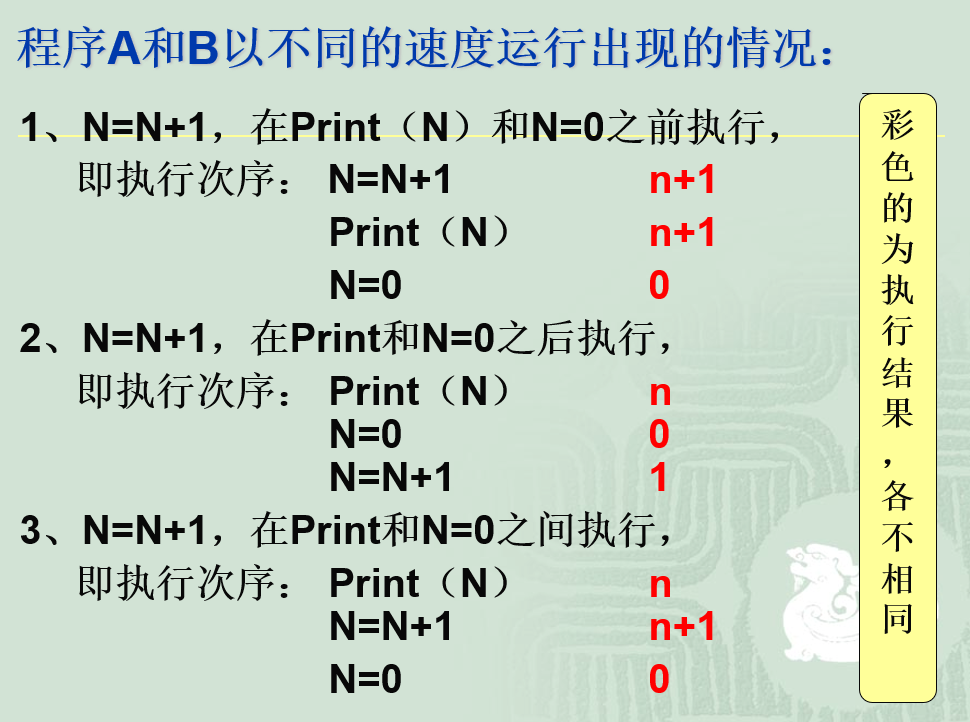
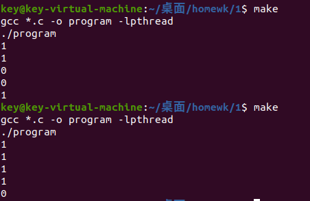
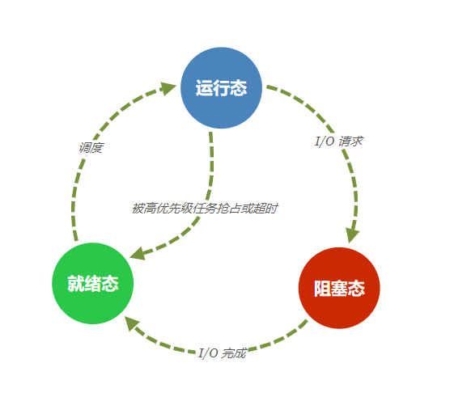
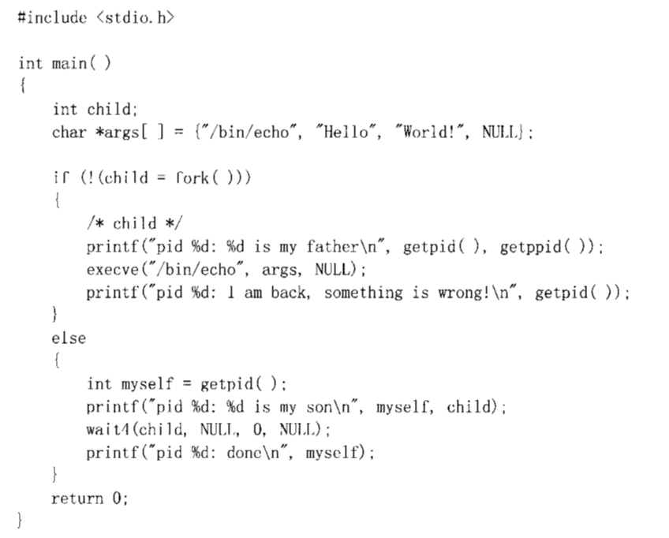
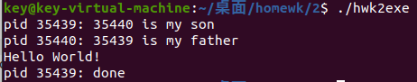
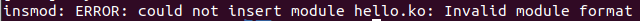
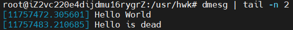
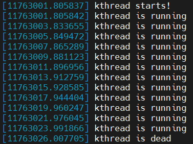

操作系统第二章的作业，集中记录一下

使用 makefile 自动编译运行程序：

```makefile
all:$(subst .c,exe,$(wildcard *.c))
%exe: %.c
	gcc -o $@ $< -lpthread
```

### 作业一

是一道考并发的题目，叫我复现以下内容：



```c
#include<stdlib.h>
#include<pthread.h>
#include<unistd.h>

int N=0;

void* plus(void *args) {
    for(int i=0;i<5;i++){
    	N++;
    	//printf("%d\n",N);
    	sleep(1);
    }
    return NULL;
}

void* tozero(void *args) {
    for(int i=0;i<5;i++){
	printf("%d\n",N);
	N=0;  
	sleep(1);
    }
    return NULL;
}

int main()
{
    pthread_t th1;
    pthread_t th2;
    
    pthread_create(&th1,NULL,plus,NULL);
    pthread_create(&th2,NULL,tozero,NULL);
    
    pthread_join(th1, NULL);
    pthread_join(th2, NULL);
    
    return 0;
}
```



### 作业二

内核中为了描述和控制进程的运行，为每个进程定义了一个数据结构——进程控制块。而在linux内核中，这个数据结构就是task_struct。

源码位置在 sched.h 中

#### 进程状态

##### 进程标志符

```c
pid_t pid; //进程ID
pid_t tgid;//线程组ID
```

##### 运行状态

```c
volatile long state;    /* -1 unrunnable（不可运行）, 0 runnable（在运行）, >0 stopped（停止的） */
```

> **volatile** 是表明其后变量是动态变化的，不采取优化，每次取值必须从变量对应的地址中读取。优化做法是，由于编译器发现两次从 i 读数据的代码之间的代码没有对 i 进行过操作，它会自动把上次读的数据放在 b 中。而不是重新从 i 里面读。在优化的情况下，如果 i 是一个寄存器变量或者表示一个端口数据就容易出错。在多线程中，该关键字的作用是防止优化编译器把变量从内存装入 CPU 寄存器中。如果变量被装入寄存器，那么两个线程有可能一个使用内存中的变量，一个使用寄存器中的变量，这会造成程序的错误执行。**volatile 的意思是让编译器每次操作该变量时一定要从内存中真正取出，而不是使用已经存在寄存器中的值**
>
> 参考资料：
>
> [面试官最爱的volatile关键字 - 掘金 (juejin.cn)](https://juejin.cn/post/6844903520760496141)
>
> [C/C++ 中 volatile 关键字详解 | 菜鸟教程 (runoob.com)](https://www.runoob.com/w3cnote/c-volatile-keyword.html)

不同状态对应的 state 使用宏定义对应：

```c
#define TASK_RUNNING        0
#define TASK_INTERRUPTIBLE  1 
#define TASK_UNINTERRUPTIBLE    2
#define __TASK_STOPPED      4
#define __TASK_TRACED       8
/* in tsk->exit_state */
#define EXIT_DEAD       16
#define EXIT_ZOMBIE     32
#define EXIT_TRACE      (EXIT_ZOMBIE | EXIT_DEAD)
/* in tsk->state again */
#define TASK_DEAD       64
#define TASK_WAKEKILL       128
#define TASK_WAKING     256
#define TASK_PARKED     512
#define TASK_NOLOAD     1024
#define TASK_STATE_MAX      2048
```

##### 进程标记

```c
unsigned int flags; /* per process flags, defined below */
```

usigned 无符号位，防止负数对应地址出错

用来反映进程状态的信息（区别于运行状态），用于内核识别进程当前的状态，以备下一步操作。候选值：

```c
#define PF_EXITING  0x00000004  /* getting shut down */
#define PF_EXITPIDONE   0x00000008  /* pi exit done on shut down */
#define PF_VCPU     0x00000010  /* I'm a virtual CPU */
#define PF_WQ_WORKER    0x00000020  /* I'm a workqueue worker */
#define PF_FORKNOEXEC   0x00000040  /* forked but didn't exec */
#define PF_MCE_PROCESS  0x00000080      /* process policy on mce errors */
#define PF_SUPERPRIV    0x00000100  /* used super-user privileges */
#define PF_DUMPCORE 0x00000200  /* dumped core */
#define PF_SIGNALED 0x00000400  /* killed by a signal */
#define PF_MEMALLOC 0x00000800  /* Allocating memory */
#define PF_NPROC_EXCEEDED 0x00001000    /* set_user noticed that RLIMIT_NPROC was exceeded */
#define PF_USED_MATH    0x00002000  /* if unset the fpu must be initialized before use */
#define PF_USED_ASYNC   0x00004000  /* used async_schedule*(), used by module init */
#define PF_NOFREEZE 0x00008000  /* this thread should not be frozen */
#define PF_FROZEN   0x00010000  /* frozen for system suspend */
#define PF_FSTRANS  0x00020000  /* inside a filesystem transaction */
#define PF_KSWAPD   0x00040000  /* I am kswapd */
#define PF_MEMALLOC_NOIO 0x00080000 /* Allocating memory without IO involved */
#define PF_LESS_THROTTLE 0x00100000 /* Throttle me less: I clean memory */
#define PF_KTHREAD  0x00200000  /* I am a kernel thread */
#define PF_RANDOMIZE    0x00400000  /* randomize virtual address space */
#define PF_SWAPWRITE    0x00800000  /* Allowed to write to swap */
#define PF_NO_SETAFFINITY 0x04000000    /* Userland is not allowed to meddle with cpus_allowed */
#define PF_MCE_EARLY    0x08000000      /* Early kill for mce process policy */
#define PF_MUTEX_TESTER 0x20000000  /* Thread belongs to the rt mutex tester */
#define PF_FREEZER_SKIP 0x40000000  /* Freezer should not count it as freezable */
#define PF_SUSPEND_TASK 0x80000000      /* this thread called freeze_processes and should not be frozen */
```

看着头疼，实际上可以归纳为四种情况：

> （1）可运行状态
>
> 处于这种状态的进程，要么正在运行、要么正准备运行。正在运行的进程就是当前进程（由current 宏 所指向的进程），而准备运行的进程只要得到CPU 就可以立即投入运行，CPU 是这些进程唯一等待的系统资源。系统中有一个运行队列（run_queue），用来容纳所有处于可运行状态的进程，调度程序执行时，从中选择一个进程投入运行。当前运行进程一直处于该队列中，也就是说，current总是指向运行队列中的某个元素，只是具体指向谁由调度程序决定。
>
> （2）等待状态
>
> 处于该状态的进程正在等待某个事件（Event）或某个资源，它肯定位于系统中的某个等待队列（wait_queue）中。Linux 中处于等待状态的进程分为两种：可中断的等待状态和不可中断的等待状态。处于可中断等待态的进程可以被信号唤醒，如果收到信号，该进程就从等待状态进入可运行状态，并且加入到运行队列中，等待被调度；而处于不可中断等待态的进程是因为硬件环境不能满足而等待，例如等待特定的系统资源，它任何情况下都不能被打断，只能用特定的方式来唤醒它，例如唤醒函数wake_up()等。
>
> （3）暂停状态
>
> 此时的进程暂时停止运行来接受某种特殊处理。通常当进程接收到SIGSTOP、SIGTSTP、SIGTTIN 或 SIGTTOU 信号后就处于这种状态。例如，正接受调试的进程就处于这种状态。
>
> （4）僵死状态
>
> 进程虽然已经终止，但由于某种原因，父进程还没有执行wait()系统调用，终止进程的信息也还没有回收。顾名思义，处于该状态的进程就是死进程，这种进程实际上是系统中的垃圾，必须进行相应处理以释放其占用的资源。

#### 任务状态

##### 任务终止

```c
int exit_state;                                             
int exit_code, exit_signal;     //终止代码  终止信号（exit_signal被置为-1时表示是某个线程组中的一员）
int pdeath_signal;              //判断父进程终止时发送信号
```

##### ABI处理

```c
/* Used for emulating ABI behavior of previous Linux versions */
unsigned int personality;

/* unserialized, strictly 'current' */
unsigned in_execve:1; /* bit to tell LSMs we're in execve */
unsigned in_iowait:1;
```

##### execve

```c
unsigned in_execve:1; /* bit to tell LSMs we're in execve */
```

##### io等待

```c
unsigned in_iowait:1; 
```

#### 进程内核栈地址

```c
void *stack;
```

内核在创建进程的时候，会创建两个堆栈，一个用户栈，存在于用户空间，一个内核栈，存在于内核空间。当进程在用户空间运行时，CPU堆栈寄存器的内容是用户堆栈地址，使用用户栈。当进程在内核空间时，CPU堆栈寄存器的内容是内核栈地址空间，使用的是内核栈。

而内核栈的地址就保存在 stack中。

#### 进程状态转换



### 作业三

首先看一下 wait，waitpid，以及 wait3、wait4 的执行方式

[点击就送屠龙宝刀](https://www.cnblogs.com/tongye/p/9558320.html)

#### wait()

```c
#include <sys/types.h>        // 提供类型 pid_t 的定义
#include <sys/wait.h>

pid_t wait(int *status);
```

调用 wait 会暂停（阻塞）当前进程，并开始自动分析是否存在前进程的某个子进程已经退出，如果找到了这样一个已经变成僵尸进程的子进程，wait 就会收集这个子进程的信息，并将其彻底销毁后返回；如果没有找到呢？它就会一直阻塞直到出现一个符合条件的僵尸进程

> #### status 参数
>
> 保存着子进程退出时的一些状态（包括 task_struct、thread_info及内核栈等）它是一个指向 int 类型的指针；
>
> 如果只是单纯想干掉僵尸不关心其数据，直接传 NULL 就好了
>
> #### wait 返回值
>
> 如果 wait() 调用成功，则会返回被收集子进程的进程ID；如果被调用进程没有子进程，则调用失败，返回 -1，这一点和 fork 有点相似

用 fork 开一个子进程可以验证一下

#### waitpid()

```c
#include <sys/types.h>
#include <sys/wait.h>

pid_t waitpid(pid_t pid,int *status,int options);
```

多了两个参数，实际就是在 wait 的基础之上加了一些条件：

> #### pid
>
> **pid < -1** ；等待进程组 ID 为 pid 绝对值的进程组中的任何子进程；
>
> **pid = -1** ；等待任何子进程，此时 waitpid() 相当于 wait()。
>
> ```c
> static inline pid_t wait(*status){
>     return waitpid(-1,*status,0);  
> }
> ```
>
> （wait 就是其特殊情况）
>
> **pid = 0** ；等待进程组 ID 与当前进程相同的任何子进程（也就是等待同一个进程组中的任何子进程）；
>
> **pid > 0** ；等待任何子进程 ID 为 pid 的子进程，只要指定的子进程还没有结束，waitpid() 就会一直等下去。
>
> #### option
>
> **WNOHANG**；如果没有任何已经结束了的子进程，则马上返回，不等待；
>
> **WUNTRACED**；如果子进程进入暂停执行的情况，则马上返回，但结束状态不予理会；
>
> 这两个条件可以一起用，用或连接
>
> **option = 0**；options 设为0，则 waitpid() 会一直等待，直到有进程退出

##### 三种返回值

- a）正常返回时，waitpid() 返回收集到的子进程的PID；
- b）如果设置了 WNOHANG，而调用 waitpid() 时，没有发现已退出的子进程可收集，则返回0；
- c）如果调用出错，则返回 -1，这时 error 会被设置为相应的值以指示错误所在。（当 pid 所指示的子进程不错在，或此进程存在，但不是调用进程的子进程， waitpid() 就会返回出错，这时 erron 被设置为 ECHILD）

#### wait3() 与 wait4()

```c
#include <sys/tpyes.h>
#include <sys/wait.h>

pid_t wait3(int *status,int options,struct rusage *rusage);
pid_t wait4(pid_t pid,int *status,int options,struct rusage *rusage);
```

他们有相似之处：**除了可以获得子进程状态信息外，还可以获得子进程的资源使用信息**

资源使用信息通过 **rusage** 传递。

wait3 没有 pid 参数，它等待所有子进程。wait4 则根据 pid 值确定等待规则，其等待规则与 waitpid 一样。

#### 关于代码段



child 实际上应该是 pid_t 类型的数据，但是底层也确实是 int，这里简化了。

child=fork()，最后 child 获取到的值就 0 或子进程 pid 或 -1。

这里没有进行错误判断，只进行了相应动作。



fork 是可以让子进程获取父进程一样的环境变量等信息的，但是子进程会从fork语句之后执行，不再执行之前语句，而fork本身返回两次，父子进程接收到的返回值是不一样的。

### 作业四

可加载内核模块（Loadable Kernel Modules）简称 LKM，用于扩展linux的内核功能。LKM的优点在于可以动态地加载到内存中，无须重新编译内核。

这里属于系统调用，使用的库也与用户态下完全不一样。调用的都是系统的内核库。

在 Linux 环境下输入 `lsmod` 可以查看全部未被隐藏的 LKM

典型的程序有一个main函数，而 LKM 包含entry和exit函数（在 2.6 版本可以任意命名这些函数）。

当向内核插入模块时，调用 entry函数，从内核删除模块时则调用exit函数。

LKM还包含一组必要的宏和一组可选的宏，用于定义模块的许可证、模块的作者、模块的描述等等

我们的目标就是将它编译为一个内核级别的库然后加以调用

一定要记住make使用的版本一定要与目前内核一致，使用 `uname -r` 查看当前内核，不然：



```c
#include <linux/module.h>     /* 模块头文件必须引入 */
#include <linux/kernel.h>     /* KERN_INFO在这里 */
#include <linux/init.h>       /* 使用的宏 */

// LICENSE
MODULE_LICENSE("GPL");

// 作者
MODULE_AUTHOR("JIN");

// 描述
MODULE_DESCRIPTION("hello world");

static int __init start(void)
{
    printk(KERN_ALERT "Hello World\n");
    return 0;
}

static void __exit exit(void)
{
    printk(KERN_ALERT "Hello is dead\n");
}

module_init(start);
module_exit(exit);
```

写一下makefile：

```makefile
obj-m:=hello.o
 
KDIR:=/lib/modules/$(shell uname -r)/build
PWD:=$(shell pwd)
 
default:
	$(MAKE) -C $(KDIR) M=$(PWD) modules
clean:
	rm -rf *.o  .*.cmd *.mod.c .tmp_versions Module.symvers modules.order 
```

调整好打印优先级，先输出一些看：



#### 加入 kthread

kthread_create() 只是创建一个内核进程，而不会执行它，想执行还需要唤醒（wake_up_process()），所以就直接打包了一个宏函数：kthread_run()，它返回一个对象指针结构体并创建执行进程

```c
#define kthread_run(threadfn, data, namefmt, ...) \

({ \

struct task_struct *__k \

= kthread_create(threadfn, data, namefmt, ## __VA_ARGS__); \

if (!IS_ERR(__k)) \

wake_up_process(__k); \

__k; \

})
```

可以看出 *_k 就是用于标记进程对象的结构体指针。且使用create之后需要传给wakeup才能进行唤醒

**kthread_stop(struct task_struct *k);**

用于关闭一个内核线程，值得一提的是，它使用的前提是该进程仍在运行，否则会一直阻塞。这个调用是会阻塞等待，直到内核线程k退出为止。原因为因为此函数内部会调用wait_for_completion(）的方法（通过等待队列来实现），阻塞等待内核线程自身的退出。

**int kthread_should_stop(void);**

如果该内核线程已经被设置stop标志了，则会返回1，否则返回0。

最后代码如下：

```c
#include <linux/module.h>     /* 模块头文件，必不可少 */
#include <linux/kernel.h>     /* KERN_INFO在这里 */
#include <linux/init.h>       /* 使用的宏 */
#include <linux/delay.h>
#include <linux/kthread.h>   /*线程库*/

// LICENSE
MODULE_LICENSE("GPL");

// 作者
MODULE_AUTHOR("JIN");

// 描述
MODULE_DESCRIPTION("kthread");

static struct task_struct *thr=NULL;//用于存放对象指针结构体

static int my_kth(void *data)
{
    while (!kthread_should_stop()) {
      printk(KERN_ALERT "kthread is running\n");
      msleep_interruptible(2000);//休眠一段时间
    }
    return 0; 
}

static int __init hello_start(void)
{
    thr = kthread_run(my_kth, NULL, "my-kthread");
    if (!thr) {
      printk("kthread goes wrong!\n");
      return -ECHILD;
    }
    printk("kthread starts!");
    return 0;
}

static void __exit hello_end(void)
{
//判断kthread是否仍在进行
    if(thr){
      kthread_stop(thr);
      thr=NULL;
    }
    printk(KERN_ALERT "kthread is dead\n");
}

module_init(hello_start);
module_exit(hello_end);
```

执行结果：


