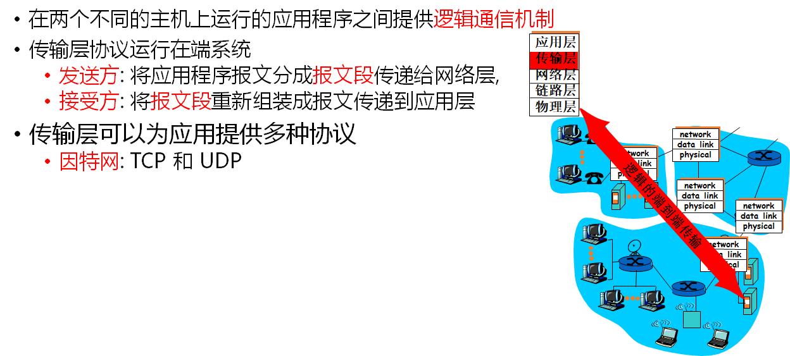
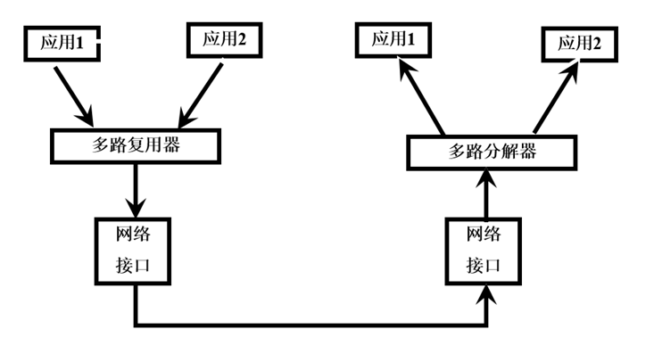
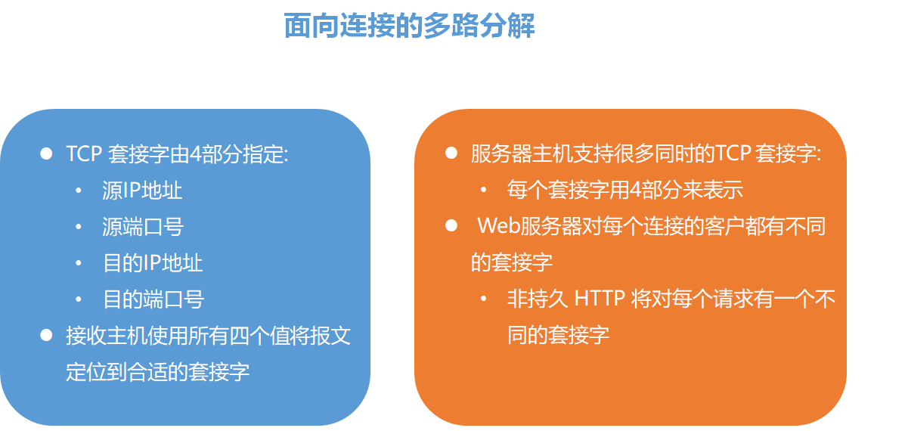
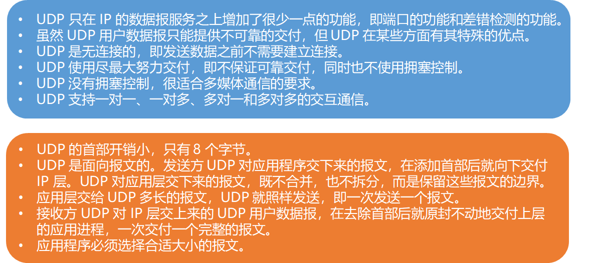
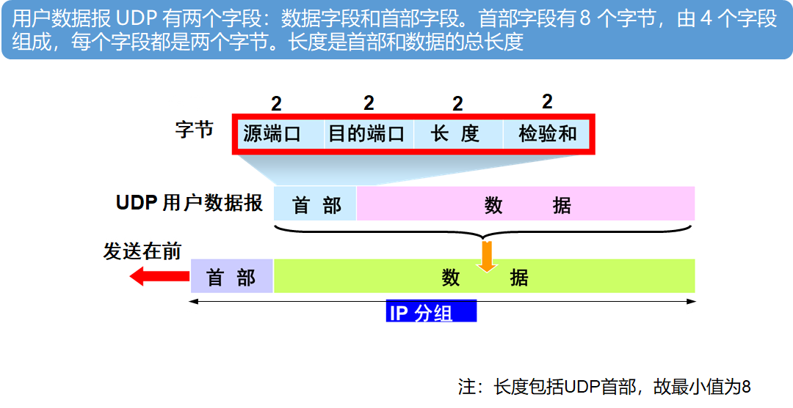
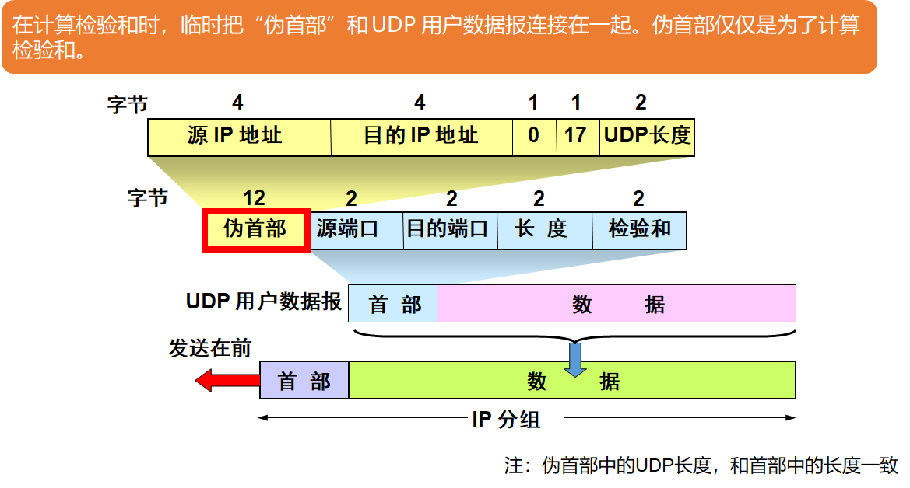
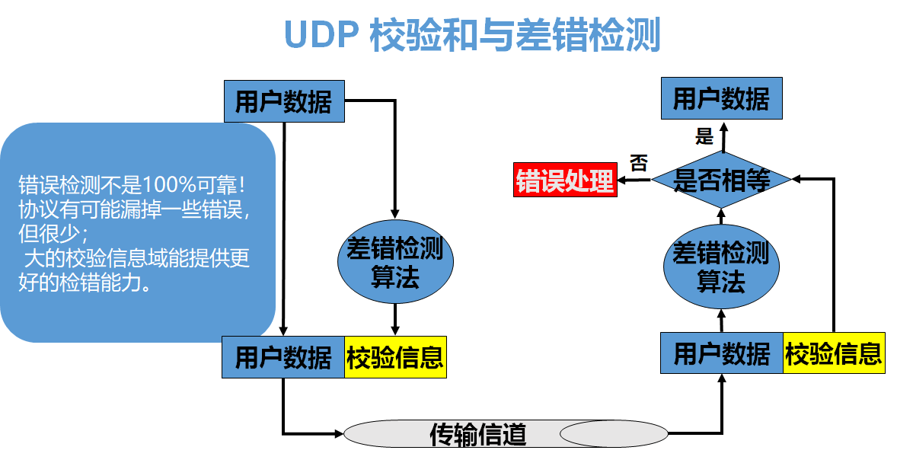
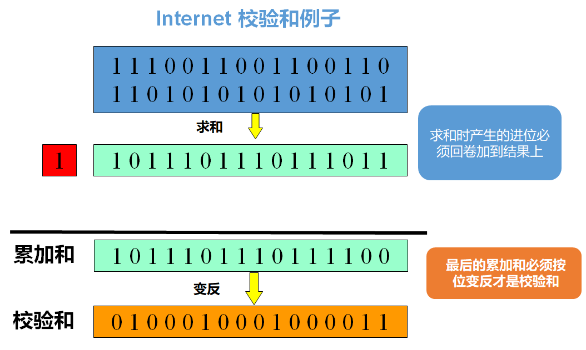

### 传输层服务

传输层建立于网络层的基础之上，依赖于网络层服务，是对网络层服务的增强。

网络层偏向 **主机** 之间的逻辑通信，传输层则是 **进程** 之间的逻辑通信

#### 因特网传输协议

##### TCP

TCP 是有验证的、可靠的、按序的传输协议，而且只支持一对一

- 拥塞控制 
- 流量控制
- 连接建立

##### UDP

UDP 不加以验证，不可靠，但连接速度快，是无序的，支持一对多、多对多、多对一、一对一

关于这两种连接方式的详细内容在之前整理的 TCP 一文中有整理。

### 多路复用与多路分解

可以看到多路复用将多个应用的连接汇集到一个网络接口上，到达目的主机之后经由多路分解再还原为不同应用的连接

这两种方法都依赖于 **套接字**，使用套接字可以定位到具体位置

数据段都是封装为报文。

### UDP

在发送时先算出校验信息，和用户数据整一块儿，到目的地之后再拆下来验证，最后用户应当得到不带有校验信息的数据

**回卷** 步骤其实就是如果存在进位，就将进位的一加到最低位。

最后记住 **按位取反**