## 应用层

应该算是相当轻松的一层，毕竟没有涉及到过多内部知识（当然啦，这也方便了我们应用程序软件开发者的研发工作）

### 应用层协议原理

#### 网络应用程序体系结构

主要有两种体系结构：

- 客户机/服务器体系结构：

  即 C/S 架构，常用于各大 web app，由一台担任服务器的主机与若干台客户机组成，很多时候一台服务器根本不能满足访问需求，因此反向代理相当重要

- P2P 体系结构：

  pear to pear，点对点的，即大部分甚至全部操作不依赖于服务器，而是对等方直连。**自扩展性** 很好（用户数量越多，服务能力越强，某一个计算机的故障不会导致服务丢失）。但是分散的管理对安全性可靠性以及性能有影响


没错，还有混合两者的架构，实际上就是一种取长补短，需要利用数据和查询时使用 C/S 架构，对等方之间直接联系使用 P2P

#### 进程通信

实际上准确来说，是进程与进程之间在通信，利用套接字（socket）

他们跨越计算机网络传递报文。

**套接字又叫做应用程序编程接口API** 
**用户通过API对传输层的控制仅限于：**
      (1) 选择传输协议; 
      (2) 能设定几个参数

那么就像寄信一样，总得有个地址吧？

这里我们就用 32 位的 IP 地址标识主机地址，再通过 16 位的端口号找到目标的进程。

#### 可靠数据传输

文件传输，邮件等需要可靠的传输，所以我们都会使用 TCP 协议。而一些视频聊天软件能容忍一定程度的数据丢失，因此可以选用 UDP

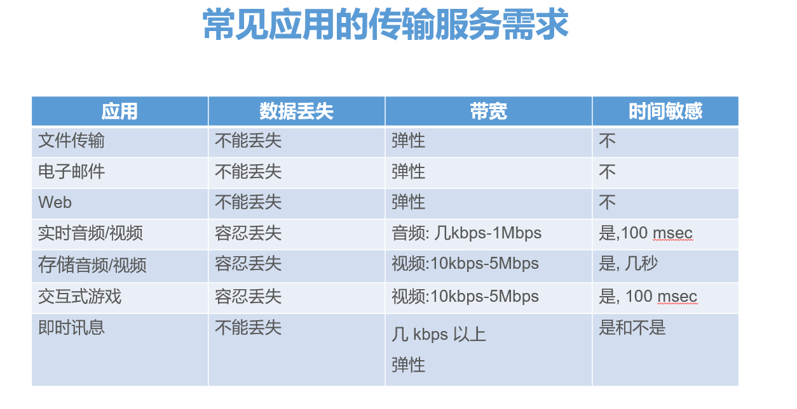

### Web 应用和 HTTP 协议

#### HTTP（超文本传输协议）

##### 状态码

像 200 OK，404 这种东西就算状态码，标志请求处理状态

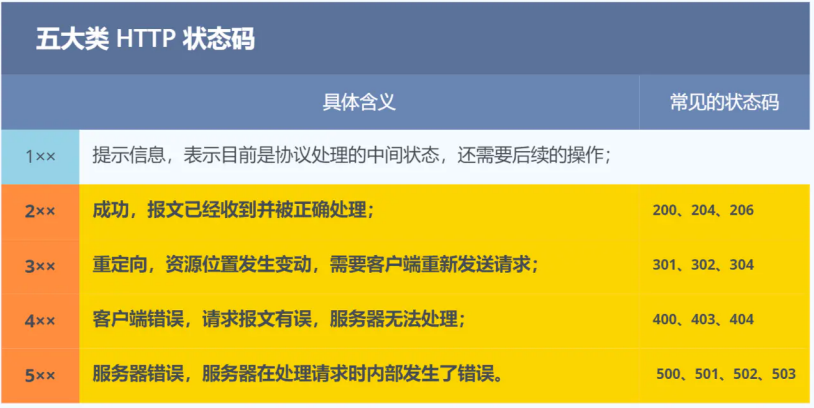

##### 报文格式

ASCII 文本：便于人读

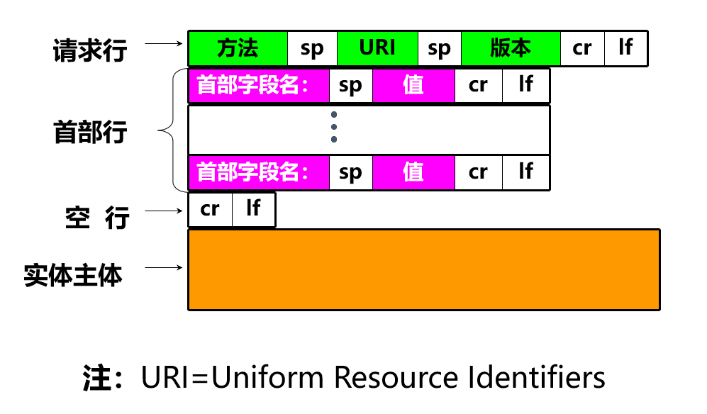

```http
HTTP/1.1 200 OK 
Connection：close
Date: Sat, 06 Aug 2011 12:00:15 GMT 
Server: Apache/1.3.0 (Unix) 
Last-Modified: Thu, 22 Jun 2011 …... 
Content-Length: 6821 
Content-Type: text/html
 
data data data data data ... 
```

除了空行，全在结尾有回车与换行

##### 持久与非持久连接

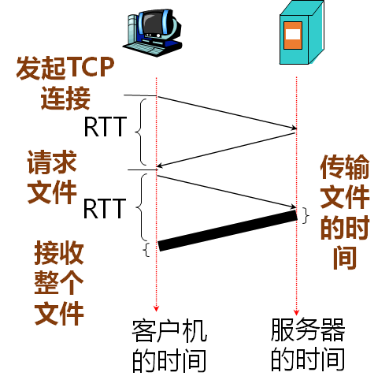

早期 HTTP/1.0 性能上的⼀个很⼤的问题，那就是每发起⼀个请求，都要新建⼀次 TCP 连接（三次握⼿），⽽且是 **串⾏请求**，做了⽆谓的 TCP 连接建⽴和断开，增加了通信开销。

所以 1.1 版本中加入了船新的 **长连接** 通信方式，也叫持久连接。这种⽅式的好处在于减少了 TCP 连接的重复建立和断开所造成的额外开销，减轻了服务器端的负载。

<font size="6">☢</font>一定要记住，HTTP 基于 TCP/IP 所以都需要先建立连接

##### GET 和 POST

GET 是获取对象，从服务器获取资源， POST ⽅法则是相反操作，它向 URI 指定的资源提交数据，数据就放在报⽂的 body ⾥。

因此，**GET 的实体主体是空的，而 POST 有数据**

<font face="幼圆" size="6">GET 和 POST 方法都是安全和幂等的吗？</font>

- 在 HTTP 协议⾥，所谓的「安全」是指请求⽅法不会「破坏」服务器上的资源。
-  所谓的「幂等」，意思是多次执⾏相同的操作，结果都是「相同」的。

所以 GET 是，而 POST 既不安全也不幂等。

##### HTTP 优缺点

简单，灵活易拓展，应⽤⼴泛和跨平台是其优点，但缺点是明文引起的不安全性

而无状态既有优点也有缺点，不占用过多资源，但是执行有关联性的操作时就寄了

**安全问题：**

- 通信使⽤明⽂（不加密），内容可能会被窃听。
- 不验证通信⽅的身份，因此有可能遭遇伪装。
- ⽆法证明报⽂的完整性，所以有可能已遭篡改。

有解决方案吗？有！

你看我们现在网络地址前面一般都是 https，这就是为了解决安全性问题的 http 升级版：也就是通过引⼊ SSL/TLS 层，使得在安全上达到了极致。

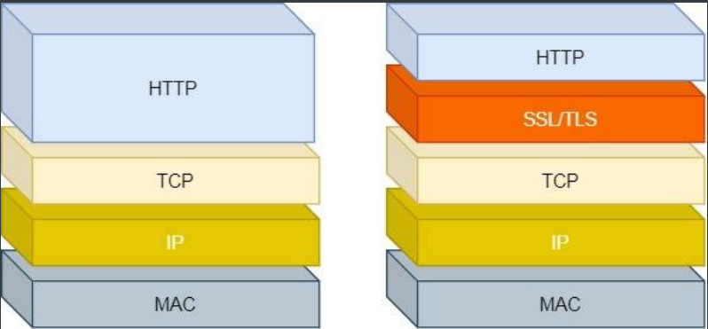

#### cookie，谁点的小饼干？

要记住的是，cookie 文件保存在本地，cookie头部行在HTTP请求消息中和HTTP响应消息中都有

通过特定识别码就可以配对请求和对应用户数据

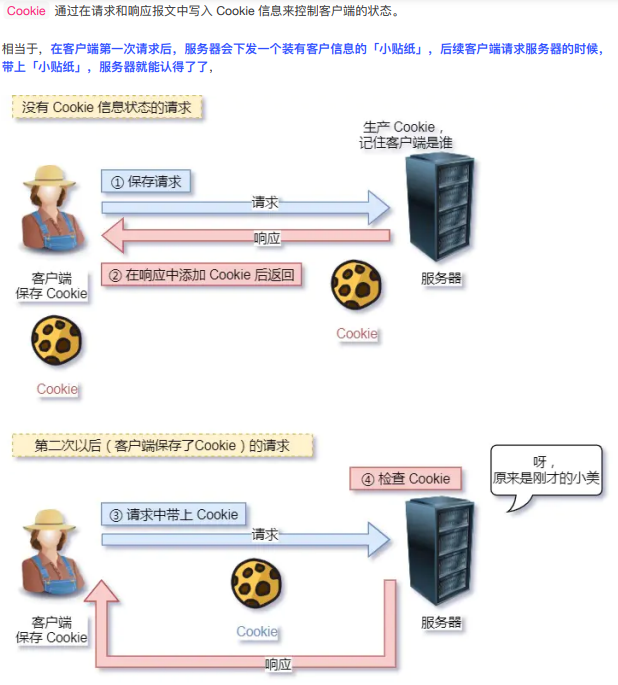

#### Web 缓存（代理服务器）

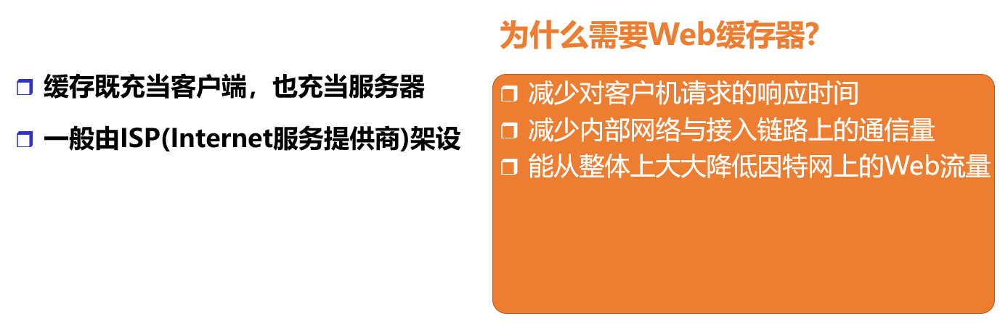

就是缓存请求对象副本，既是服务器又是客户

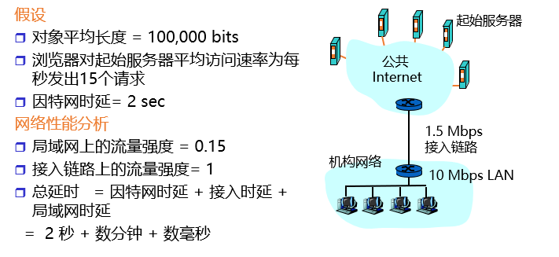

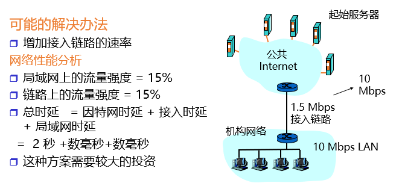

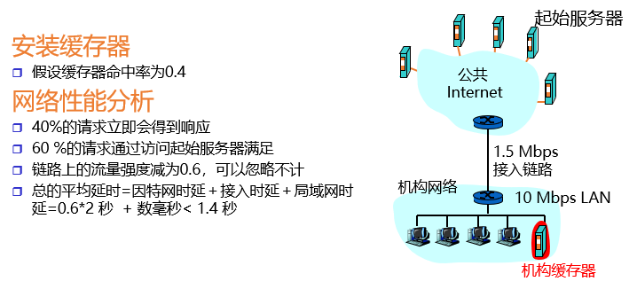

甩几张图，看看就懂了

##### 条件GET方法

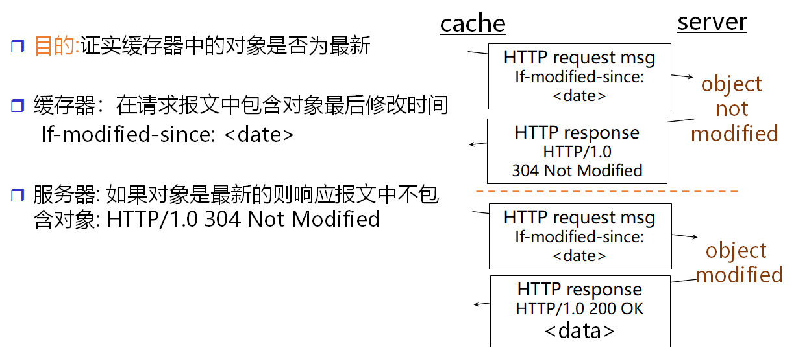

<font size="6">☢</font>注意，这是缓存服务器给初始服务器发送的

### FTP（file transport protocol）

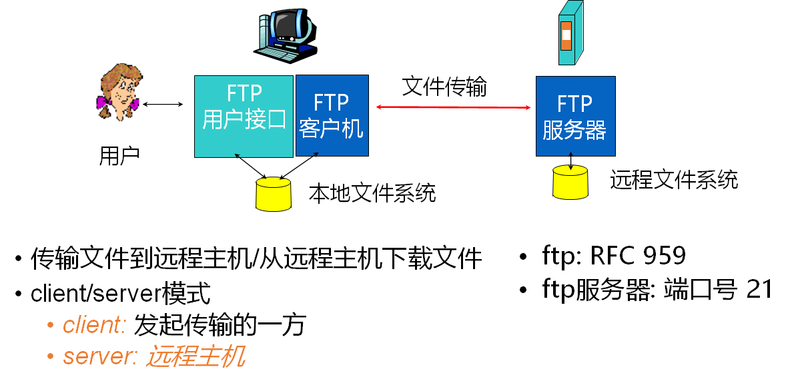

一个完整的文件传输过程应该包含至少两种连接的建立：

**TCP 控制连接（端口21）**

<div style="background-color:lightblue;">
    <ul>
        <li>FTP客户首先发起建立1个与FTP服务器端口号21之间的TCP控制连接</li>
        <li>客户在建立的控制连接上获得身份认证</li>
    </ul>
</div>

**TCP 数据连接（端口20）**

<div style="background-color:lightgreen;">
    <ul>
        <li>客户在建立的控制连接上发送命令来浏览远程主机的目录.</li>
        <li>当服务器接收到1个文件传输命令时, 在服务器端口号20创建1个与客户的TCP数据连接</li>
        <li>1个文件传输后,服务器结束这个TCP数据连接.</li>
    </ul>
</div>

这时，断开的只有数据连接，控制连接仍在继续

#### **FTP:** 独立的控制连接,数据连接

之前两个连接的方式让我们眼前一亮，实际上，这叫做 **带外管理**，而之前的 HTTP 则是另一种典型的 **带内管理**

这个“带”指的应该是业务链接，管理信息通过别的连接单独通信就是带外。HTTP 管理数据不多，带内管理足矣，但是 FTP 就可能造成网络性能的影响。

这篇写的很好，笼统地看了一下：https://www.cnblogs.com/bakari/archive/2012/08/05/2623780.html

除此之外，FTP 服务器要 **维护用户状态信息**: 当前目录, 先前的身份认证

相比之下，HTTP 无状态，不维护

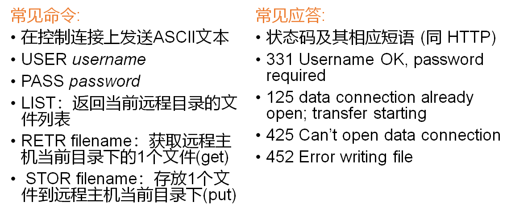

**控制连接：**

•USER-PI(protocol interpreter)：用户协议解释器

•SERVER-PI：服务器协议解释器

**数据连接：**

•user-DTP(Data Transfer Process)：用户数据传输进程

•server-DTP：服务器数据传输进程

然后这里有俩模型，注意看数据连接才管理文件系统！

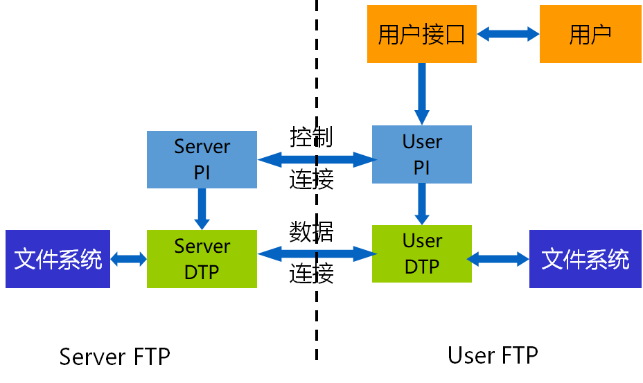

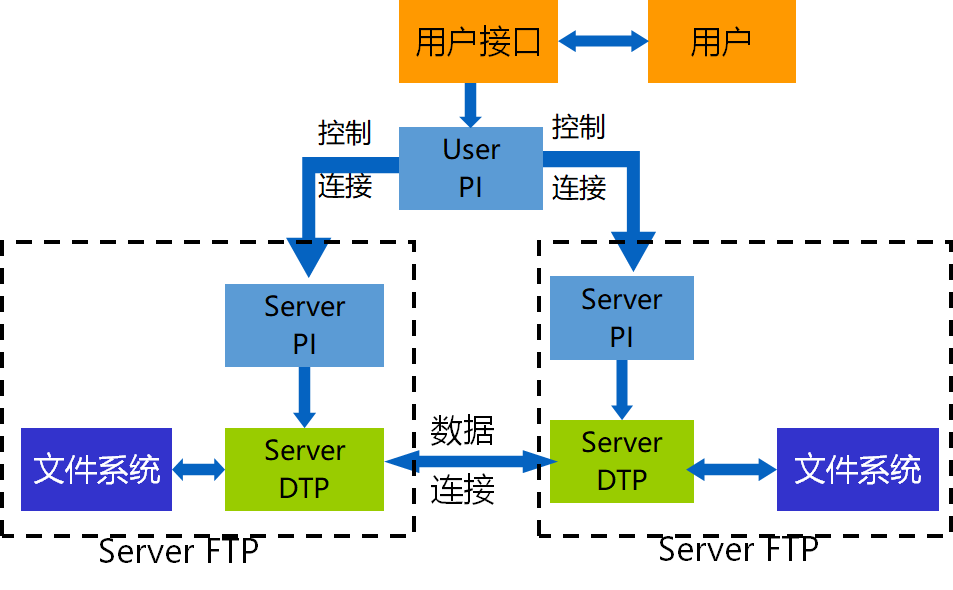

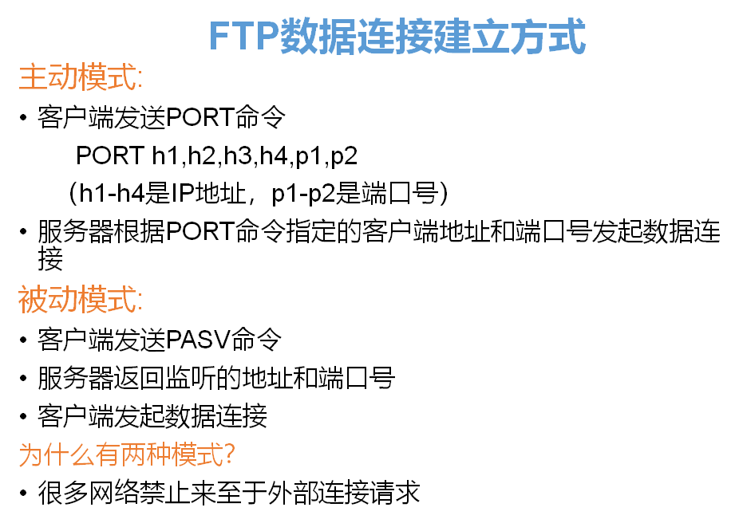

PORT：主动模式

PASV：被动模式

>     在主动模式下，FTP客户端随机开启一个大于1024的端口N向服务器的21号端口发起连接，然后开放N+1号端口进行监听，并向服务器发出PORT N+1命令。服务器接收到命令后，会用其本地的FTP数据端口（通常是20）来连接客户端指定的端口N+1，进行数据传输。
>
>
> ​    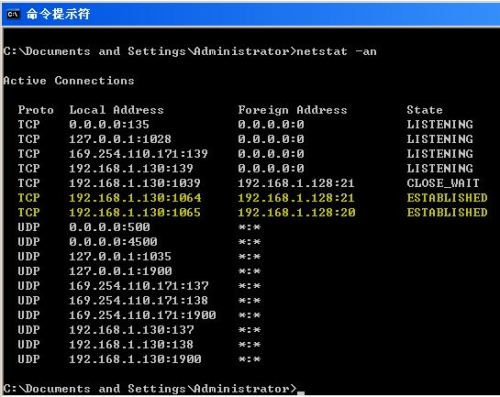
>
>      在被动模式下，FTP库户端随机开启一个大于1024的端口N向服务器的21号端口发起连接，同时会开启N+1号端口。然后向服务器发送PASV命令，通知服务器自己处于被动模式。服务器收到命令后，会开放一个大于1024的端口P进行监听，然后用PORT P命令通知客户端，自己的数据端口是P。客户端收到命令后，会通过N+1号端口连接服务器的端口P，然后在两个端口之间进行数据传输。
>
> 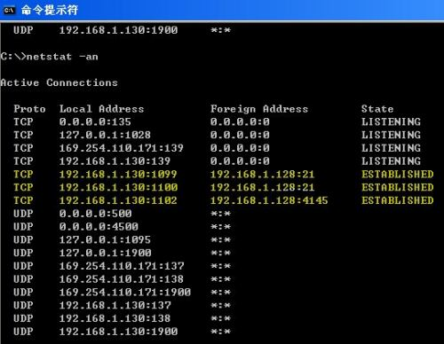
>
>  总的来说，主动模式的FTP是指服务器主动连接客户端的数据端口，被动模式的FTP是指服务器被动地等待客户端连接自己的数据端口。
>
> ​    被动模式的FTP通常用在处于防火墙之后的FTP客户访问外界FTp服务器的情况，因为在这种情况下，防火墙通常配置为不允许外界访问防火墙之后主机，而只允许由防火墙之后的主机发起的连接请求通过。因此，在这种情况下不能使用主动模式的FTP传输，而被动模式的FTP可以良好的工作。

<div style="background-color:lightgreen;">
    <pre>
	不同之处是由于PORT（主动）这个方式需要在接上TCP 21端口后，服务器通过自己的TCP 20来发出数据。并且需要建立一个新的连接来传送档案。而PORT的命令包含一些客户端没用的资料，所以有了PASV的出现。而PASV模式拥有PORT模式的优点，并去掉一些PORT的缺点。PASV运行方式就是当服务器接收到客户端连接请求时，就会自动从端口1024到5000中随机选择一个和客户端建立连接传递数据。由于被动且自动建立连接，容易受到攻击，所以安全性差。</pre>
</div>
### 因特网中的电子邮件 SMTP,POP3,IMAP

#### SMTP（Simple Mail TransferProtocol）

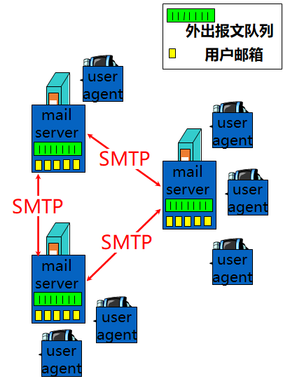

##### 三大组成部分：

- 用户代理user agents
- 邮件服务器mail servers 
- 简单邮件传送协议和邮件接收协议

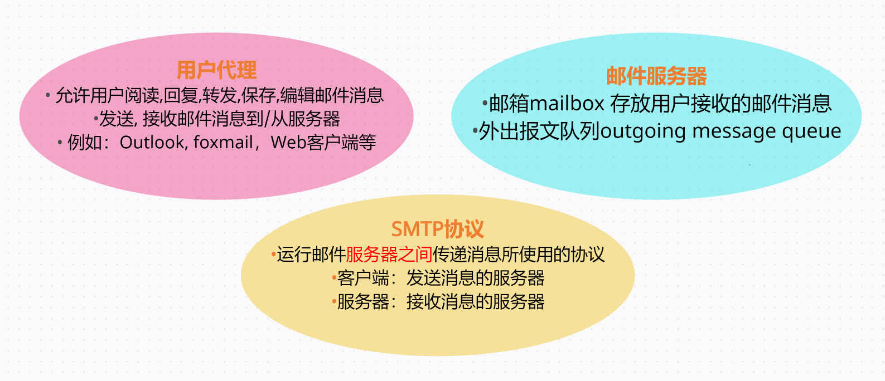

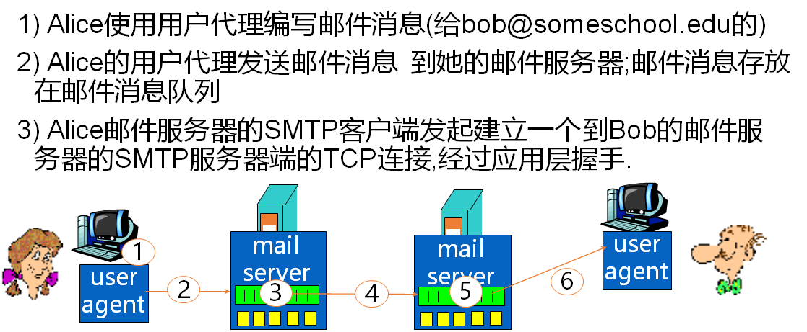


SMTP 一般不使用中间邮件服务器，哪怕两用户服务器隔得再远也只有他们之间建立 TCP 连接，等待也只会在用户服务器的消息队列中等待

> <font size="8">☢</font>SMTP（Simple Mail TransferProtocol）即简单邮件传输协议，它是一种TCP协议支持的提供可靠且有效电子邮件传输的应用层协议。smtp服务器是遵循smtp协议的发送邮件服务器，当接收时作为smtp服务端，当发送时做smtp客户端。SMTP是一个 **推协议**，它不允许根据需要从远程服务器上“拉”来消息。如果客户使用邮件客户端收取邮件，需要使用POP3或IMAP协议，向邮件服务器拉取邮件数据，此时该服务器作为POP3或IMAP服务器。

不能拉取的疏漏由 POP3 或 IMAP 补充

##### 报文格式

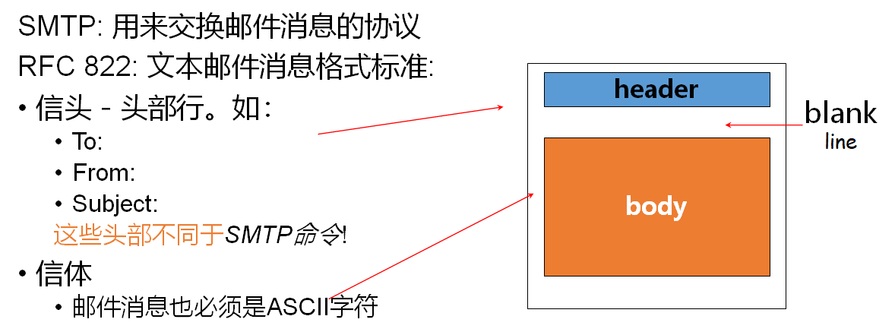

信体必须是 7 比特 ASCII 码，在传输大文件时要先转码，麻烦

#### 邮件访问协议

##### POP3（Post Office Protocol 3）

主要有三阶段：**特许**（authorization，身份验证），**事务处理** 和 **更新**

- **一阶段：特许**

  客户发送身份信息命令，服务器再验明身份

- **二阶段：事务处理**

  客户发送相关指令，服务器响应 OK 或 ERR；同时用户还可以标记删除报文（只是标记）

- **三阶段：更新**

  用户退出结束该 POP3 会话，此时邮件服务器再删除被标记报文

POP3 的会话过程中不带状态信息

##### IMAP（Internet Message Access Protocol）

- 所有邮件消息保存在一个位置: 服务器
- 允许用户利用文件夹组织管理邮件消息
- IMAP支持跨会话(Session)的用户状态:

  - 文件夹的名字
- 邮件消息IDs和文件夹的映射

**另一个重要特性**：允许用户代理获取报文的某一部分，这对使用低宽带的用户很友好

##### HTTP

就是将客户服务器与本地主机之间的收发方式换成了 HTTP，而服务器之间仍旧采用 SMTP

### DNS:英特网的目录服务

主要解决IP和主机名之间的映射建立 

#### 域名系统

##### DNS服务器提供的功能：

> - 主机名到IP地址的转换
>
> - 主机别名
>
>   一个主机可以有一个规范主机名和多个主机别名
>
> - 邮件服务器别名
>
> - 负载分配
>
>   DNS实现冗余服务器：一个IP地址集合可以对应于同一个规范主机名。

DNS 有两大特点：

- 分布式数据库：一个由分层DNS服务器实现的分布式数据库
- 应用层协议：DNS服务器实现域名转换 (域名/地址转换)

#### 服务器结构

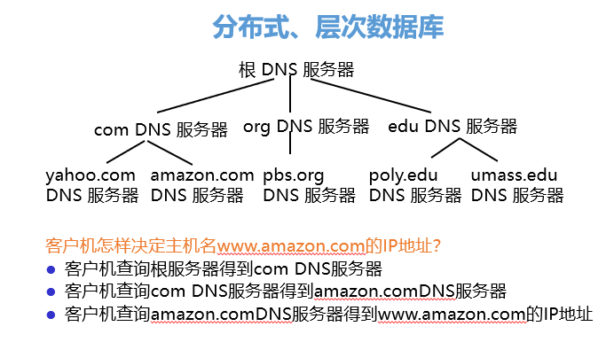

是一个 **根——顶级——权威** 的结构

根中存所有顶级的信息，顶级存下属的权威服务器信息

##### 本地DNS服务器(Local DNS name server)

- 严格来说不属于该服务器的层次结构

- 每个ISP（如居民区ISP、公司、大学）都有一个本地DNS

  也叫默认服务器

- 当主机发出DNS请求时，该请求被发往本地DNS服务器。

  起着代理的作用，转发请求到层次结构中。

#### DNS 查询方法

##### 递归查询

意思就是：如果服务器查询不到，则交由更高级服务器进行查询，查询到结果后再逐级返回

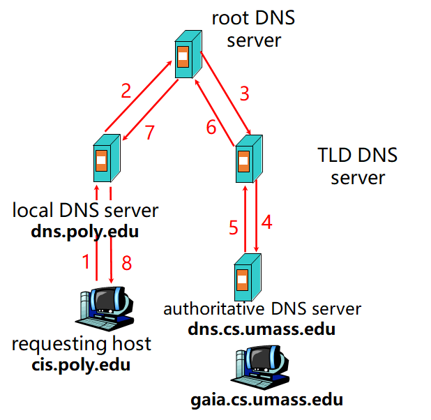

图中每个服务器都只发送了一次查询请求

##### 迭代查询

与递归不同，如果服务器 N 查询不到向上级请求，上级不会帮助查询，而是会给出能够查询到线索的名字服务器 ip，由本地服务器 N 自己继续发送请求。

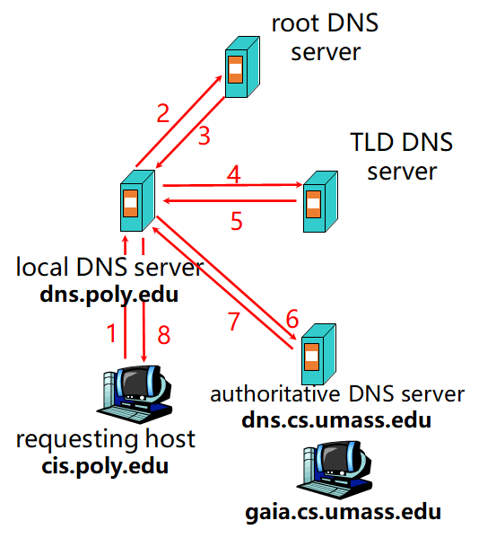

可以看到本地 DNS 服务器发送了多次请求

#### DNS 缓存和权威 DNS 记录更新

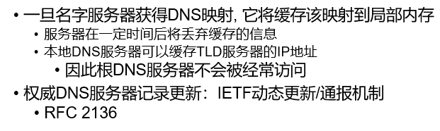

#### DNS 记录

DNS: **存储资源记录(RR，Resource Records)**的分布式数据库

<center>RR 格式: <b>(name, value, type,ttl)</b></center>

一眼就知道 **TYPE** 是用来规定存储信息的类型的，TYPE 值不一样，NAME 与 VALUE 对应值的意义也不一样：

| TYPE                | NAME                 | VALUE                      |
| ------------------- | -------------------- | -------------------------- |
| A（Address）        | 主机名               | IP 地址                    |
| CNAME（canonical）  | 主机别名             | 真实的规范主机名           |
| NS（ name server ） | 域名                 | 该域权威名字服务器的主机名 |
| MX（mail exchange） | 邮件服务器的主机别名 | 邮件服务器的真实规范主机名 |

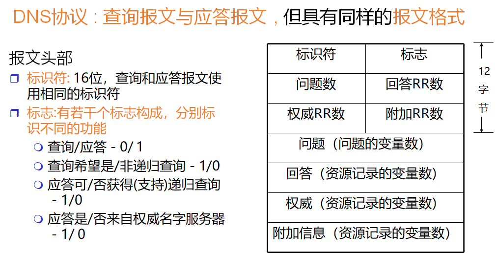

 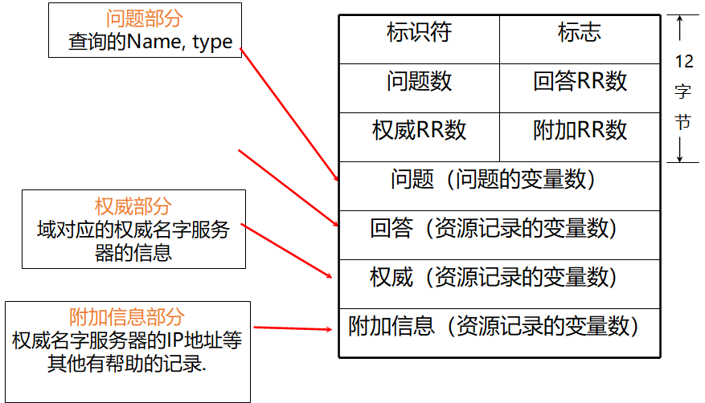
