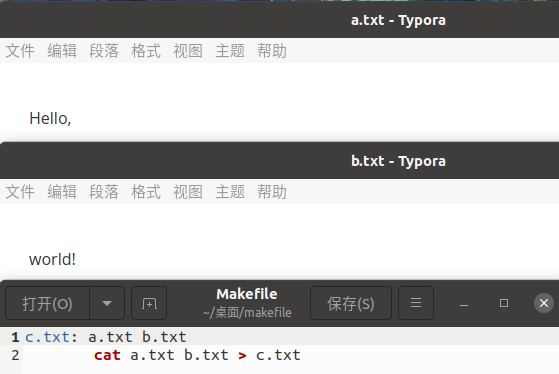
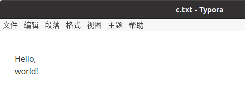
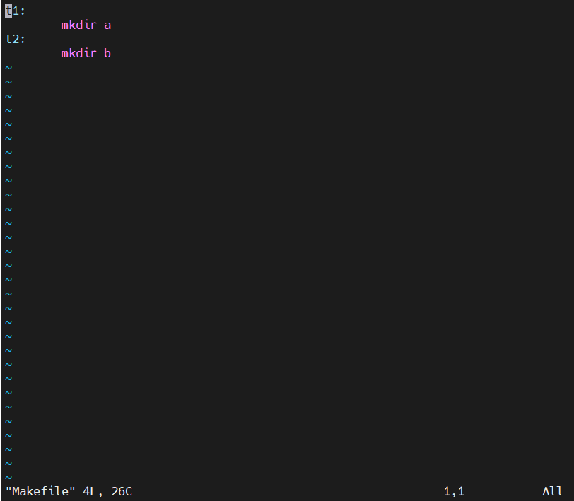
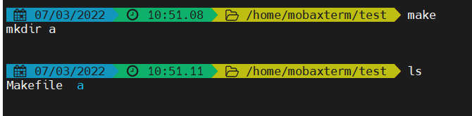
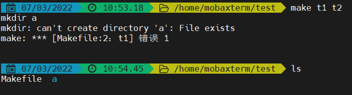
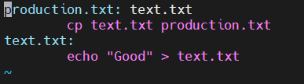
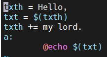
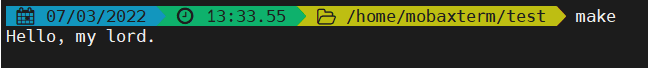
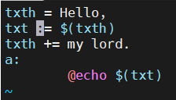
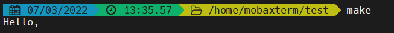

从大一白老师的课上混到结课后，基本就没怎么碰过 Makefile 这玩楞了，但是最近接触操作系统编写时发现它用的比较多（因为他是目前批量编译和操作的最优解），想到以后说不定要跟他打一辈子交道，还是先入个门。

> 外文资料：https://gist.github.com/isaacs/62a2d1825d04437c6f08
>
> 阮一峰：https://www.ruanyifeng.com/blog/2015/02/make.html
>
> 跟我一起写Makefile：https://seisman.github.io/how-to-write-makefile/introduction.html
>

### 一、Make的概念

Make这个词，英语的意思是"制作"。Make命令直接用了这个意思，就是要做出某个文件。

但是制作一个东西，需要 **原材料** ，**目标成品** 和 **制作方法**，缺一不可，像这样的规则，都写在一个叫做Makefile的文件中，Make命令依赖这个文件进行构建。所以 makefile 就是提供这些资料指导 make 的配置文件。

可以直接创建一个 Makefile（首字母大写），这样使用 make 默认这个文件，也可以加参数使用另外的文件：

```makefile
$ make -f rules.txt
# 或者
$ make --file=rules.txt
```

上面代码指定make命令依据rules.txt文件中的规则，进行构建。 






make只是一个根据指定的Shell命令进行构建的工具。它的规则很简单，你规定要构建哪个文件、它依赖哪些源文件，当那些文件有变动时，如何重新构建它。

> <font size="10">💊</font> make 的重新构建功能较为完善，不仅能补缺，还可以根据时间戳判断版本进行重新执行
>
> 它检测的是《target》对应的同名文件，所以不要乱改名，可能干扰 make 的重新构建

### 二、Makefile文件的格式

Makefile文件由一系列规则（rules）构成。每条规则的形式如下。

```makefile
<target> : <prerequisites> 
[tab]  <commands>
```

上面第一行冒号前面的部分，叫做"目标"（target），冒号后面的部分叫做"前置条件"（prerequisites）；第二行必须由一个tab键起首，后面跟着"命令"（commands）。

<font size="6"><b>目标必选，前置条件和命令二选一</b></font>

#### 目标（target）

首先明确，有两种目标：指定文件名的 **通常目标** 和用于标示某个操作的 **伪目标**

比如：

```makefile
create:
	mkdir new
```

这个伪目标就会指导生成一个叫 “new” 的新文件夹

然而，如果当前目录中，正好有一个文件叫做 create，那么这个命令不会执行。因为 Make 发现 create 文件已经存在，就认为没有必要重新构建了，就不会执行指定的 mkdir 命令。

**有没有方法规避这种检测呢？**

为了避免这种情况，可以明确声明clean是"伪目标"，写法如下。

```makefile
.PHONY: clean
create:
	mkdir new
```

[官方文档](https://www.gnu.org/software/make/manual/html_node/Special-Targets.html#Special-Targets)上面一堆类似于 “.PHONY” 的关键字，头痛，记一些重要的就够了

如果Make命令运行时没有指定目标，默认会执行 Makefile 文件的第一个目标。

```bash
$ make
```

上面代码执行 Makefile 文件的第一个目标。

例子：





第二个目标 t2 未执行

之后尝试了几次，a 仍存在的情况下会卡住，在 t1 执行时报错



#### 前置条件（prerequisites）

实际上，是否重新构建，**取决于前置条件**，只要有一个前置文件不存在，或者有过更新（前置文件的last-modification时间戳比目标的时间戳新），"目标"就需要重新构建。

> 你 make 之后更改产物文件再 make，是不会触发重新构建的
>
> 同理，在存在文件的情况下修改 Makefile 内容也不会触发重新构建

写入不同目标，目标之间可以相互依赖，会自动排序生成



02@8.png)

如果需要生成多个文件，往往采用下面的写法。

```makefile
source: file1 file2 file3
```

上面代码中，source 是一个伪目标，只有三个前置文件，没有任何对应的命令。

```bash
$ make source
```

执行`make source`命令后，就会一次性生成 file1，file2，file3 三个文件。

#### 命令（commands）

**用于描述生成与更新方法**，由一行或多行的Shell命令组成。它是构建"目标"的具体指令，它的运行结果通常就是生成目标文件。

每行命令之前必须有一个tab键。如果想用其他键，可以用内置变量.RECIPEPREFIX声明。

```makefile
.RECIPEPREFIX = >
all:
> echo Hello, world
```

上面代码用 `.RECIPEPREFIX` 指定，大于号（>）替代tab键。所以，每一行命令的起首变成了大于号，而不是tab键。

需要注意的是，每行命令在一个单独的shell中执行。这些Shell之间没有继承关系。

```makefile
var-lost:
    export foo=bar
    echo "foo=[$$foo]"
```

上面代码执行后（`make var-lost`），取不到foo的值。因为两行命令在两个不同的进程执行。一个解决办法是将两行命令写在一行，中间用分号分隔。

```makefile
var-kept:
    export foo=bar; echo "foo=[$$foo]"
```

另一个解决办法是在换行符前加反斜杠转义。（表示这一行还没完，下一行继续）

```makefile
var-kept:
    export foo=bar; \
    echo "foo=[$$foo]"
```

最后一个方法是加上`.ONESHELL:`命令。

```makefile
.ONESHELL:
var-kept:
    export foo=bar; 
    echo "foo=[$$foo]"
```

简单粗暴但有用

### 三、Makefile文件的语法

#### 注释

和很多配置文件一样， `#` 表示注释

#### 回声（echoing）

上面截图中，每次 make 之后它执行了什么操作都乖乖跟你说了一遍，就叫回声

在命令的前面加上@，就可以关闭回声。

```makefile
test:
    @# 这是测试
```

现在再执行`make test`，就不会有任何输出。

由于在构建过程中，需要了解当前在执行哪条命令，所以通常只在注释和纯显示的echo命令前面加上@。

```makefile
test:
    @# 这是测试
    @echo TODO
```

#### 通配符

通配符（wildcard）用来指定一组符合条件的文件名。Makefile 的通配符与 Bash 一致，主要有星号（*）、问号（？）和 [...] 。比如， *.o 表示所有后缀名为o的文件。

```makefile
clean:
        rm -f *.o
```

#### 模式匹配

和 nginx 一样都能模式匹配，这玩意类似正则，要用的时候查一下就行

Make命令允许对文件名，进行类似正则运算的匹配，主要用到的匹配符是%。比如，假定当前目录下有 f1.c 和 f2.c 两个源码文件，需要将它们编译为对应的对象文件。

```makefile
%.o: %.c
```

等同于下面的写法。

```makefile
f1.o: f1.c
f2.o: f2.c
```

使用匹配符%，可以将大量同类型的文件，只用一条规则就完成构建。

**编译一个文件夹下的所有.c文件**

```makefile
all: test1.o test2.o
test1.o: test1.c
    gcc -o test1.o test1.c
 
test2.o: test2.c
    gcc -o test2.o test2.c
```

<center><font size="10" color="red">↓</font><font>改用匹配符后</font></center>

```makefile
%.o: %.c
    gcc -o $@ $<
```

关于代码里的 `$@ $<` [详见](#自动变量（Automatic Variables）)

#### 变量和赋值符

##### 变量

Makefile 允许使用等号自定义变量。

```makefile
txt = Hello World #测完发现加不加双引号echo都会自动变成无双引号的格式
test:
    @echo $(txt)
```

上面代码中，变量 txt 等于 Hello World。调用时，变量需要放在 $( ) 之中。

不过也有例外，就像直接调用 Shell 变量时，需要在美元符号前，再加一个美元符号，因为Make命令会对美元符号转义。

```makefile
test:
    @echo $$HOME
```

同时变量也能引用其他变量：

```makefile
v1 = $(v2)
```

##### 赋值符号

问题又来了，上面代码中，变量 v1 的值是另一个变量 v2。这时会产生一个问题，v1 的值到底在定义时扩展（静态扩展），还是在运行时扩展（动态扩展）？

如果 v2 在 make 过程中改变了——即它的值是动态的，那么，最终结果差异会很大。

所以为了表示不同类型的赋值，makefile 有一共四种赋值符号（=、:=、？=、+=）：

```makefile
VARIABLE = value
# 在执行时扩展，允许递归扩展。
# 就是说，在执行途中 value 值会变化，make 会递归寻找究竟如何变化的。

VARIABLE := value
# 在定义时扩展。

VARIABLE ?= value
# 只有在该变量为空时才设置值。

VARIABLE += value
# 将值追加到变量的尾端。
```

比如：





将 `=` 改为 `:=` 后：





#### 内置变量（Implicit Variables）

Make命令提供一系列内置变量，比如，$(CC) 指向当前使用的编译器，$(MAKE) 指向当前使用的Make工具。这主要是为了跨平台的兼容性，详细的内置变量清单见[手册](https://www.gnu.org/software/make/manual/html_node/Implicit-Variables.html)。

```makefile
output:
    $(CC) -o output input.c
```

#### 自动变量（Automatic Variables）

##### （1）$@

$@指代当前目标，就是Make命令当前构建的那个目标。比如，`make foo`的 $@ 就指代foo。

```makefile
a.txt b.txt: 
    touch $@
```

等同于下面的写法。

```makefile
a.txt:
    touch a.txt
b.txt:
    touch b.txt
```

##### （2）$<

$< 指代第一个前置条件。比如，规则为 t: p1 p2，那么$< 就指代p1。

```makefile
a.txt: b.txt c.txt
    cp $< $@ 
```

等同于下面的写法。

```makefile
a.txt: b.txt c.txt
    cp b.txt a.txt 
```

##### （3）$?

$? 指代比目标更新的所有前置条件，之间以空格分隔。比如，规则为 t: p1 p2，其中 p2 的时间戳比 t 新，$?就指代p2。

##### （4）$^

$^ 指代所有前置条件，之间以空格分隔。比如，规则为 t: p1 p2，那么 $^ 就指代 p1 p2 。

##### （5）$\*

$* 指代匹配符 % 匹配的部分， 比如% 匹配 f1.txt 中的f1 ，$* 就表示 f1。

##### （6）$(@D) 和 $(@F)

$(@D) 和 $(@F) 分别指向 $@ 的目录名和文件名。比如，$@是 src/input.c，那么$(@D) 的值为 src ，$(@F) 的值为 input.c。

##### （7）$(<D) 和 $(<F)

$(<D) 和 $(<F) 分别指向 $< 的目录名和文件名。

所有的自动变量清单，请看[手册](https://www.gnu.org/software/make/manual/html_node/Automatic-Variables.html)。下面是自动变量的一个例子。

```makefile
dest/%.txt: src/%.txt
    @[ -d dest ] || mkdir dest
    cp $< $@
```

上面代码将 src 目录下的 txt 文件，拷贝到 dest 目录下。首先判断 dest 目录是否存在，如果不存在就新建，然后，$< 指代前置文件（src/%.txt）， $@ 指代目标文件（dest/%.txt）。

#### 判断和循环

针不戳，还有简易判断与循环

Makefile使用 Bash 语法，完成判断和循环。

```makefile
ifeq ($(CC),gcc)
  libs=$(libs_for_gcc)
else
  libs=$(normal_libs)
endif
```

上面代码判断当前编译器是否 gcc ，然后指定不同的库文件。

```makefile
LIST = one two three
all:
    for i in $(LIST); do \
        echo $$i; \
    done

# 等同于

all:
    for i in one two three; do \
        echo $$i; \
    done
```

上面代码的运行结果。

```bash
one
two
three
```

#### 函数

Makefile 还可以使用函数，格式如下。(括号内前函数名后参数)

> ```makefile
> $(function arguments)
> # 或者
> ${function arguments}
> ```

Makefile提供了许多[内置函数](https://www.gnu.org/software/make/manual/html_node/Functions.html)，可供调用。下面是几个常用的内置函数。

##### （1）shell 函数

shell 函数用来执行 shell 命令

> ```makefile
> srcfiles := $(shell echo src/{00..99}.txt)
> ```

##### （2）wildcard 函数

wildcard 函数用来在 Makefile 中，替换 Bash 的通配符。

> ```makefile
> srcfiles := $(wildcard src/*.txt)
> ```

##### （3）subst 函数

subst 函数用来文本替换，格式如下。

> ```makefile
> $(subst from,to,text)
> ```

下面的例子将字符串"feet on the street"替换成"fEEt on the strEEt"。

> ```makefile
> $(subst ee,EE,feet on the street)
> ```

下面是一个稍微复杂的例子。

> ```makefile
> comma:= ,
> empty:=
> # space变量用两个空变量作为标识符，当中是一个空格
> space:= $(empty) $(empty)
> foo:= a b c
> bar:= $(subst $(space),$(comma),$(foo))
> # bar is now `a,b,c'.
> ```

##### （4）patsubst函数

patsubst 函数用于模式匹配的替换，格式如下。

> ```makefile
> $(patsubst pattern,replacement,text)
> ```

下面的例子将文件名"x.c.c bar.c"，替换成"x.c.o bar.o"。

> ```makefile
> $(patsubst %.c,%.o,x.c.c bar.c)
> ```

##### （5）替换后缀名

替换后缀名函数的写法是：变量名 + 冒号 + 后缀名替换规则。它实际上patsubst函数的一种简写形式。

> ```makefile
> min: $(OUTPUT:.js=.min.js)
> ```

上面代码的意思是，将变量OUTPUT中的后缀名 .js 全部替换成 .min.js 。

懂了懂了，基本上舒服了，之后的学习中边学边查吧。


