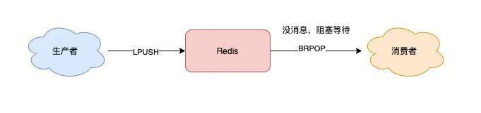
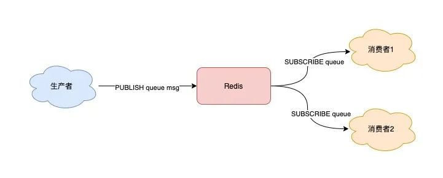

### List

头尾操作复杂度都是 O(1)，因此使用 L/R+PUSH/POP 比想象中好用

但是问题主要集中在客户端读取机制上，一直读取可能造成 CPU 空转，设置休眠时长则可能导致信息时延

好在 Redis 确实的给了 “阻塞等待” 的解决方案：

BRPOP / BLPOP，这里的 B 指的是阻塞（Block）。



现在，你可以这样来拉取消息了：

```java
while true:
    // 没消息阻塞等待，0表示不设置超时时间
    msg = redis.brpop("queue", 0)
    if msg == null:
        continue
    // 处理消息
    handle(msg)
```

使用 BRPOP 这种阻塞式方式拉取消息时，还支持传入一个「超时时间」，如果设置为 0，则表示不设置超时，直到有新消息才返回，否则会在指定的超时时间后返回 NULL。

> **乌龙事件：**如果超时时间过长，可能会导致 redis server 误判为无效链接，被一脚踢出链接。所以一般设置超长或无超时时间都要留一手重连机制

**缺点：**

1. **不支持重复消费**：消费者拉取消息后，这条消息就从 List 中删除了，无法被其它消费者再次消费，即不支持多个消费者消费同一批数据
2. **消息丢失**：消费者拉取到消息后，如果发生异常宕机，那这条消息就丢失了

如果说第一个问题是受 List 功能限制，第二个就是这一套机制上的问题了

### 解决问题

为了满足多组生产者与消费者的模型，Redis 推出了 **发布/订阅模型**

它正好可以解决前面提到的第一个问题：重复消费。



这个模型既支持阻塞式，也满足多组消费者

但是最大的问题仍然得不到解决：**丢数据**

1. 消费者下线
2. Redis 宕机
3. 消息堆积

都可能导致数据丢失

> Pub/Sub 在实现时非常简单，它没有基于任何数据类型，也没有做任何的数据存储，它只是单纯地为生产者、消费者建立「数据转发通道」，把符合规则的数据，从一端转发到另一端。
>
> 一个完整的 **发布、订阅消息** 处理流程是这样的：
>
> 1. 消费者订阅指定队列，Redis 就会记录一个映射关系：队列->消费者
> 2. 生产者向这个队列发布消息，那 Redis 就从映射关系中找出对应的消费者，把消息转发给它

所以，订阅或重连之后只能接收到新的消息，其他都会丢失

**另外，因为 Pub/Sub 没有基于任何数据类型实现，所以它也不具备「数据持久化」的能力。**

真要命，快照也没办法将其持久化

而消息积压，就如同网络交换中的分组丢失，缓冲区满了，不过不同的是，redis 会把消费者踢了，真暴脾气……

> client-output-buffer-limit pubsub 32mb 8mb 60。
>
> 它的参数含义如下：
>
> - **32mb**：缓冲区一旦超过 32MB，Redis 直接强制把消费者踢下线
> - **8mb + 60**：缓冲区超过 8MB，并且持续 60 秒，Redis 也会把消费者踢下线

> 好了，现在我们总结一下 Pub/Sub 的优缺点：
>
> 1. 支持发布 / 订阅，支持多组生产者、消费者处理消息
> 2. 消费者下线，数据会丢失
> 3. 不支持数据持久化，Redis 宕机，数据也会丢失
> 4. 消息堆积，缓冲区溢出，消费者会被强制踢下线，数据也会丢失
>
> 有没有发现，除了第一个是优点之外，剩下的都是缺点。
>
> 所以，很多人看到 Pub/Sub 的特点后，觉得这个功能很「鸡肋」。
>
> 也正是以上原因，Pub/Sub 在实际的应用场景中用得并不多。
>
> > 目前只有哨兵集群和 Redis 实例通信时，采用了 Pub/Sub 的方案，因为哨兵正好符合即时通讯的业务场景。
>
> 我们再来看一下，Pub/Sub 有没有解决，消息处理时异常宕机，无法再次消费的问题呢？
>
> 其实也不行，Pub/Sub 从缓冲区取走数据之后，数据就从 Redis 缓冲区删除了，消费者发生异常，自然也无法再次重新消费。

结果就是，注意以后慎用发布订阅模型，也基本不常用

追求目标：

- 支持阻塞等待拉取消息
- 支持发布 / 订阅模式
- 消费失败，可重新消费，消息不丢失
- 实例宕机，消息不丢失，数据可持久化
- 消息可堆积

感谢万能的 redis 作者，在 5.0 版本加入了 Stream 类型

### Stream

#### Stream 的生产消费模型

首先，Stream 通过 XADD 和 XREAD 完成最简单的生产、消费模型：

- XADD：发布消息
- XREAD：读取消息

> 生产者发布 2 条消息：
>
> ```sql
> // *表示让Redis自动生成消息ID
> 127.0.0.1:6379> XADD queue * name zhangsan
> "1618469123380-0"
> 127.0.0.1:6379> XADD queue * name lisi
> "1618469127777-0"
> ```
>
> 使用 XADD 命令发布消息，其中的「*」表示让 Redis 自动生成唯一的消息 ID。
>
> 这个消息 ID 的格式是「时间戳-自增序号」。
>
> 消费者拉取消息：
>
> ```sql
> // 从开头读取5条消息，0-0表示从开头读取
> 127.0.0.1:6379> XREAD COUNT 5 STREAMS queue 0-0
> 1) 1) "queue"
>    2) 1) 1) "1618469123380-0"
>          2) 1) "name"
>             2) "zhangsan"
>       2) 1) "1618469127777-0"
>          2) 1) "name"
>             2) "lisi"
> ```
>
> 如果想继续拉取消息，需要传入上一条消息的 ID：
>
> ```sql
> 127.0.0.1:6379> XREAD COUNT 5 STREAMS queue 1618469127777-0
> (nil)
> ```
>
> 没有消息，Redis 会返回 NULL

并且它支持添加 BLOCK 参数实现 **阻塞式拉取**

#### Stream 的发布 / 订阅模式

也没问题，Stream 通过以下命令完成发布订阅：

- XGROUP：创建消费者组
- XREADGROUP：在指定消费组下，开启消费者拉取消息

下面我们来看具体如何做？

> 首先，生产者依旧发布 2 条消息：
>
> ```sql
> 127.0.0.1:6379> XADD queue * name zhangsan
> "1618470740565-0"
> 127.0.0.1:6379> XADD queue * name lisi
> "1618470743793-0"
> ```
>
> 之后，我们想要开启 2 组消费者处理同一批数据，就需要创建 2 个消费者组：
>
> ```sql
> // 创建消费者组1，0-0表示从头拉取消息
> 127.0.0.1:6379> XGROUP CREATE queue group1 0-0
> OK
> // 创建消费者组2，0-0表示从头拉取消息
> 127.0.0.1:6379> XGROUP CREATE queue group2 0-0
> OK
> ```
>
> 消费者组创建好之后，我们可以给每个「消费者组」下面挂一个「消费者」，让它们分别处理同一批数据。
>
> 第一个消费组开始消费：
>
> ```sql
> // group1的consumer开始消费，>表示拉取最新数据
> 127.0.0.1:6379> XREADGROUP GROUP group1 consumer COUNT 5 STREAMS queue >
> 1) 1) "queue"
>    2) 1) 1) "1618470740565-0"
>          2) 1) "name"
>             2) "zhangsan"
>       2) 1) "1618470743793-0"
>          2) 1) "name"
>             2) "lisi"
> ```
>
> 同样地，第二个消费组开始消费：
>
> ```sql
> // group2的consumer开始消费，>表示拉取最新数据
> 127.0.0.1:6379> XREADGROUP GROUP group2 consumer COUNT 5 STREAMS queue >
> 1) 1) "queue"
>    2) 1) 1) "1618470740565-0"
>          2) 1) "name"
>             2) "zhangsan"
>       2) 1) "1618470743793-0"
>          2) 1) "name"
>             2) "lisi"
> ```
>
> 我们可以看到，这 2 组消费者，都可以获取同一批数据进行处理了。
>
> 这样一来，就达到了多组消费者「订阅」消费的目的。

#### 消息处理异常应对机制

一组消费者处理完之后要返回命令 XACK 和消息 ID，相当于确认收到，类比 TCP 协议中的 ACK。

如果没有确认，那就是处理失败，重新上线后会重传

#### 关于持久化

Stream 与发布订阅不同，是一种实打实的数据类型，和别的数据类型一样都可以写入 RDB 和 AOF 中做持久化

#### 关于消息堆积

其实，当消息队列发生消息堆积时，一般只有 2 个解决方案：

1. 生产者限流：避免消费者处理不及时，导致持续积压
2. 丢弃消息：中间件丢弃旧消息，只保留固定长度的新消息

而 Redis 在实现 Stream 时，采用了第 2 个方案。

所以仍然会丢数据

### 结论

雀食可以做为一个相对一般的消息队列，但距离专业的还有一定距离

不过胜在简单轻量，要求低的小场景完全可以使用

使用一个消息队列，其实就分为三大块：**生产者、队列中间件、消费者**。

而分析是否丢信息就从这三个部分上面分析

