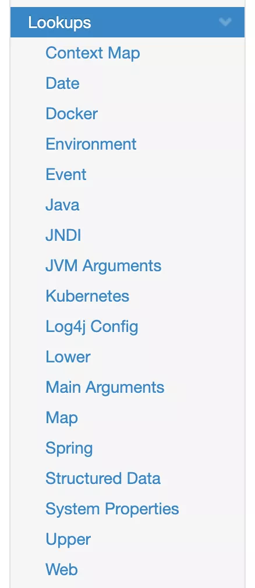
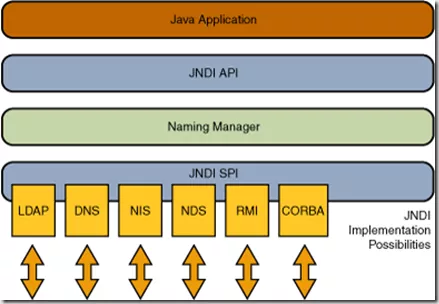
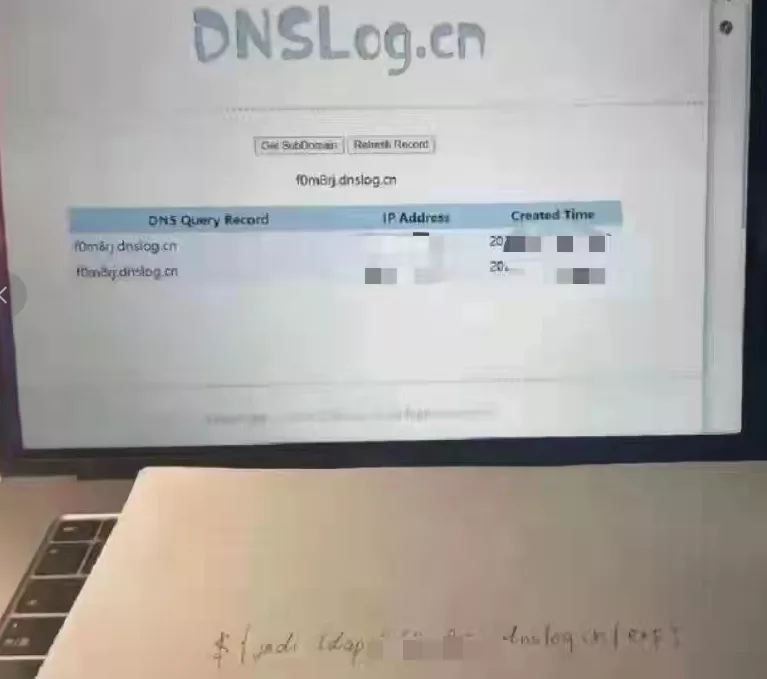

### 写在之前的话

本人技术很差，平时也不怎么关心这些技术问题，log4j也没用多久，写下这篇随笔单纯就是为了记录一下，中途偶尔喷两句纯粹嘴贱。

### 周末泡汤的前辈们

就在一两天前——也就是马上要周末的这个时间点上，log4j2爆出了史诗级大漏洞。所有使用了这个库的框架、web应用、小程序全部受到波及，由于其实现容易，一时间成了脚本小子们的狂欢。我看了几个论坛，阿里都被骂臭了（尤其是连带着上次fastjson远程执行漏洞一起），不过说实话阿里的fastjson这些确实不太好用，恶心我了一次就换成Jackson了。所幸漏洞不能对工程内部造成进一步的危害，所以及时补救问题不大，就是苦了一众糊代码的程序员——多亏apache的哥们儿临近周末爆个洞出来，这加班是板上钉钉的事儿了。

不过我倒不用牺牲周末去加班补船，但鉴于以后可能会频频接触Java后端（不过打死也不用log4j2了，选择logback），这种漏洞还是早点了解为好。所以无内鬼，来点 JNDI 注入速成。

### 关于漏洞

程序运行时打印日志是一件很常见的事情，在Java技术栈中，用的比较多的日志输出框架主要是**log4j2**和**logback**。

而日志在输出过程中，可能会需要打印一个Java对象，这个对象出现在程序里还好说，要是他不呢？要是在文件中，甚至在网络上？这个时候我们该怎么找到正确的对象——这个时候就该lookup出场了。

log4j2 提供了一个叫做 lookup 的组件，调用这个接口，可以查找到对应的内容了。



实际上不同途径的查找方式都已经被实现了，这里被利用的是 JNDI 注入。

#### JNDI

> JNDI即 `Java Naming and Directory Interface`（JAVA命名和目录接口），它提供一个目录系统，并将服务名称与对象关联起来，从而使得开发人员在开发过程中可以使用名称来访问对象。

JNDI 就像是一个字典（实际上原理复杂得多也和字典不一样嗷），传入一个 name，就能获取到对象。JNDI 也只是一个上层封装，在它下面也支持很多种具体的数据源。



看到上图中的 LDAP 了吗，那个 SPI 也是接口的意思（和 API 一样都是接口，区别在于概念上更依赖于哪一方……麻了我说不清楚自己看：[Java SPI思想梳理 - 知乎 (zhihu.com)](https://zhuanlan.zhihu.com/p/28909673)、[听过了API咱们来看看SPI是什么 - 掘金 (juejin.cn)](https://juejin.cn/post/6844903866681524238)）

关于这个玩意儿，先贴一段官话：

> LDAP即 `Lightweight Directory Access Protocol`（轻量级目录访问协议），目录是一个为查询、浏览和搜索而优化的专业分布式数据库，它呈树状结构组织数据，就好象Linux/Unix系统中的文件目录一样。目录数据库和关系数据库不同，它有优异的读性能，但写性能差，并且没有事务处理、回滚等复杂功能，不适于存储修改频繁的数据。所以目录天生是用来查询的，就好像它的名字一样。

这个东西用在统一身份认证领域比较多，但这不是重点。你只需要简单粗暴理解：有一个类似于字典的数据源，你可以通过 LDAP 协议，传一个 name 进去，就能获取到数据。

#### 原理

简单概述一下，就是在打印日志时，如果发现日志内容中包含关键词 `${xxx…}`，那么这个里面包含的内容会当做变量来进行替换，导致攻击者可以任意执行命令。

网络安全中有一个准则：**不要信任用户输入的任何信息**。没准哪天哪个混球上传一串意☆义☆不☆明的字符，然后莫名其妙的就把你数据库捅个底朝天

比如我包个指令进去：

```
${jndi:ldap://127.0.0.1/exploit}
```

- 首先，它发现了字符串中有 **${}**，知道这个里面包裹的内容是要单独处理的。
- 进一步解析，发现是JNDI扩展内容。
- 再进一步解析，发现了是LDAP协议，LDAP服务器在127.0.0.1，要查找的key是exploit。
- 最后，调用具体负责LDAP的模块去请求对应的数据。

如果只是请求普通的数据，那也没什么，但问题就出在还可以 **请求Java对象**！

Java对象一般只存在于内存中，但也可以通过序列化的方式将其存储到文件中，或者通过网络传输。

> 有时候Java对象比较大，直接通过LDAP这些存储不方便，就整了个类似于二次跳转的意思，不直接返回对象内容，而是告诉你对象在哪个class里，让你去那里找。

如果是自己定义的序列化方式也还好，但更危险的在于：**JNDI还支持一个叫命名引用（Naming References）的方式，可以通过远程下载一个class文件，然后下载后加载起来构建对象。**

这就是最要命的东西了，假如下载并构建的 class 文件里面被塞了一段恶意代码，你的服务器就等着被操烂吧……

### 一些题外话

Java 本来应用就广，它的开源库使用量也不小，尤其是本次的主角 log4j2，大大小小的各种公司可能都在使用它，一旦出了问题波及范围就难以想象的大。已经有不少老哥开始抱怨并声称此后不会再使用 log4j2 了——这听上去虽然未免有点一朝被蛇咬十年怕井绳的嫌疑，但是对于小企业以及个人开发者而言，可能真的经不起这种造，对他们来说可能 logback 才是一个更为稳妥的选择。

#### 修复

好在新版本已经发布了，但是按照阿里的尿性，由于代码结构混乱逻辑不清晰，估计代码向前兼容性不会太好（我又想把 fastjson 踢出来一起骂了），而且更新后小问题会很多

修复方式就是禁用二次跳转（命名引用），使用白名单，简单粗暴但是有用

> 1. 默认不再支持二次跳转的方式获取对象
> 2. 只有在log4j2.allowedLdapClasses列表中指定的class才能获取。
> 3. 只有远程地址是本地地址或者在log4j2.allowedLdapHosts列表中指定的地址才能获取

各大公司的洞算是陆陆续续地被补上了，可是到截稿时QQ聊天仍然可以简单触发这一漏洞，我觉得是懒鹅的问题，不说多了放几张弔图，周末愉快！（修洞的人并不）



