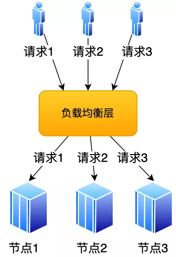
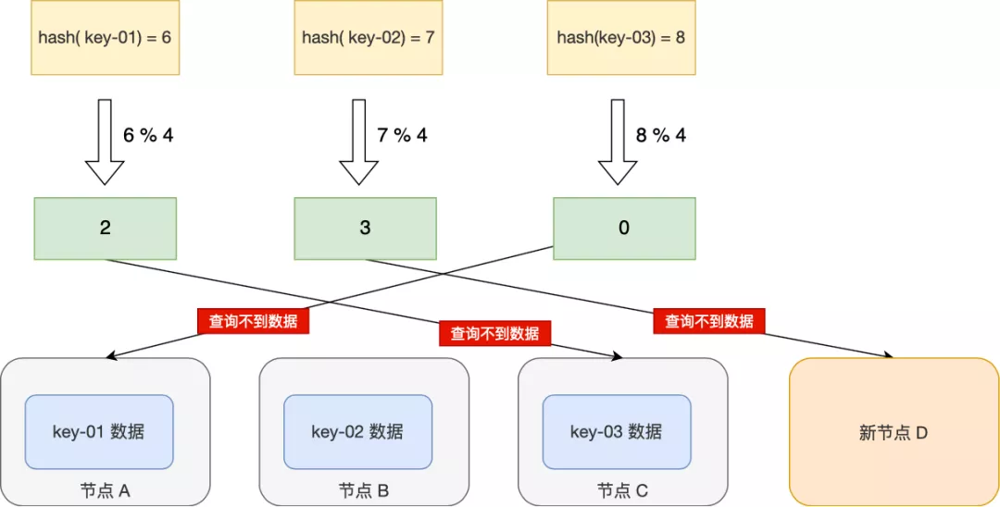
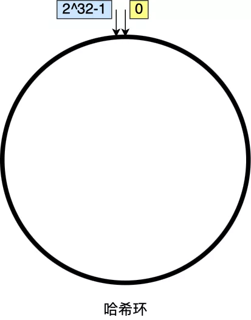
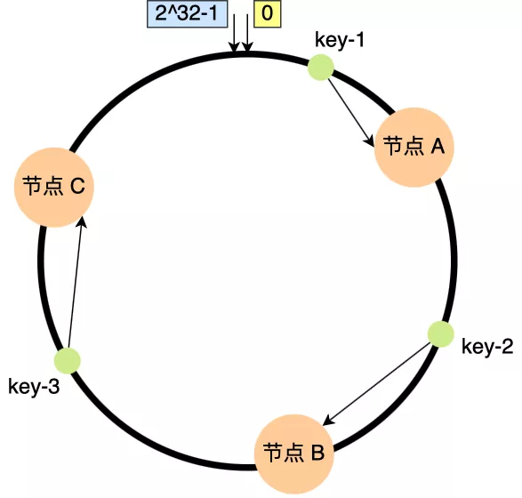
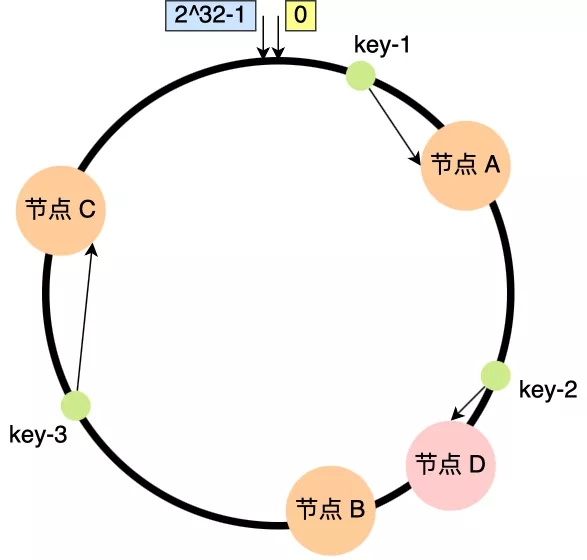
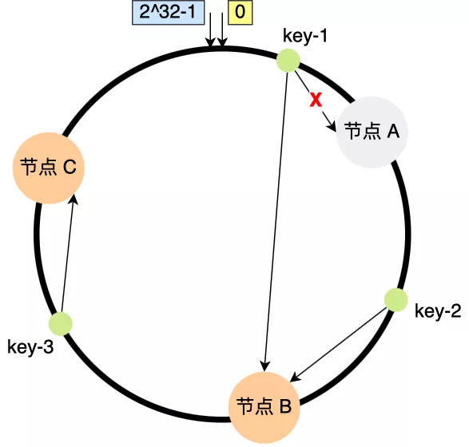
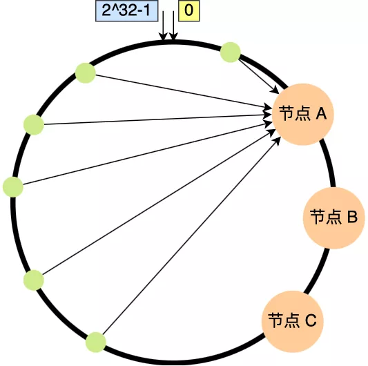
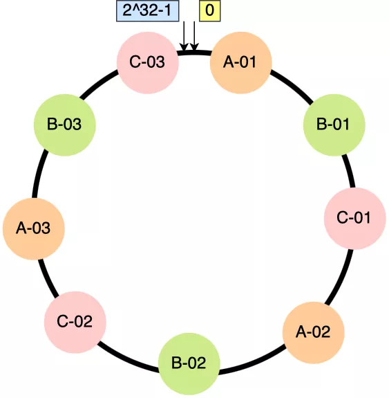

参考文章：[又被微信问懵了！ (qq.com)](https://mp.weixin.qq.com/s?__biz=MzUxODAzNDg4NQ==&mid=2247504513&idx=1&sn=4faa7afcd98b03ef3c24912860317e9e&chksm=f98d962bcefa1f3db85b9f3b3f690359d12089ab93200eb2ce92750ab4224e6d8f145e391402&mpshare=1&scene=23&srcid=0219hffbHkmLiovQE7nEgEaP&sharer_sharetime=1645235544742&sharer_shareid=959f5603f3d31e4e5cff11a678fd00ee#rd)

评论区里有老哥就在说，一致性哈希也没能弄明白，还敢去面微信胆子是真的大。

讲道理，看完这篇文章之前，我也对负载均衡策略的一些内容半懂不懂，还好我离就业季还有一段时间，今天看懂了特写一篇随笔记录一下。

**一致性哈希是什么，使用场景，解决了什么问题？**

### 如何分配请求

在学习 nginx 之初，可能你还只能潦潦草草挂个页面，但你绝对不能不知道它的一个重要功能就是实现负载均衡。随着用户量的激增，一台服务器显然不够，多节点运作才支撑得住如此庞大的并发量与数据量（所以我经常怀疑你电的网站是不是背后只架了一台服务器）

那么问题来了，如何将不同用户的请求分散到不同节点上并绑定呢？（不考虑共用远程数据库）

有句老话说得好（谁说的已经不重要了，你说他是鲁迅说的也行）：“计算机科学领域的任何问题都可以通过增加一个间接的中间层来解决”。那么在这里我们选择增设一个负载均衡层进行轮流转发，甚至可以根据不同硬件设备性能来更改转发权重——即为 **加权轮询**

> **加权轮询**（ **Weighted round robin** ）是网络中用于调度数据流的算法，也可用于[调度进程](https://zh.wikipedia.org/wiki/调度_(计算机))。
>
> 加权轮询[[1\]](https://zh.wikipedia.org/wiki/加权轮询算法#cite_note-WRR-ATM-1991-1)是[轮询调度](https://zh.wikipedia.org/wiki/循環制)的一般化。加权轮询在队列或一系列任务上循环，每个轮次中各数据包或进程按权重获得运行机会。
>
> 加权轮询[[2\]](https://zh.wikipedia.org/wiki/加权轮询算法#cite_note-WRR-2003-2)有若干种类，比如经典加权轮询和交替加权轮询。

然而对于大多数分布式系统而言，每个节点存储的数据是不同的，该算法就显得有些不足了，我们需要做一定的改动，来使得请求与节点绑定

### 一般哈希仍有不足

当然，这种情况下哈希是一个优质的解决方案，因为相同输入结果具有唯一性，且映射较为分散。一般来说，取模运算最为干净又卫生：
$$
hash(key)\ \%\ n
$$
此处的 n 即是节点数，这代表结果从 0 到 n-1 都会映射到相应的节点。

不过看到这里，它的几个大问题就显露出来了：

- 不能为节点设置权重
- 更改节点结构会造成大量的资源损失

**如果节点数量发生了变化，也就是在对系统做扩容或者缩容时，必须迁移改变了映射关系的数据**，然而在实际生产环境里，动辄成百上千台服务器，如果采用这种方案，更改一下就意味着数据的疯狂迁移（最坏情况下所有都要迁移一遍），马云也经不起你这么造

为了解决上述两个问题，我们沿着哈希的路继续往下走

### 一致性哈希

一致性哈希算法就很好地解决了分布式系统在扩容或者缩容时，发生过多的数据迁移的问题。

既然节点数改变会造成最终结果改变，那我们换一个常数不就可以让结果固定了吗？**而一致哈希算法规定对 2^32 进行取模运算，最终结果是一个固定的值**。

而映射又成为了一项新的难题，如果仍沿用之前索引式的分配，肯定会出问题，这次我们选择将模型抽象一下：

> 我们可以把一致哈希算法是对 2^32 进行取模运算的结果值组织成一个圆环，就像钟表一样，钟表的圆可以理解成由 60 个点组成的圆，而此处我们把这个圆想象成由 2^32 个点组成的圆，这个圆环被称为**哈希环**，如下图：
>
> 
>
> 一致性哈希要进行两步哈希：
>
> - 第一步：对存储节点进行哈希计算，也就是对存储节点做哈希映射，比如根据节点的 IP 地址进行哈希；
> - 第二步：当对数据进行存储或访问时，对数据进行哈希映射；
>
> 所以，**一致性哈希是指将「存储节点」和「数据」都映射到一个首尾相连的哈希环上**。

在这个模型中，我们算出的最终结果只对应一个圆环上的点，而它对应的节点，则是从它对应的点开始顺时针向后走所遇到的第一个节点。

> 比如上图：Key1——节点 A；Key2——节点 B；Key3——节点 C；

此时再改变节点结构，只会产生一个节点上的影响：

因此，**在一致哈希算法中，如果增加或者移除一个节点，仅影响该节点在哈希环上顺时针相邻的后继节点，其它数据也不会受到影响**。

不过虽然是解决了更改节点的问题，但是却造成了分布可能不均的问题，容易造成雪崩式的连锁反应。

> 关于雪崩：
>
> 
>
> 此时非常凑巧，几乎所有的数据计算出的位置都在节点 A，这是相当不均衡且危险的情况，如果此时节点 A 因为不能承受而崩溃宕机，根据一致性哈希算法的规则，其上数据应该全部迁移到相邻的节点 B 上。然而突如其来的数据量与并发访问极有可能继续压垮节点 B，并使节点 C、节点 D……相继宕机。

**一致性哈希算法虽然减少了数据迁移量，但是存在节点分布不均匀的问题。**为了解决均衡度的问题，出现了虚拟节点。

### 虚拟节点

在理想情况下，只要节点数量足够多，是可以在环上密密麻麻铺一层的，也可以实现负载均衡，但问题就是正常情况下没有谁闲着没事干整那么多服务器。所以可以采用一对多的映射方式，将一个物理节点映射到环上的多个虚拟节点上，这样你想铺多密都 OK。

上面为了方便你理解，每个真实节点仅包含 3 个虚拟节点，这样能起到的均衡效果其实很有限。而在实际的工程中，虚拟节点的数量会大很多，比如 Nginx 的一致性哈希算法，**每个权重为 1 的真实节点就含有160 个虚拟节点。**

另外，虚拟节点除了会提高节点的均衡度，还会提高系统的稳定性。**当节点变化时，会有不同的节点共同分担系统的变化，因此稳定性更高**。

这个时候你发现，甚至连不同节点的权重问题也解决了，喵了。

